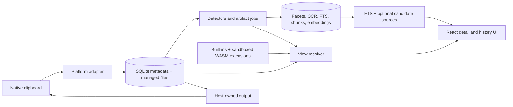
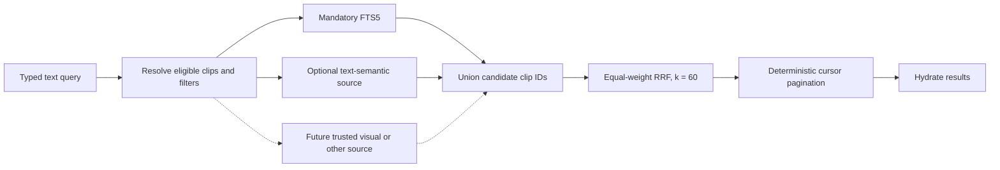

# ClipsX Architecture

ClipsX is a local-first programmable clipboard:

```text
Capture -> Understand -> Render / Transform -> Copy or Paste
```

This is the stable reference for the system that exists today. [MODELS.md](MODELS.md) explains the complete SQLite model and its trade-offs, [ROADMAP.md](ROADMAP.md) contains only unfinished work, and [RELEASE.md](RELEASE.md) contains the installed-build certification matrix.

## System at a glance



React owns interaction and renders typed presentation models. Rust owns native clipboard access, canonical storage, derived work, search, providers, extension isolation, and every clipboard write. The webview never writes to the browser clipboard.

## Core rules

- A clip is one coherent capture with independent raw representations, not one persisted content type.
- Raw representations are canonical. Facets, artifacts, FTS documents, chunks, embeddings, history previews, and transform previews are derived or versioned data.
- Platform adapters alone interpret native clipboard identifiers. ClipsX never guesses UTI, OLE, or equivalent native types.
- Renderer selection is ephemeral UI policy. It never changes canonical data or Original/Plain Text clipboard output.
- Binary payloads live in managed application files; SQLite stores metadata and relative references, never a generic clipboard BLOB.
- The schema is fresh and currently version 7. Older pre-release databases use the explicit reset flow; there are no V1 migrations, compatibility reads, or dual schemas.
- Community extensions are untrusted WebAssembly Components. Providers are host-owned because credentials, consent, scheduling, and vector-space integrity are privileged concerns.

## Capture and persistence

The platform-format matrix is executable capture and reconstruction policy. It defines supported selectors, format families, storage contracts, capture/write priorities, codecs, limits, and settings gates for Windows, macOS, and X11.

On a clipboard change, the adapter reads a stable snapshot with bounded retries. The repository either deduplicates a ready capture or creates canonical rows. Binary bytes are staged, hashed, fsynced, atomically moved to managed storage, and marked ready in transaction order. Clip deletion, clear-history, and retention share one transactional cascade. Final binary-reference deletion enqueues a durable path; an application-owned worker rechecks references, removes the file and empty directories, and retries failures after mutations and startup.

| Storage kind   | Canonical storage                    | Typical examples                 |
| -------------- | ------------------------------------ | -------------------------------- |
| `text`         | normalized UTF-8 in SQLite           | plain text, HTML, RTF            |
| `binary_asset` | immutable managed file plus metadata | images, PDF, Office/native bytes |
| `file_list`    | ordered external references          | copied files                     |

Text normalization preserves semantic content, while adapter-supported binary formats preserve their bytes. Original output reconstructs every explicitly supported captured format; Plain Text chooses only a supported text representation. Self-writes are suppressed using the platform change token with a representation-fingerprint fallback.

## Understanding and derived work

After canonical capture, bounded background work may add facets from built-in or extension detectors, artifacts such as thumbnails and local OCR text, FTS/search projections, semantic chunks and embeddings, and compact presentation caches. Every item records bounded producer/input/version provenance where it matters.

Derived failures never roll back a canonical capture. They are retryable or rebuildable and must leave the clip usable.

Every `ClipSummary` carries one `historyPreview`: a bounded, always-useful leading icon/thumbnail, title, optional subtitle/badge, and accessibility label for the history row. The host resolves it deterministically from the clip's leading representation (visible text for HTML/RTF, never markup; OCR text or a format label for images; meaningful labels for files, PDFs, Office, and unsupported content — never a generic "binary" placeholder). A cached extension compact-render result with a non-empty title replaces the built-in result wholesale; otherwise the built-in result is used immediately. History previews refresh automatically as OCR and other artifacts complete.

## Views, previews, transforms, and output

The host creates a `ClipViewSet` from ready representations, facets, installed extension contributions, and saved renderer preferences. The selected clip opens its `primaryViewId`; other compatible views appear as tabs. A view names a source representation, renderer, optional facet, purpose, and placement.

Saved renderer preference is resolved facet first, then capability, then MIME. Without a preference, image/file/document/Office content prefers faithful renderers; text-centric content prefers structured, semantic, faithful, source, then diagnostic renderers. Matcher specificity, capture priority, native ordinal, and stable renderer ID make the result deterministic. Known built-in semantic views remain additive. For an otherwise unknown facet, the generic key/value view is a recovery fallback: an enabled compatible extension renderer claiming that exact source/facet suppresses it, and disabling, removing, quarantining, or making that renderer incompatible restores it automatically. A failing extension renderer falls back to a compatible built-in view.

Renderers return the bounded `RenderModel` union, which React renders directly: text, code, Markdown, HTML/rich text in a sanitized sandboxed iframe, tables, trees, key/value data, cards, images, files, documents, semantic views, and explicit errors. View descriptors may carry validated light/dark package SVG data and a bounded icon scale for preview tabs; history rows continue to describe the canonical representation. Extension package detail/dialog UI is the exception: it runs in a dedicated child webview with package-scoped assets and no inherited main-webview capability, generic IPC, direct network, filesystem, shell, clipboard, database, popup, or download access. Tauri registers app-command ACLs explicitly: its app-registered package protocol is local, only an `extension-*` child label receives `extension_bridge`, and all normal application commands remain `main`-only. On Windows, Tauri represents registered custom protocols as `http(s)://<protocol>.localhost`; the host navigation guard accepts only that translated form or the native form, with the session token still required in the path. The host injects the scoped bridge at document start before package scripts run, rather than serving privileged SDK code as a package resource. A child remains hidden behind a host loading state until that bridge reports ready; bootstrap failures close it and expose a recoverable host error. Unclaimed history-navigation keys are forwarded by the same bridge so focus inside a child view does not disable host navigation. Its session context receives the currently applied `light` or `dark` theme and active locale, and an open detail view is recreated when either changes.

Transforms are explicit byte-producing operations. The host validates parameters, caches an exact short-lived result, and uses those exact result bytes for preview, Copy, Paste, and Save as New Clip. Saving creates a linked canonical clip with transform provenance; it never overwrites the source. The output boundary is the only clipboard-write owner.

## Extensions

Built-ins and community packages use one contribution model: detector, renderer, transformer, and contextual action. The public package contract is [Extension API v2](EXTENSION_API_V2.md), with its privilege boundary defined by the [extension threat model](EXTENSION_THREAT_MODEL.md); V1 and the obsolete pre-release v2 draft are rejected. Releases are checksum-pinned and lifecycle-managed independently from canonical clip data. External navigation, HTTPS, credentials, provider generation, settings, and clip output use one host-owned broker; grants bind to a checksum and are revoked on update, disablement, replacement, or removal.

Packages are checksum-pinned registry or Developer Mode `.clipsx` archives. Registry-owned marketplace metadata is validated and snapshot with installed registry releases, so package identity remains useful offline without trusting the archive. Installed bytes live in app-owned storage; enablement, runtime state, contribution failure streaks, quarantine, compact caches, update preferences, and app-local action shortcuts are profile data. The Extensions UI separates Installed, Discover, Built-ins, and Developer destinations, with Overview, Settings, Permissions, Actions, and Diagnostics on each package detail page. Global automatic updates default off; an opted-in package auto-installs only a newer stable compatible registry release with an unchanged complete permission set, then revokes grants and sessions exactly like a manual update.

The v2 runtime has no WASI or ambient host imports. A guest receives only one host-approved representation and optional facet. Contextual actions are discovered across every ready representation in the selected clip: the active view source wins when compatible, otherwise the host binds the action to the highest-priority matching source and preserves that exact scope through state evaluation, consent, invocation, and execution. Renderer choice therefore does not hide an action that can operate on another canonical representation. Fresh Wasmtime stores enforce memory, stack, transfer, fuel, timeout, output-size, and failure limits. Repeated failures quarantine the package; canonical clip data is unaffected.

Renderers and detectors are permanently offline. Local transformers and actions are offline and reproducible. Explicit host actions may open isolated, checksum/session-bound dialogs whose only IPC is the extension bridge. That bridge enforces declared HTTPS/navigation origins, checksum grants, scoped credential-header injection, and bounded output through the transform/output boundary. Capability-backed WASM transformers and actions receive only invocation-scoped WIT broker imports for declared HTTPS and `generation.text` capabilities. Configured credential values are injected by the host and reflected-secret responses are rejected. JSON-schema parameter controls are host-rendered and values are validated again in Rust before guest execution.

## Search

Search is derived from preserved clips, not a replacement for them.



`builtin.search.fts` is always enabled. It builds one derived FTS projection from notes, tags, ready textual representations, and completed OCR/extractions. Simple syntax turns whitespace tokens into prefix terms with implicit AND, so `doc` matches `document`; advanced mode passes FTS5 syntax through and reports typed query errors.

Optional sources run independently over the same eligible set. The current optional source, `builtin.search.semantic_text`, can contribute semantic-only clips. Source failures retain FTS results with diagnostics. Candidate lists are bounded at 5,000 entries per source; results record source ranks, use equal-weight reciprocal-rank fusion, sort deterministically, then paginate. FTS and semantic source participation are persisted separately, so disabling Meaning Search never stops indexing.

### Structure-aware semantic indexing

Semantic inputs are independently built from notes, tags, every ready text representation, and completed OCR artifacts. Equivalent normalized visible text is embedded once, preferring the richest successfully parsed source; genuinely distinct representations remain searchable.

| Input              | Semantic atoms and embedding context                                                      |
| ------------------ | ----------------------------------------------------------------------------------------- |
| HTML and Markdown  | headings, paragraphs, lists, quotes, code, table rows; heading ancestry and table headers |
| JSON               | object subtrees and array ranges; JSON Pointer paths                                      |
| CSV/TSV            | complete rows packed under repeated headers                                               |
| RTF                | extracted paragraphs and text blocks                                                      |
| Code               | declaration/blank-line-aware blocks with inferred language                                |
| OCR and plain text | paragraphs, lines, and sentence-like boundaries                                           |
| Notes and tags     | separate labelled metadata chunks                                                         |

Blocks sharing structural context pack toward 1,536 UTF-8 bytes. A contextual Ollama input never exceeds 2,048 bytes; structural prefixes are bounded to 384 bytes and stored only in the embedding input. Normal structural chunks do not overlap. An oversized atom is split Unicode-safely with at most 256 bytes of overlap, and a reported provider overflow recursively subdivides only the failing chunk.

`search_chunks` stores clean snippet text plus strategy/version and representation/artifact provenance; `search_embeddings` stores only one vector per chunk. Pipeline version 3 invalidates old routing/chunk behavior. Relational, monotonic generations allow one active and one building generation per source. The old active generation remains searchable until every replacement job succeeds, then promotion is atomic.

### Providers

Provider contracts exist under `providers/` for text, visual, OCR, and generation capabilities. Ollama endpoint validation, model discovery, bounded HTTP transport, wire types, and typed errors implement both `TextEmbeddingProvider` and `GenerationProvider` under `providers/ollama`. Search owns chunking, generations, jobs, indexing, and retrieval; application state owns its background worker. Device configuration stores generation and embedding endpoint/model/enablement separately; extensions see only provider availability and generated output, never provider configuration.

Hosted providers and visual embedding runtimes are not implemented. They require explicit consent and must never be auto-downloaded or silently receive clipboard data.

## Code and data ownership

| Area              | Main location                | Responsibility                                                              |
| ----------------- | ---------------------------- | --------------------------------------------------------------------------- |
| Desktop/UI        | `src/`                       | React interaction, typed presentation, settings, search and plugin screens  |
| App and IPC       | `src-tauri/src/ipc/`, `app/` | Tauri composition, commands, windows, tray, startup orchestration           |
| Clipboard         | `clipboard/`                 | platform capture, reconstruction, capability matrix, self-write suppression |
| Canonical history | `history/`, `foundation/`    | domain records, SQLite, managed-file lifecycle, settings, reset             |
| Contributions     | `contributions/`             | built-in detectors, renderer resolution, transforms                         |
| Artifacts         | `artifacts/`                 | thumbnails, OCR, artifact lifecycle                                         |
| Search            | `search/`                    | FTS, source planner, semantic spaces/jobs/chunks/vectors                    |
| Extensions        | `extensions/`, `wit/`        | manifests, packages, WASM runtime, registry and quarantine                  |
| Providers         | `providers/`                 | host-owned capability contracts and future adapters                         |

SQLite keeps canonical clip tables separate from derived `artifact_*`, `search_*`, and extension runtime/cache tables. Artifacts have an explicit owning clip; input edges are same-clip provenance. Saved transformed clips survive source deletion because live links are nullable and bounded provenance snapshots remain. Managed files are removed only after their final canonical or derived reference disappears. Do not persist renderer trees, JSON ASTs, decoded tokens, parsed URLs, generic metadata blobs, or unsaved transform output as canonical clip metadata.

Semantic retrieval uses exact cosine ranking for release portability: SQL filters eligible clips before Float32 vectors stream through a best-chunk-per-clip bounded heap. ANN is deferred until an active space exceeds 50,000 chunks or local ranking p95 exceeds 100 ms, excluding provider latency; SQLite `vec1` is preferred only once its testing and desktop packaging are release-ready.

## Legacy reference policy

The read-only `archive/v1-pre-m0` branch/tag may inform visual behavior, keyboard interaction, accessibility, tests, and platform format discovery. It must not be used to restore V1 schemas, IPC payloads, sparse metadata, semantic-model services, entitlement coupling, or compatibility behavior. See [ROADMAP.md](ROADMAP.md#legacy-v1-reference) for the retained reference procedure.
