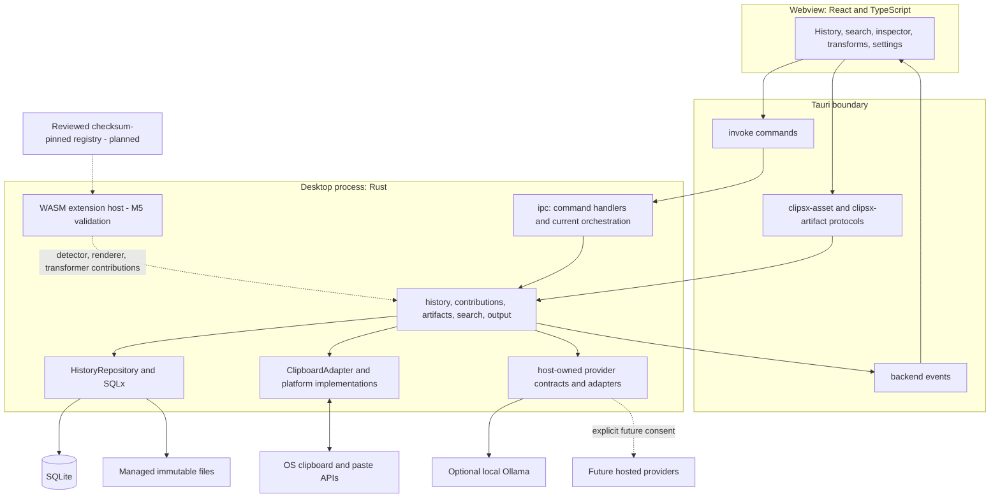
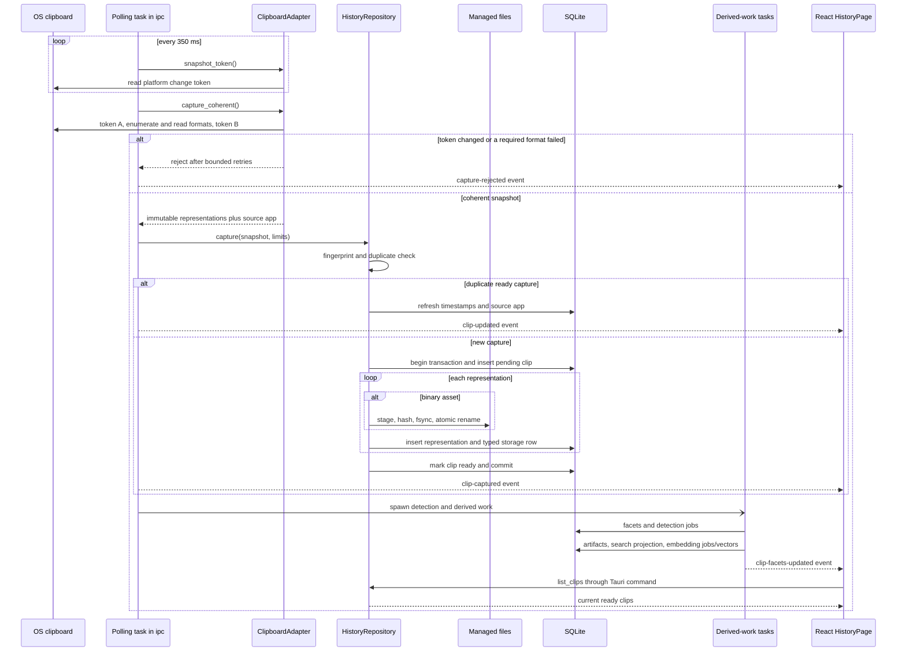
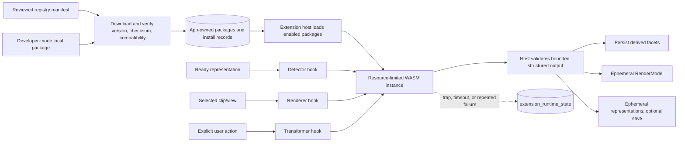
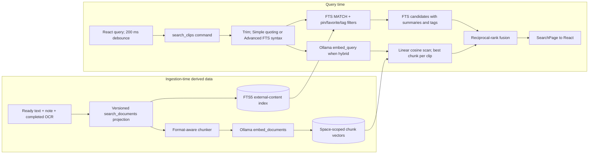

```mermaid
erDiagram
  clip_items ||--|{ clip_representations : owns
  clip_representations ||--o| clip_text_values : stores_text_as
  clip_representations ||--o{ clip_file_list_entries : stores_references_as
  clip_binary_files ||--o{ clip_representations : backs_binary

  clip_items ||--o{ content_clip_facets : has_derived
  clip_representations ||--o{ content_clip_facets : source_of
  clip_representations ||--o{ content_detection_jobs : schedules

  content_facet_definitions ||--o{ content_clip_facets : defines

  clip_items ||--o{ catalog_clip_tags : tagged_by
  catalog_tags ||--o{ catalog_clip_tags : groups
  clip_items ||--o| clip_transform_provenance : produced_clip
  clip_items ||--o{ clip_transform_provenance : source_clip

  artifact_records ||--|{ artifact_inputs : declares
  clip_representations ||--o{ artifact_inputs : raw_input
  artifact_records ||--o{ artifact_inputs : derived_input
  artifact_records ||--o| artifact_text_values : text_output
  artifact_records ||--o{ artifact_binary_files : binary_output

  clip_items ||--|| search_documents : projects_to
  clip_items ||--o{ search_chunks : chunked_as
  search_embedding_spaces ||--o{ search_chunks : versions
  search_chunks ||--o| search_embeddings : embedded_as

  extension_installs ||--|| extension_runtime_state : has_state
```

# ClipsX Architecture
This is the newcomer-friendly, stable architecture reference for ClipsX. It combines the primer, runtime architecture, data model, extension boundary, and search behavior; [ROADMAP.md](ROADMAP.md) separately tracks milestones, locked decisions, validation, and delivery status.
## Start here: ClipsX in plain English

ClipsX is a local-first programmable clipboard: `Capture -> Understand -> Render / Transform -> Copy or Paste`. A clip is one coherent clipboard snapshot, not one content type. It can preserve several raw **representations**—for example plain text, HTML, PNG, and an exact Office format—and later gain semantic **facets** such as JSON or timestamp meaning.

**✅ Shipped (through M4a); 🧪 ready for validation (M5):** coherent multi-representation capture, facets and renderers, transformations, local artifacts and OCR, FTS5, optional Ollama text embeddings, and the M5 extension/registry scope. **Deferred:** optional local visual search plus additional hosted/user-selected providers and generation; **Planned:** M6 release validation.

## Read in this order

These documents separate stable behavior from delivery planning. Begin here, then follow the question you have; each pillar links to related material instead of duplicating it.

| Question | Read |
| --- | --- |
| Runtime, capture, output, invariants | [runtime architecture](#runtime-architecture-capture-and-output) |
| Canonical data, derived data, persistence | [data model](#data-model-preserve-first-derive-later) |
| Built-ins and planned community extensions | [extensions](#extensions-contributions-without-privilege) |
| FTS, embeddings, providers, limitations | [search](#search-keyword-first-semantic-when-opted-in) |
| Decisions, M0–M6, validation | [ROADMAP.md](ROADMAP.md) |

## Four pillars

Architecture gives React and Rust distinct responsibilities. The data model preserves raw inputs and makes indexes rebuildable; extensions add understanding and views without privilege; search reads derived projections. The roadmap tells you which of those boundaries are running.

## Glossary

| Term | Meaning |
| --- | --- |
| **Clip** | One coherent clipboard ownership state (`clip_item`); it has no global content type. |
| **Representation** | One independent raw form of a clip, such as `text/plain`, HTML, PNG, Office/OLE, or file list. |
| **Facet** | Additive meaning from a representation, such as `data.json`, `value.number`, or `time.timestamp`; it never replaces raw data. |
| **Artifact** | Versioned reusable derived text/binary output, such as OCR or thumbnail, with provenance. |
| **Projection** | A deterministic rebuildable document assembled for FTS. |
| **Provider** | Trusted host-owned embedding, generation, or OCR integration; never a community extension. |
| **Embedding** | Fixed-size semantic-search vector in one compatible embedding space. |
| **Embedding space** | Immutable provider/model/modality/dimensions/normalization/metric identity. |
| **Extension** | Detector, renderer, or transformer contribution; built-ins ship today, community WASM is in M5 validation. |
| **Renderer** | Contribution returning a structured model rendered by ClipsX-owned React UI. |
| **Transformer** | Contribution that produces representations from source data and validated parameters. |
| **Canonical / derived / ephemeral** | Preserved capture or durable user data / rebuildable output / session or in-memory state. |

## Rules to keep in mind

- Raw representations are canonical; facets, artifacts, search documents, chunks, embeddings are derived; render models/previews are ephemeral unless a transformation is explicitly saved as a new clip.
- Binary payloads live in managed app files. SQLite contains metadata/validated relative paths, never generic payload BLOBs or JSON metadata.
- Platform adapters alone interpret native clipboard types; never guess UTI, OLE, or equivalent identifiers. Renderer selection is UI policy, not clip state.
- Use the fresh domain-prefixed schema and reset flow. Do not add v1 migrations, compatibility reads/writes, or dual schemas.

[platform-format-matrix.json](platform-format-matrix.json) defines supported capture/reconstruction. The read-only `archive/v1-pre-m0` branch/tag can inform visual behavior, keyboard interaction, accessibility, and platform discovery, but never v2 schema, IPC, semantic models, sparse metadata, or compatibility behavior; see [LEGACY_V1_REFERENCE.md](LEGACY_V1_REFERENCE.md).


---

## Runtime architecture, capture, and output

ClipsX is one Rust desktop process plus one React webview. React owns interaction and rendering; Rust owns canonical data, clipboard access, persistence, search, and provider calls. **✅ Shipped through M4a; 🧪 M5 is ready for validation** unless marked **Deferred**; [ROADMAP.md](ROADMAP.md) tracks delivery and [data model](#data-model-preserve-first-derive-later) owns persistence detail.

## Runtime layers

This shows the route from the webview to privileged systems. Dashed extension/hosted-provider paths are planned, not running code.



React uses typed Tauri commands, invalidation events, and app-owned binary URI protocols. Events such as `clip-captured`, `clip-updated`, and `clip-facets-updated` are not replicated state: `HistoryPage` queries current data again. Tokio tasks poll clipboard and run derived work in-process, moving blocking detector/OCR tasks where needed; `AppState` owns roots, schema state, cloneable repository, and in-memory `TransformService`.

## Clipboard ingestion

This shows what happens after a clipboard change. The system never exposes an incomplete capture, and derived failure never invalidates raw data.



The adapter compares token A/B, rejects changed or required-format-failed reads after bounded retries, and returns immutable representations plus source app. Repository deduplicates ready captures or writes pending canonical rows, staging/hashing/fsyncing/atomically renaming binary bytes while the transaction is open, then marks ready and commits. Startup reconciles missing/pending/staged/unreferenced files; manual `capture_clipboard` uses the same adapter/repository and ordering; self-writes are fingerprinted/suppressed.

## Ownership and dependencies

This reference table maps responsibilities to code. The two listed coupling points are intentional current limits, not hidden architecture.

| Responsibility | Current code | What it owns |
| --- | --- | --- |
| Composition/state | `app/`, `main.rs` | Thin composition root and `AppState`. |
| Tauri adapter/orchestration | `ipc/mod.rs` | Commands, events, protocols, startup, polling, sequencing. |
| Canonical capture/catalog | `clipboard/`, `history/domain.rs`, `history/repository.rs` | Reads/writes, snapshots, representations, retention, reconstruction, tags, notes, recovery. |
| Understand/render | `contributions/host.rs`, `detector/`, `renderer/` | Built-in registry, bounded jobs, facets, resolver, `RenderModel`. |
| Transform | `contributions/transformer/mod.rs` | Registry, parameters, expiring cache, output, preferences, provenance. |
| Artifacts/search/providers/output/foundation | `artifacts/`; `search/`; `providers/`; `output/paste.rs`; `foundation/`, `migrations/` | Derived output; FTS/Ollama/fusion; contracts/adapters; reconstruction/paste; roots/schema/reset/files/credentials. |
| Wire contracts | `contracts.rs`, `src/shared/types/` | Serializable Tauri shapes. |

Intended flow is `React -> Tauri adapter -> domain capability -> storage/platform/provider boundary`. Domain modules do not import Tauri; canonical history does not depend on derived subsystems; only adapters interpret native identifiers; providers receive no arbitrary history/SQLite/clipboard/files. Two deliberate couplings remain: domain services accept concrete `HistoryRepository` and use its public pool, so persistence is not replaceable; `ipc/mod.rs` coordinates capture through indexing, rather than a separate application-service layer.

## Rendering, transformation, and output

Renderer choice is computed from ready representations, facets, installed contributions, and global preferences—never stored per clip. Resolver order is global MIME/facet preference, rich/native representation (Office/image/HTML/PDF), facet (JSON/JWT/Markdown/table/date/math), then original `text/plain`; active renderer is UI session state, so policy or installed-renderer changes need no migration and new detectors can re-detect history.

`TransformService` runs a built-in transformer from one representation plus validated parameters, caches exact outputs/preview under a short-lived result ID, and reuses exactly those bytes for preview/copy/paste/save. Save makes a new clip with `clip_transform_provenance`; it never overwrites source. Original output reconstructs every explicitly supported capture, plain output selects supported text, transformed output uses cached result representations; self-write suppression, focus restoration, synthetic paste, and `[RECONSTRUCT]` helper logs apply.

### UI parity and interaction contract

The desktop UI is a product boundary, not a diagnostic surface for backend
capabilities. The history workspace automatically renders the resolver's first
view for a selected clip, exposes alternate representation and facet views as
tabs, and keeps raw representations in an advanced inspector. Selecting a
renderer never changes clipboard output.

Normal copy and paste reconstruct the original supported representation set.
Primary-action preferences may select original or plain-text output, but active
renderer selection may not. Transformations are explicit utilities that produce
different bytes; preview, copy, paste, and save of a transform reuse the same
result. Parsed meaning is rebuildable, versioned facet or artifact data, never
canonical clip metadata.

The archived v1 shell, keyboard behavior, previews, actions, settings, and
desktop integrations are parity references. Reintroduce them through v2
contracts, never through `ClipItem`, legacy IPC shapes, or the legacy schema.

The frontend list uses lightweight `ClipSummary` rows. Selecting an item builds
an ephemeral `ClipPresentation` from `ClipDetail`, `ClipViewSet`, and the chosen
`RenderModel`; it does not persist a UI-selected content type. The restored v1
row components are being rewired to this presentation contract incrementally;
the temporary row adapter is frontend-only and may not cross IPC or persistence.
This avoids loading every representation for history rows and keeps renderer
policy outside canonical storage.

Search documents are derived from canonical textual representations, safe
extractions/artifacts, notes, and tag names. A note or tag mutation refreshes
the document and queues re-embedding when a text provider is configured.

## Invariants and code map

Canonical capture commits before detector/artifact/index work; derived data may be cleared/rebuilt. FTS works with providers disabled; hosted calls require explicit consent; secrets stay in OS secure storage and never logs/SQLite. Community code runs only as capability-free M5 WASM components; trusted provider adapters receive explicit immutable inputs.

| Concept | Start here |
| --- | --- |
| Startup, IPC | `src-tauri/src/main.rs`, `app/`, `ipc/mod.rs` |
| Clipboard/output | `clipboard/`, `output/`, `docs/platform-format-matrix.json` |
| Data | `history/`, `migrations/`, `foundation/` |
| Contributions | `contributions/`, `features/transforms/` |
| Artifacts/search/providers | `artifacts/`, `search/`, `providers/` |
| UI | `src/app/App.tsx`, `features/history/HistoryPage.tsx`, `features/inspector/`, `shared/rendering.ts` |

## Capture participant reference

This table expands the ingestion diagram into concrete ownership. It is useful when tracing a capture problem from a visible event back to platform data.

| Component | Purpose |
| --- | --- |
| OS clipboard | The operating system's clipboard, which owns native formats and its change token. |
| Polling task in `ipc` | Watches for clipboard changes, coordinates capture, and emits UI invalidation events. |
| `ClipboardAdapter` | Reads a coherent, platform-specific clipboard snapshot and converts supported formats into immutable representations. |
| `HistoryRepository` | Owns canonical capture: deduplication, transactional metadata writes, representation records, and ready-state transitions. |
| Managed files | Application-owned, content-addressed files that hold binary representation bytes outside SQLite. |
| SQLite | Stores clip metadata, representation rows, typed storage records, facets, jobs, and other durable relational state. |
| Derived-work tasks | Background work that creates non-canonical facets, artifacts, search projections, and optional embeddings. |
| React `HistoryPage` | Receives invalidation events and re-queries the current ready clips for display. |

## Detailed backend reference

This is the complete backend-responsibility lookup table. The shorter ownership discussion above explains dependency direction; use this table to locate the actual code owner.

| Responsibility | Current code | What it owns |
| --- | --- | --- |
| Composition and state | `src-tauri/src/app/`, `main.rs` | Starts Tauri and owns `AppState`. The composition root is intentionally thin. |
| Tauri adapter and orchestration | `src-tauri/src/ipc/mod.rs` | Commands, events, custom asset protocols, startup work, polling, and sequencing across services. |
| Canonical capture and catalog | `clipboard/`, `history/domain.rs`, `history/repository.rs` | Platform reads/writes, coherent snapshots, typed representations, retention, reconstruction, tags, notes, and managed-file recovery. |
| Understand and render | `contributions/host.rs`, `contributions/detector/`, `contributions/renderer/` | Built-in detector registry, bounded detection jobs, additive facets, renderer resolution, and structured `RenderModel` output. |
| Transform | `contributions/transformer/mod.rs` | Built-in transformer registry, parameters, expiring result cache, preview, output bytes, preferences, and save provenance. |
| Derived artifacts | `artifacts/` | Thumbnail and native OCR producers, jobs, provenance, and artifact retrieval. |
| Search | `search/mod.rs`, `search/semantic/mod.rs` | Search projections, FTS query construction, filters, Ollama indexing, cosine scoring, and fusion. |
| Provider boundary | `providers/contracts/`, `providers/registry.rs`, `providers/ollama/` | Capability contracts and host-owned adapters. The current semantic path still has its operational Ollama provider in `search/semantic`. |
| Output | `output/paste.rs`, clipboard writer | Original/plain/transformed reconstruction, self-write suppression, focus restoration, and synthetic paste. |
| Storage foundation | `foundation/mod.rs`, `migrations/` | App roots, fresh-schema validation/reset, migrations, managed-file primitives, and credential cleanup. |
| Shared wire/domain contracts | `contracts.rs`, `src/shared/types/` | Serializable shapes used across the Tauri boundary. |


---

## Data model: preserve first, derive later

The data model separates original clipboard data from everything ClipsX computes later. A clip is one coherent ownership state with many raw representations and additive facets; raw representations are canonical, while facets, artifacts, search documents, chunks, and embeddings are rebuildable.

**✅ Shipped through M4a; 🧪 M5 is ready for validation.** This file is the stable persistence reference. [ROADMAP.md](ROADMAP.md) holds build scope and acceptance criteria.

## Entity relationships

This ERD shows the important persisted records. Canonical clip records are separate from derived work, user catalog data, and M5 extension package/runtime state.



`clip_items`, representations, and typed children are canonical. Text is normalized UTF-8, file lists are ordered external references, binary bytes are immutable managed files; facets/artifacts/search preserve source and producer/version provenance, while job tables record resumable work rather than content. Tags, notes, pins/favorites, and transform provenance are durable; an unsaved transform is in-memory, but a saved transform makes a new linked canonical clip.

`artifact_inputs` references raw representations or other artifacts. Search chunks instead reference clip, immutable embedding space, projection hash, chunker version, and generation. The fresh physical schema is organized by database ownership domain in `001_system.sql` through `008_extension.sql`; these are initialization files, not an upgrade history.

## Files and database tables

SQLite stores relationships, metadata, queries, and local non-secret configuration. Managed files hold binary payload bytes; paths are SHA-256-derived, validated relative paths below managed root, never user-controlled locations.

```text
clipboard_data/
  managed/
    images/
    office/
    pdf/
    svg/
    native/
  derived/
    thumbnails/
    binary/
  staging/
```

| Domain | Tables | Purpose |
| --- | --- | --- |
| System | `system_schema_meta` | Fresh-schema identity/version; rejects legacy databases. |
| Clip | `clip_items`, `clip_representations`, `clip_text_values`, `clip_binary_files`, `clip_file_list_entries` | Canonical catalog, raw references, managed-file metadata. |
| Content | `content_facet_definitions`, `content_clip_facets`, `content_detection_jobs` | Facets and detection scheduling. |
| Catalog | `catalog_tags`, `catalog_clip_tags` | User organization. |
| Artifact | `artifact_records`, `artifact_inputs`, `artifact_text_values`, `artifact_binary_files`, `artifact_jobs` | OCR/previews/approved output, provenance, derived files/invalidation. |
| Search | `search_documents`, `search_documents_fts`, `search_embedding_spaces`, `search_embeddings`, `search_index_jobs` | FTS and semantic retrieval. |
| Extension | `extension_installs`, `extension_runtime_state`, `extension_contribution_runtime_state` | Packages, activation, per-contribution failure streaks, and quarantine. |
| Config | `config_profile_values`, `config_device_values` | Local non-secret configuration. |

Binary capture writes unique staging bytes, hashes/fsyncs them, transactionally inserts/fetches a pending binary row and clip references, atomically renames to final hash path/fsyncs its parent, then marks ready. Startup reconciliation is idempotent across pending rows, stale staging, missing/unreferenced files and never deletes referenced bytes. Identical bytes may share one binary row/file across clips; deletion waits for the final representation reference.

## Representation and byte contract

Each `clip_representations` row contains `clip_id`; non-null `format_key` such as `mime:text/plain` or `macos:public.html`; MIME only when known without guessing; optional exact native type; storage kind; exactly one matching reference; ordinal/capture priority; and pending-to-ready lifecycle. `(clip_id, format_key)` is unique, preserving native-only formats without SQLite NULL ambiguity or invented MIME.

Every Office/native extra is its own binary representation. Unknown native formats are kept but written back only with explicit adapter support; no code guesses UTI, OLE, or other native types. One-to-one text children, ordinal file lists, `binary_file_id`, `CHECK` constraints, and a trigger that confirms children/references (and binary ready state) enforce correctness. Only ready data reaches UI, detectors, renderers, search, or reconstruction.

| Storage kind | Canonical storage | Read and processing contract | Clipboard reconstruction |
| --- | --- | --- | --- |
| `text` | `clip_text_values`: normalized UTF-8, byte length, SHA-256. | Detectors/renderers/FTS/transforms receive UTF-8 text. | Write normalized text only for explicit support; adapter regenerates wrappers such as HTML headers. |
| `binary_asset` | `clip_binary_files` reference to immutable managed bytes. | Validate path/ready state; treat opaque unless exact-format parser supports it. | Write captured exact type only if supported; never guess identifiers. |
| `file_list` | Ordered `clip_file_list_entries`; external content is not copied. | References may no longer exist. | Write supported file-list formats only. |

Normalized text is semantically—not byte-for-byte—preserved. Byte-exact formats use `binary_asset`, mandatory for Office/OLE and unknown native data; the platform matrix decides each format’s rule. Deleting a clip cascades owned rows; only after no reference remains may the binary reconciler remove the managed file.

## What may be persisted

Do not persist JSON AST/formatted JSON, parsed URL/query structures, decoded JWTs, renderer trees/state, generic transformer output, or hex-encoded native binary data as canonical metadata. Reusable expensive output is `artifact_*`, with producer ID/version, input hash, parameter hash, creation time, ordered representation/artifact inputs, and tracked text/binary output; derived files are never untracked paths.

Detection follows raw capture and never selects a global type. Detectors declare accepted types, candidate checks, limits, timeouts, facets; routing uses MIME/prefix/length/lightweight signatures before parsing. `search_documents` is one rebuildable projection per clip, composing user note, preferred direct text (`text/plain`, else approved text), and eligible completed OCR/extraction; notes augment rather than replace captured content, sources/input hashes enable deterministic rebuild. HTML/RTF extraction is projection work or a versioned artifact, never clip metadata; rebuild eligible-source changes and all projections after projection-algorithm changes.

## Invariants

- SQLite has relationships/metadata, not generic payload BLOBs or JSON metadata. Binary paths are validated relative paths.
- Adapters alone interpret native types and regenerate only supported platform wrappers. File lists are references, not copies.
- Use fresh domain-prefixed schema/reset only: no v1 migrations, compatibility reads/writes, or dual schema.


---

## Extensions: contributions without privilege

Extensions add semantic understanding, views, and transformations while preserving canonical capture. Built-ins are trusted Rust; community packages are untrusted WebAssembly Components in a capability-free M5 sandbox. Providers are deliberately not extensions because credentials, consent, model runtimes, and vector-space integrity need a host-owned boundary.

## Built-in contribution system

Built-ins use the same contracts intended for public extensions. A detector adds meaning; a renderer describes a view; a transformer produces explicit new representations.

- **Detector:** receives bounded immutable text after capture, uses candidate routing plus concurrency/timeout limits, and emits source-provenanced additive facets—not a global content type.
- **Renderer:** returns host-owned `RenderModel`; failure falls back to original representation. Supported models are `text`, `code`, `markdown`, `table`, `tree`, `key/value`, `image`, `error`; ClipsX owns React UI.
- **Transformer:** takes explicit user action and validated parameters, creates bounded cached results, and becomes canonical only after explicit save.

Built-ins are enabled by default. Renderer selection is computed UI policy: user MIME/facet preference, rich/native representation, facet, then plain text. See [runtime architecture](#runtime-architecture-capture-and-output) for output behavior and [data model](#data-model-preserve-first-derive-later) for persistence.

## M5 WASM boundary

This diagram shows how community contributions participate without receiving privileged handles.



Normal installation will accept checksum-pinned reviewed GitHub releases with package ID/version, release URL, SHA-256, compatibility, permissions, contribution metadata. Developer Mode permits local packages only with a persistent warning; packages use app-owned storage and relative `extension_installs` paths, while enabled/runtime/quarantine state is SQLite.

WASM gets only representation/facet data and explicit hook context: no history, clipboard, SQLite/database, filesystem, network, shell, environment, React/frontend code/components, secrets, or providers. Host owns scheduling, size/time/memory limits, validation, retries, and quarantine. Detection is post-capture derived work; rendering is on-demand; transforms use built-in preview/copy/paste/save and cannot mutate clips in place.

Extension API v1 is defined by [`EXTENSION_API_V1.md`](EXTENSION_API_V1.md) and its WIT world. Packages are validated before installation, run with bounded memory/fuel/epoch interruption, and are quarantined after repeated contribution failures. The Extensions UI manages reviewed-registry and explicitly enabled Developer Mode packages; live reload remains unsupported.

## Provider separation

`TextEmbeddingProvider`, `MultimodalEmbeddingProvider`, `GenerationProvider`, `OcrProvider` are Rust host-owned capabilities. Ollama, later OpenAI-compatible integrations, and optional local visual provider implement that interface; generic provider integrations, rather than community WASM, are the supported route to other services. The host owns consent/scheduling/retries/space validation/rebuilds; providers own invocation/tokenization/preprocessing/vector production and receive immutable input, never repository access. See [search](#search-keyword-first-semantic-when-opted-in).


---

## Search: keyword-first, semantic when opted in

Search is derived from preserved clips, not a replacement for them. **✅ Shipped:** FTS5 and optional user-selected loopback Ollama text embeddings. **Deferred:** optional local visual search, OpenAI-compatible/hosted providers, and generation.

## Index and query flow

This diagram shows ingestion-time indexes and query-time ranking. FTS is always available and, today, is also the candidate gate for hybrid ranking.



Projection uses user note, ready plain/HTML/RTF in priority order, completed OCR; facets, binary bytes, tags, unsaved/generated previews are not independently searchable. Simple syntax quotes whitespace tokens and uses FTS5 implicit AND; advanced mode passes FTS syntax, while scope/tag filters are SQL. Enabling/changing Ollama creates an immutable space, chunks current projections, queues `search_index_jobs`, promotes only after completion; failure degrades to FTS with diagnostics and spaces never mix.

## Current hybrid limitation

Hybrid search currently improves lexical ordering, but it cannot return a semantic-only clip. This is an implementation limitation, not the target definition of semantic retrieval.

It retrieves the FTS page first, embeds query, scans every active-space chunk vector in process, keeps best chunk per clip, then reciprocal-rank fuses only clips already in that FTS page. Pagination cursors/totals are pre-fusion FTS values. Code/UI must not claim semantic recall beyond FTS candidates. A future planner may union candidates, filter both, fuse, hydrate, and paginate after fusion.

There is a second gap: `update_clip_note` changes canonical note but does not rebuild that clip’s projection; startup detects only missing/old versions. Notes can remain stale in FTS until another path rebuilds. This should move behind one projection-invalidation operation.

## Providers, spaces, privacy

Desktop connects directly to providers; v1 has no model proxy/server. Default disabled embedding leaves FTS functional; Ollama ships first; OpenAI-compatible follows validation; optional local visual provider owns runtime/tokenizer/preprocessing/model and is never auto-installed/downloaded.

Embedding providers implement `describe`, `embed_documents`, `embed_query`; multimodal also `embed_images`. `describe` gives immutable kind, canonical endpoint when applicable, model/revision/digest when available, modality, dimensions, normalization, metric; descriptor/config change creates space and host rejects mismatched vectors.

| Scope | Examples |
| --- | --- |
| Profile | Capability, provider/model, safe label, renderer preference, transform favorite. |
| Device | Ollama endpoint/model, local path, GPU/runtime choice. |
| Secret | API keys/auth tokens in OS secure storage only. |

No auto downloads; remote generation is user-invoked, remote indexing requires explicit opt-in, no silent hosted clipboard transmission, endpoints/local paths/credentials never leave device. `search_*` is disposable local index state: users clear spaces/all semantic data and rebuild; OCR/summaries/expensive output are versioned artifacts. OCR is native/local only and records `unsupported` rather than hosted fallback. Ollama probes capability rather than model names, and unavailable/unsuitable/disabled service leaves FTS alone; BGE code/artifacts/auto-download removal follows acceptance tests, while visual code becomes optional package and capture/preview/OCR remain independent.
