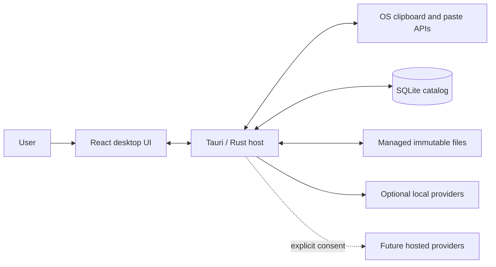
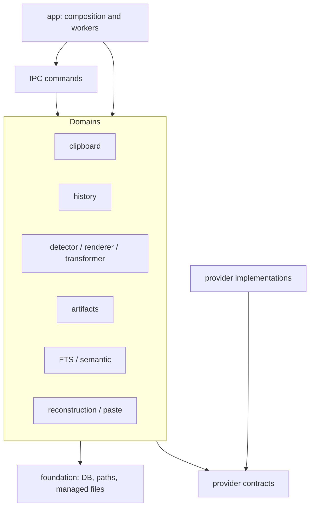
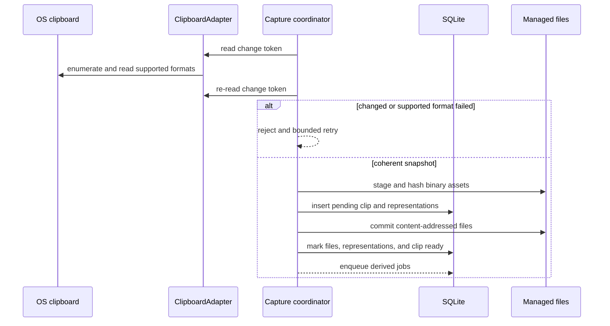
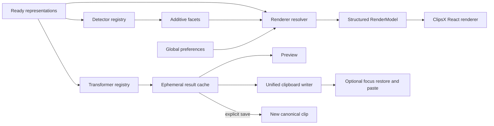
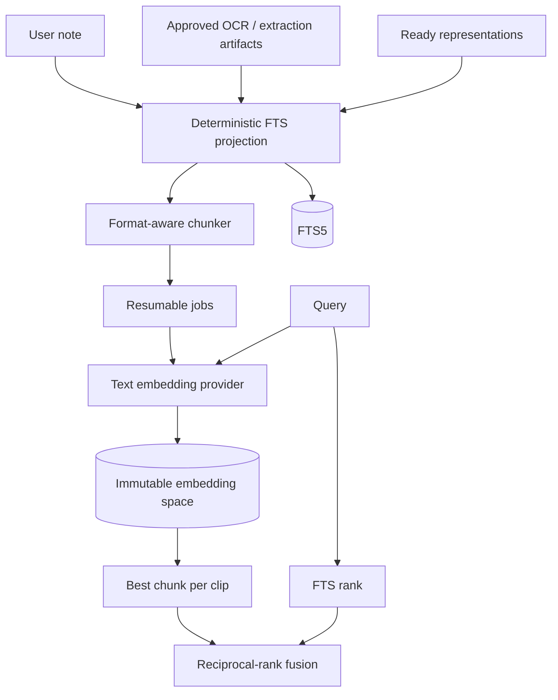
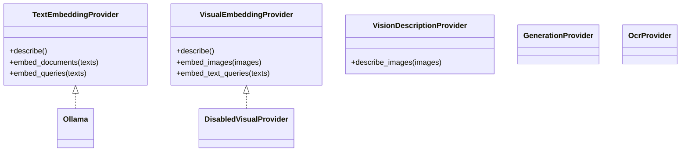
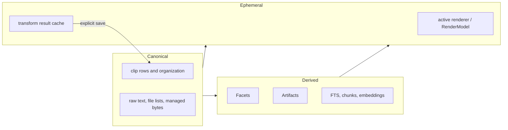
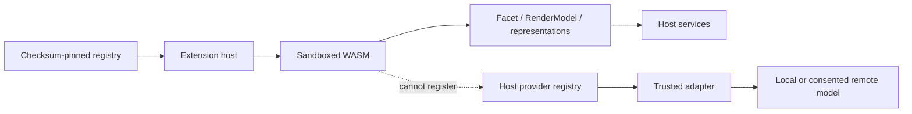

# ClipsX Architecture

ClipsX is a local-first programmable clipboard following
`Capture -> Understand -> Render / Transform -> Copy or Paste`.

> Raw representations are canonical. Facets, artifacts, search documents,
> chunks, and embeddings are derived. Render and transform previews are
> ephemeral unless explicitly saved.

Milestones live in [ARCHITECTURE_EXECUTION_PLAN.md](ARCHITECTURE_EXECUTION_PLAN.md)
and durable decisions in [adr/](adr/).

## System context

SQLite owns relationships, jobs, configuration, and rebuildable indexes.
Binary clipboard payloads live in content-addressed managed files. Providers
are contacted directly by the desktop host; ClipsX has no model proxy.

## Backend modules

Dependency direction is `app/IPC -> domain services -> repositories/provider
contracts`. Domain modules do not depend on Tauri. Provider implementations
receive explicit immutable input and cannot access history, SQLite, clipboard,
or arbitrary files.

## Coherent capture

One ownership state creates one clip with multiple representations. Unknown
native types are retained but written back only when the platform matrix
explicitly permits them. Native types are never guessed.

## Understand, render, transform, and output

Detectors are additive. Renderers return structured models, never frontend
code. Preview, copy, paste, and save consume the same transformation result.

## Search

FTS always works. Provider failures return FTS results with a diagnostic.
Incompatible provider/model/vector spaces are never mixed.

## Provider capabilities

Visual embeddings require image and text-query vectors in one multimodal space.
Vision descriptions produce inspectable derived text; they are complementary
and are never presented as visual similarity embeddings.

## Data ownership

Derived state can be cleared or rebuilt without changing canonical captures.

## Extensions and provider isolation

WASM receives bounded input and has no direct database, filesystem, network,
shell, environment, clipboard, history, or React access. Providers remain
host-owned because they involve consent, credentials, runtimes, and vector-space
integrity.

## Frontend organization

React capabilities live under `src/features`: history, search, inspector,
transformations, settings, and tags. `src/app/App.tsx` only composes the product.
The `v1-pre-m0-reference` tag remains the behavioral blueprint for selection,
shortcuts, accessibility, focus restoration, and macOS IME handling—not legacy
data or IPC types.
