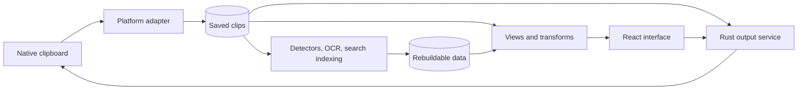

# ClipsX architecture

ClipsX captures clipboard content, offers useful views and transformations, and
copies or pastes the chosen result. Original content stays local.



| Read this for                          | Document                                          |
| -------------------------------------- | ------------------------------------------------- |
| System ownership and invariants        | This document                                     |
| Tables, relationships, storage         | [Data model](MODELS.md)                           |
| Package format, isolation, permissions | [Extension API](EXTENSION_API_V2.md)              |
| Semantic indexing and Recall           | [Meaning Search](SEMANTIC_SEARCH_ARCHITECTURE.md) |
| Shipping work / installed tests        | [Roadmap](ROADMAP.md) / [Release](RELEASE.md)     |

## Ownership

| Owner                | Responsibility                                                | Code                         |
| -------------------- | ------------------------------------------------------------- | ---------------------------- |
| React                | Interaction and typed presentation                            | `src/`                       |
| Rust app / IPC       | Startup, commands, windows, tray, worker coordination         | `src-tauri/src/app/`, `ipc/` |
| Clipboard adapter    | Native formats, capture, reconstruction, self-write detection | `clipboard/`                 |
| History / foundation | Canonical records, SQLite, managed files, settings, reset     | `history/`, `foundation/`    |
| Contributions        | Built-in detectors, view selection, transform cache           | `contributions/`             |
| Artifacts            | Thumbnails and OCR jobs                                       | `artifacts/`                 |
| Search               | FTS, ranking, chunks, vectors, index lifecycle                | `search/`                    |
| Extensions           | Packages, registry, isolation, permission broker              | `extensions/`, `wit/`        |
| Providers            | Host-owned OCR, embedding, generation contracts and adapters  | `providers/`                 |

Rust owns every clipboard write; the webview never uses the browser clipboard.
Extensions receive only approved input and broker capabilities.

## Diagnostics and error reporting

The desktop has two independent diagnostic paths. A local Rust logger always
writes curated `info`, `warn`, and `error` events to Tauri's application log
directory. Verbose diagnostics adds allowlisted `debug` events until the user
turns it off. Files rotate at 2 MB and retain five generations. The webview can
emit only reviewed event names through typed IPC; arbitrary JavaScript logging
and `console.*` forwarding are outside the boundary.

Sentry receives actionable production failures when **Send error reports** is
enabled. The Rust host and React webview share the `clipsx-desktop` project and
use `layer=native|webview`. Signed-in events identify the Supabase account by
UUID, verified email, bounded display name, and controlled auth-provider tag.
Signed-out desktop events use a random installation ID and short support code.
Disabling reporting takes effect in both layers without disabling local logs.

Neither path admits clipboard or OCR content, search queries, notes, tags,
Vault data, arbitrary URLs, query strings, file paths, window titles, secrets,
tokens, request bodies, screenshots, databases, or indexes. Manual diagnostic
exports contain only rotated logs, an allowlisted machine summary, and a README;
they are never uploaded automatically. The native SDK reports panics and errors
that reach its hooks, but cannot guarantee capture of every hard process crash.

## What a clip contains

**Canonical** means saved source data. **Derived** means data that can be rebuilt.

```text
One capture
├── Independent representations: text, HTML, image, files, ...
├── User data: notes, tags, pin/favourite state
└── Derived data: facets, previews, OCR, search documents, vectors
```

A facet adds an interpretation, such as "URL"; it does not replace a
representation. There is no single persisted clip content type.

| Representation | Storage                                                      | Byte contract                              |
| -------------- | ------------------------------------------------------------ | ------------------------------------------ |
| `text`         | UTF-8 in SQLite                                              | Adapter-normalized text preserving content |
| `binary_asset` | Immutable managed file; relative path and metadata in SQLite | Adapter's supported byte contract          |
| `file_list`    | Ordered external file references                             | Order and references preserved             |

The executable [platform-format matrix](platform-format-matrix.json) defines
native selectors, codecs, priorities, limits, settings gates, and write support.
Adapters alone interpret UTI, OLE, and other native identifiers; never guess them.
SQLite has no generic clipboard-payload BLOB or JSON metadata bag.

The local schema is `clipsx-local-v2`, version 9. Incompatible pre-release
databases require explicit reset; there are no compatibility reads or dual schemas.

### Capture, recovery, deletion

```text
Stable native snapshot (bounded retries)
  -> deduplicate a ready capture, or create new records
  -> stage binary files -> hash + fsync -> atomic move -> mark ready
  -> schedule derived work
```

| Event                            | Behaviour                                                                  |
| -------------------------------- | -------------------------------------------------------------------------- |
| Startup                          | Recover staging and incomplete records; do not rehash all ready files      |
| Access to ready binary           | Verify SHA-256                                                             |
| Background maintenance           | Recheck references, remove orphans/empty directories, retry failed cleanup |
| Delete, clear history, retention | One transactional cascade                                                  |
| Final file reference removed     | Managed file becomes eligible for deletion                                 |
| Derived job fails                | Preserve the captured clip; expose retry/rebuild                           |

Artifacts belong to a clip; their input references stay within that clip.
A saved transform survives deletion of its source through nullable live links
and a bounded provenance snapshot.

Clip deletion also writes semantic cleanup intent in the same transaction.
That intent survives the clip cascade and restart. The single semantic writer
removes the clip, chunks, routing entries, and unused vectors from retained
indexes, checkpoints complete indexes, then acknowledges cleanup. This runs
before provider validation, including when Meaning Search is unavailable.

Notes, tags, and OCR changes refresh search projections. Extension lifecycle
changes invalidate its derived facets, views, sessions, and grants.
`clip-facets-updated` refreshes the matching preview; `clipId: null` refreshes
loaded summaries and the open preview.

## Views and output

Renderer choice is UI policy, never canonical clip state. Saved preferences
influence presentation without changing Original or Plain Text output.

```text
Ready representations + facets + enabled renderers + preferences
  -> ClipViewSet
     ├── primaryViewId: opened first and used for history identity
     └── other compatible views: tabs
```

Each view identifies its source, renderer, optional facet, purpose, and placement.

| Selection rule                                         | Order                                                                              |
| ------------------------------------------------------ | ---------------------------------------------------------------------------------- |
| Saved preference                                       | Facet -> capability -> MIME                                                        |
| Images, files, documents, renderable Office alternates | Faithful view first                                                                |
| Text without preference                                | Structured -> semantic -> faithful -> source -> diagnostic                         |
| Deterministic ties                                     | Matcher specificity, facet priority, capture priority, native ordinal, renderer ID |

Opaque Office data remains reconstructable; an HTML, RTF, image, or PDF
alternate supplies its preview. Known built-in semantic views are additive.
An unknown facet gets generic key/value details unless an enabled compatible
extension claims that exact source/facet. The fallback returns when the
extension becomes unavailable. Renderer failure falls back to a compatible
built-in view.

Host `RenderModel` types cover text, code, Markdown, sanitized sandboxed
HTML/rich text, tables, trees, key/value data, images, files, documents,
semantic views, and errors. Custom extension UI follows the
[isolated-view contract](EXTENSION_API_V2.md#custom-ui-and-broker).

| User action             | Source and result                                                    |
| ----------------------- | -------------------------------------------------------------------- |
| Copy / Original         | Reconstruct explicitly supported captured formats                    |
| Copy plain text         | Offered only for ready `text/plain`; copies exact stored characters  |
| Transform               | Validate parameters; cache exact result bytes for preview and output |
| Save transformed result | New canonical clip with provenance; source unchanged                 |
| Share                   | Explicit host-owned disclosure of supported source content           |

Copy plain text never substitutes OCR or rendered/extension content.
Self-writes use a consumable native change token before readback; the snapshot
fallback requires both matching token and fingerprint.

Transforms use native MIME-aware host previews. Raster previews use an opaque,
no-store URL into the expiring cache; unsaved results are not canonical data.
At clipboard write time, typed source text without a portable native format may
gain an identical plain-text companion. Cached and saved representations remain
unchanged.
On Windows, a canonical PNG is reconstructed as both registered `PNG` and
standard `CF_DIBV5` clipboard formats so native applications and browsers can
consume the same image without changing the stored representation.

Sharing receives only a clip ID. Rust resolves a URL, exact plain text, live file
references, or a checksum-verified export in `share-staging`. Notes, tags,
source metadata, OCR, and extension renderings are excluded. ClipsX performs no
upload. Windows uses Share Sheet, macOS uses `NSSharingServicePicker`, and
Linux/X11 uses the desktop portal. Random export names prevent replacement;
startup removes files older than 24 hours without descending into directories.

## Background work and history

Detectors, thumbnails, OCR, search projections, and compact previews record
bounded producer/input/version provenance. Startup resumes missing, failed, or
version-stale extension detection in cursor batches. Completed detection and
compact previews are not globally regenerated at each launch. Extension or
renderer-preference changes can request a full, batched refresh.

### OCR

```text
Commit image -> persistent single-flight queue -> bounded native OCR
             -> accept only current job/configuration -> OCR artifact -> search
```

| Platform | Provider                                                               |
| -------- | ---------------------------------------------------------------------- |
| Windows  | Image decoding and Windows.Media.Ocr on a dedicated WinRT MTA executor |
| macOS    | Vision off the UI thread                                               |
| Linux    | System Tesseract, invoked without a shell                              |

OCR provenance is version 3. Input limits cover encoded bytes, dimensions,
decoded allocation, and pixels. Providers report runtime version, installed
languages, availability, and recovery instructions. Automatic language is the
default; an installed-language override is optional.

Restart recovers interrupted jobs. Configuration changes cancel stale work;
enablement/language changes rebuild only OCR and related search data. Image
bytes remain unchanged on failure, cancellation, or disablement.

### History presentation

Every `ClipSummary.historyPreview` contains a leading visual, title, optional
subtitle/badge, and accessibility label.

| Concern                  | Rule                                                                                                   |
| ------------------------ | ------------------------------------------------------------------------------------------------------ |
| Title                    | Visible HTML/RTF text; image OCR or format label; meaningful file/document labels                      |
| Icon                     | Same resolved primary view as detail; thumbnail, color swatch, host icon, or validated extension glyph |
| Extension compact result | Nonempty title may replace the built-in preview; otherwise retain built-in text                        |
| Compact cache            | Content-only JSON, at most 2 KiB; resolve SVGs from enabled package metadata                           |
| Reading cached icons     | No WASM compilation/execution; no decoded-content disclosure                                           |
| Hydration                | Batch by category: tags, compact previews, OCR, file info, facets                                      |
| Refresh                  | Artifact completion, renderer preferences, extension lifecycle                                         |

Single-item reads use the same resolver. Rows are measured and virtualized with
bounded overscan. Selection uses clip IDs, and keyboard selection scrolls
unmounted rows into view. Each `End` keypress loads at most one older 50-item page.

Search input updates immediately; requests wait 300 ms after typing stops and
until IME composition ends. Its subscription is separate from history/layout
rendering. Unchanged preview models and statistics are reused with the applied
theme.

## Search and providers

| Capability                        | Current implementation                                                   |
| --------------------------------- | ------------------------------------------------------------------------ |
| Keyword search                    | Always-available FTS5; exact words/prefixes                              |
| Meaning Search                    | Optional local Ollama embeddings                                         |
| Recall                            | Explicit question answered by a configured local Ollama generation model |
| OCR                               | Native platform providers above                                          |
| Hosted models / visual embeddings | No shipped runtime                                                       |
| Ollama network                    | Loopback endpoints only                                                  |

One derived FTS document per clip combines notes, tags, ready text, and completed
OCR. HTML/RTF contribute safe visible text; equivalent normalized inputs
contribute once. Simple queries use whitespace-separated prefix terms with
implicit AND; advanced queries use FTS5 syntax with typed errors.

Keyword/filter eligibility runs in SQLite. Optional sources use the same
eligible clips and may add semantic-only matches. Each source returns at most
5,000 candidates; FTS snippets are bounded in SQLite. Source failures preserve
successful results. Ranking, semantic limits, index recovery, and Recall are
defined in [Meaning Search](SEMANTIC_SEARCH_ARCHITECTURE.md).

Search participation and embedding/indexing enablement are separate settings:
excluding Meaning Search from a query does not itself stop indexing.

```text
Query/filter change -> invalidate old responses immediately
  -> retain old rows + preview with "updating" state
  -> pause result actions/pagination; hide native extension detail surface
  -> current success: atomically replace rows, outcomes, cursor
     failure: keep stale rows and offer retry
```

Only pages from the current request may append. Selection survives by ID where
possible and clears on empty results. Input remains editable; operations already
started, including note saves, may finish. Status events are coalesced to one
start per 500 ms, one active refresh, and one trailing refresh; unmounted
consumers ignore late responses.

The Models screen owns the shared Ollama connection and independent embedding
and generation assignments. Bounded model inspection derives `embedding` /
`completion` capabilities. Indexing owns progress, failures, retry, reindex,
disk use, and reset. Extensions receive provider availability and output, never
endpoint/model configuration or credentials.

## Settings, account, and sync

| Screen       | Owns                                                                                        |
| ------------ | ------------------------------------------------------------------------------------------- |
| Clips        | History and preview                                                                         |
| Intelligence | Models, provider health, indexing, search, OCR                                              |
| Extensions   | Installed, Discover, Built-ins, Developer; package settings/permissions/actions/diagnostics |
| Settings     | General, Clipboard, Keyboard, Storage, Privacy, Sync, Account, Advanced                     |

List pages show identity, health, and next action; detail pages hold configuration
and diagnostics. SQLite is the live settings store; JSON is the validated value
and export format.

| Data class            | Examples                                                                                                  | Travels through configuration sync?                |
| --------------------- | --------------------------------------------------------------------------------------------------------- | -------------------------------------------------- |
| Portable preferences  | Theme, language, output/copy UI, search, OCR, renderer preference                                         | Explicit allowlist only                            |
| Portable intent       | Signed-registry extensions, approved boolean/number settings, app shortcuts                               | Yes, subject to local validation and fresh consent |
| Device settings       | Window geometry, autostart, capture limits, provider endpoint/model, similarity floor, local package path | No                                                 |
| Secrets               | Account sessions, API credentials                                                                         | No; OS-protected storage                           |
| Consent / operations  | Grants, tokens, quarantine, jobs, health, cursor                                                          | No                                                 |
| Clip and derived data | Clips, notes, tags, files, OCR, caches, indexes                                                           | No                                                 |

Extension setting portability and approval rules live in the
[Extension API](EXTENSION_API_V2.md#settings).

### Account storage

The Supabase client owns Google/GitHub sign-in choice, PKCE, session serialization,
refresh, and local sign-out. Provider choice is per attempt, not a preference.
Rust exposes an allowlisted opaque key/value adapter.

| Platform      | Session storage                                                                            |
| ------------- | ------------------------------------------------------------------------------------------ |
| Windows       | Versioned map in private app data, encrypted and integrity-protected by current-user DPAPI |
| macOS / Linux | Native credential store                                                                    |

This protects against other ordinary OS users, not malicious code running as
the signed-in user or a compromised ClipsX process.

### Configuration sync v1

Sync is opt-in and account-protected, independent of browser vault and billing.

```text
Local settings transaction + outbox
  -> event-driven coordinator -> owner-scoped server RPC
  -> staged cloud records -> validated local application -> pending effects/recovery
```

SQLite owns the clock, cursor, per-account/generation outbox, exact-revision
acknowledgements, staged first restore, invalid-record quarantine, and pending
effects. Triggers commit settings and outbox together.

| Trigger                  | Schedule                                                                                    |
| ------------------------ | ------------------------------------------------------------------------------------------- |
| Startup / manual request | Synchronize                                                                                 |
| Eligible local mutations | 5-second debounce; 30-second maximum wait                                                   |
| Active reconnect         | Synchronize                                                                                 |
| Window activation        | Wait 2 seconds; cancel on blur; pull only if last automatic pull is at least 15 minutes old |
| Idle/hidden app          | No periodic polling                                                                         |

Conflicts use deterministic `(physical time, logical counter, source device)`
ordering. Received clocks are observed; excessive future clocks use server-time
correction. Reset/replacement increments profile generation so offline devices
cannot resurrect cleared state. Late responses must match account, generation,
and local session epoch.

First connection defaults to cloud restore. Empty-cloud initialization and
explicit replacement are atomic snapshots; paged restores stage before replacing
local portable values. Sign-out disables sync and preserves local data. Sync
does not upgrade installed extensions or transfer grants. Unavailable packages
and unknown/conflicting commands remain pending.

The sibling `clipsx-web` repository owns Supabase migrations, tests, deployment,
and [backend protocol](../../clipsx-web/docs/backend/configuration-sync.md).
Desktop owns the client, generated types, secure session storage, and local
coordinator. Backend RPCs enforce ownership over `sync_profiles`,
`sync_devices`, and `sync_records`; clients have no raw table access.
Internal operations use a NOLOGIN/NOBYPASSRLS role. Enrollment requires a live
Auth session; revoked sessions cannot replace their device identity.

### Settings changes and recovery

| Operation                    | Guarantee                                                                                                                                                     |
| ---------------------------- | ------------------------------------------------------------------------------------------------------------------------------------------------------------- |
| Read                         | Coherent SQLite snapshot                                                                                                                                      |
| Save                         | Host validates patch against latest values under one lifecycle lock; commits capture/profile/device values and outbox together                                |
| Frontend edits               | Serialized; display committed values; preserve unedited fields, including exact byte limits                                                                   |
| Native effects               | Startup reconciles autostart, shortcuts, window behaviour, logging, retention; failures have Retry                                                            |
| Shortcut edit                | Register replacement before removing old binding; persist after success; restore old registration if save fails and report failed rollback                    |
| Retention failure after save | Report failed effect, not an unsaved setting                                                                                                                  |
| Reset settings               | Restore defaults and logging; clear built-in shortcut overrides/pending intent; preserve clips, account, Intelligence, renderer/extension settings and grants |
| App language change          | Atomically invalidate automatic-language OCR; recover interrupted jobs after restart                                                                          |

The command registry defines stable IDs, contexts, defaults, overrides,
conflicts, and labels. Rust owns configurable built-in bindings; portable
`Primary` overrides live in `config_command_shortcuts`. UI records keys and
requires Save; restoring a default deletes its override. Fixed navigation is
separate. Extension shortcuts use their contribution-owned table/lifecycle.
Context-only commands are explicitly configurable, menu-only, or unbound.

Portable import/export works without an account:

| Contract   | Value                                                                                                |
| ---------- | ---------------------------------------------------------------------------------------------------- |
| Envelope   | `format: "clipsx-portable-settings"`, `version: 1`                                                   |
| Records    | Only `kind`, `key`, `payload`, `tombstone`                                                           |
| Limits     | 4 MiB, 1,000 records, existing per-record bounds                                                     |
| Validation | Whole document before commit; reject duplicates/unknown fields; validate signed-package declarations |
| Merge      | Apply supplied records/tombstones; preserve omitted records and device settings                      |

Import uses the same domain application as sync; local triggers publish eligible
changes when sync is enabled. OCR invalidation is atomic; workers/UI refresh
after commit. Pending imports remain recoverable while signed out. Their origin
survives matching cloud echoes: import and retry never auto-install packages.
Users install through Extensions and review fresh permissions. No legacy
settings-file import exists.

### Window activation, layout, and logging

| Entry point                         | Behaviour                                                                                          |
| ----------------------------------- | -------------------------------------------------------------------------------------------------- |
| Global shortcut                     | Hide only if visible, focused, and not minimized; otherwise cancel blur-hide, restore, show, focus |
| Tray left-click                     | Open/focus Clipboard History                                                                       |
| Tray Open, second launch, deep link | Open; never toggle closed                                                                          |
| Explicit activation                 | Focus Search on History; preserve control on Settings/Extensions                                   |
| Alt+Tab / taskbar                   | Preserve previous editor focus                                                                     |

Windows uses actual OS foreground state. Native callbacks enqueue work and
return. One coordinator coalesces requests; a dedicated worker restores normal
Z-order, confirms foreground within a bound, then focuses the embedded webview.
OS refusal is visible. Stage/timing diagnostics and a watchdog report stalls
without releasing the single-flight guard or starting competing workers.

The device-local `window.history_split_ratio` defaults to 0.50; valid range is
0.20–0.80. Layout subtracts the separator and preserves 280 px history / 420 px
preview minimums where possible; narrow windows scale minima without rewriting
the saved ratio. Pointer gestures save on completion; keyboard changes save
per action.

Logging defaults on and changes immediately through
`diagnostics.logging_enabled` in Settings > Advanced. Startup reads policy
before diagnostics and stays quiet if reading fails. Rust logs reviewed
operational messages/counts/timings; frontend sends allowlisted event IDs.
Content, notes, auth URLs, credentials, tokens, and unnecessary paths are
excluded. Disabling logs does not hide user-facing errors. Logging preference
is device-local; reset enables it.

## Extension boundary

Core owns clipboard fidelity, common views and structure detection, secret
detection, local-file activation, fallbacks, and privileged operations.
Optional packages own specialized interpretation and conversion; none are
installed by default. Package capabilities, lifecycle, limits, and security
rules are centralized in [Extension API v2](EXTENSION_API_V2.md).

The main webview has no generic filesystem asset protocol or inline scripts.
Managed binaries use opaque database IDs. Core file-list image preview checks
clip membership, bounds reads to 4 MiB, sniffs an allowed raster, and returns a
data URL. Extensions cannot invoke this or generic local-path activation.
