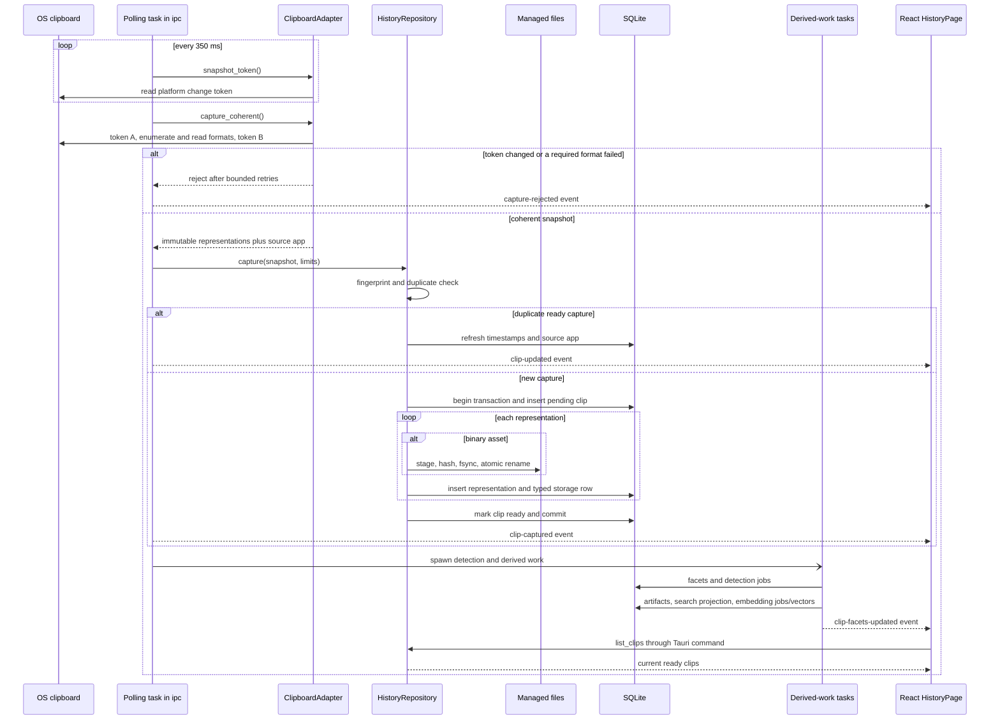
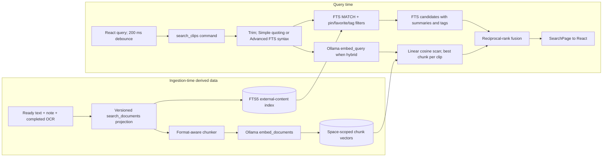
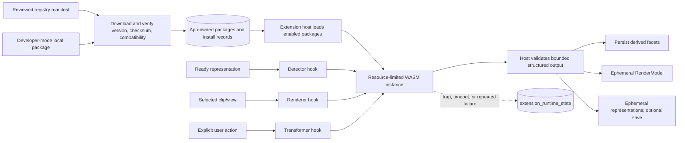

# ClipsX Architecture

ClipsX is a local-first programmable clipboard:

`Capture -> Understand -> Render / Transform -> Copy or Paste`

This document is the source of truth for stable system boundaries and
invariants. [ARCHITECTURE_EXECUTION_PLAN.md](ARCHITECTURE_EXECUTION_PLAN.md)
tracks milestone scope and acceptance criteria, and
[platform-format-matrix.json](platform-format-matrix.json) defines which native
clipboard formats may be captured and reconstructed.

The repository currently implements the architecture through M4a: coherent
multi-representation capture, facets and renderers, transformations, local
artifacts and OCR, FTS5, and optional Ollama text embeddings. The WASM extension
runtime (M5), visual provider (M4b), and generation/hosted providers (M6) are
planned. Sections below label planned boundaries instead of presenting them as
running code.

The central data rule is:

> Raw representations are canonical. Facets, artifacts, search documents,
> chunks, and embeddings are derived. Render models and transformation previews
> are ephemeral unless the user explicitly saves a transformation as a new
> clip.

## 1. Architecture at a glance

This diagram answers: **What are the major runtime layers, and how do control
and data move between them?**

- React owns interaction and rendering, but not clipboard access, persistence,
  search ranking, content detection, or provider calls. It crosses Tauri using
  typed command payloads, listens for invalidation events, and fetches binary
  content through app-owned URI protocols.
- The Rust process owns canonical data and all privileged integrations. Today
  `ipc/mod.rs` is both the Tauri adapter and much of the application
  orchestrator; there is not yet a separate application-service layer.
- Providers and extensions are different trust boundaries. Providers are
  host-owned integrations that may manage credentials or model runtimes.
  Community extensions will be untrusted WASM contributions with no direct
  access to providers or privileged resources.

### Runtime components versus code modules

A box above is a runtime responsibility, not necessarily a Rust type or
thread. The desktop app is one Rust process plus one webview. Tokio tasks run
clipboard polling and derived work in the same process; blocking detector and
OCR work is moved to blocking tasks where needed. `AppState` owns storage
roots, schema state, a cloneable `HistoryRepository`, and the in-memory
`TransformService`.

The frontend calls commands with `invoke`. Rust returns request results and
emits events such as `clip-captured`, `clip-updated`, and
`clip-facets-updated`. Those events are invalidations, not a replicated state
stream: `HistoryPage` responds by querying current state again.

## 2. Clipboard ingestion flow

This diagram answers: **How does an OS clipboard change become a durable clip
and eventually appear in React and search?**

### Components in this flow

| Component | Purpose |
| --- | --- |
| OS clipboard | The operating system's clipboard, which owns native formats and its change token. |
| Polling task in `ipc` | Watches for clipboard changes, coordinates capture, and emits UI invalidation events. |
| `ClipboardAdapter` | Reads a coherent, platform-specific clipboard snapshot and converts supported formats into immutable representations. |
| `HistoryRepository` | Owns canonical capture: deduplication, transactional metadata writes, representation records, and ready-state transitions. |
| Managed files | Application-owned, content-addressed files that hold binary representation bytes outside SQLite. |
| SQLite | Stores clip metadata, representation rows, typed storage records, facets, jobs, and other durable relational state. |
| Derived-work tasks | Background work that creates non-canonical facets, artifacts, search projections, and optional embeddings. |
| React `HistoryPage` | Receives invalidation events and re-queries the current ready clips for display. |

- A clip is observable only after all of its representations are ready. SQLite
  constraints and triggers enforce that rule; React, renderers, detectors, and
  search only read ready state.
- Binary writes occur while the repository transaction is open: bytes are
  staged and fsynced, then atomically moved to a content-addressed path before
  the metadata transaction commits. Startup recovery reconciles missing,
  pending, staged, and unreferenced files.
- Detection, artifact production, FTS projection, and optional embedding work
  happen after canonical capture. Their failure cannot invalidate or erase the
  raw clip. App-originated clipboard writes are fingerprinted and suppressed
  by the monitor.

Manual capture uses the same adapter and repository through the
`capture_clipboard` command. Its detection and artifact/index tasks are spawned
separately, but preserve the same canonical-before-derived ordering.

## 3. Backend responsibilities and dependency direction

The backend is organized by responsibility rather than by one class per
layer. These are the important owners:

| Responsibility | Current code | What it owns |
| --- | --- | --- |
| Composition and state | `src-tauri/src/app/`, `main.rs` | Starts Tauri and owns `AppState`. The composition root is intentionally thin. |
| Tauri adapter and orchestration | `src-tauri/src/ipc/mod.rs` | Commands, events, custom asset protocols, startup work, polling, and sequencing across services. |
| Canonical capture and catalog | `clipboard/`, `history/domain.rs`, `history/repository.rs` | Platform reads/writes, coherent snapshots, typed representations, retention, reconstruction, tags, notes, and managed-file recovery. |
| Understand and render | `contributions/host.rs`, `contributions/detector/`, `contributions/renderer/` | Built-in detector registry, bounded detection jobs, additive facets, renderer resolution, and structured `RenderModel` output. |
| Transform | `contributions/transformer/mod.rs` | Built-in transformer registry, parameters, expiring result cache, preview, output bytes, preferences, and save provenance. |
| Derived artifacts | `artifacts/` | Thumbnail and native OCR producers, jobs, provenance, and artifact retrieval. |
| Search | `search/mod.rs`, `search/semantic/mod.rs` | Search projections, FTS query construction, filters, Ollama indexing, cosine scoring, and fusion. |
| Provider boundary | `providers/contracts/`, `providers/registry.rs`, `providers/ollama/` | Capability contracts and host-owned adapters. The current semantic path still has its operational Ollama provider in `search/semantic`. |
| Output | `output/paste.rs`, clipboard writer | Original/plain/transformed reconstruction, self-write suppression, focus restoration, and synthetic paste. |
| Storage foundation | `foundation/mod.rs`, `migrations/` | App roots, fresh-schema validation/reset, migrations, managed-file primitives, and credential cleanup. |
| Shared wire/domain contracts | `contracts.rs`, `src/shared/types/` | Serializable shapes used across the Tauri boundary. |

### Dependency rules

The intended direction is `React -> Tauri adapter -> domain capability ->
storage/platform/provider boundary`. Domain code must not depend on React, and
provider implementations must not receive arbitrary access to history,
SQLite, clipboard, or files. Platform adapters are the only code allowed to
interpret native clipboard identifiers.

The current code has two deliberate-but-visible coupling points:

- Domain services accept the concrete `HistoryRepository` and execute SQL
  directly through its public pool; repository interfaces have not been split
  out. This keeps the implementation compact but means persistence is not a
  replaceable port today.
- `ipc/mod.rs` coordinates capture, detection, artifacts, projections, and
  indexing. Moving this sequence into an application service would reduce
  Tauri coupling, but the document does not claim that layer already exists.

These constraints still hold: domain modules do not import Tauri, canonical
history does not depend on derived subsystems, and renderer selection remains
computed UI policy rather than persisted clip state.

## 4. Domain and persistence model

A **clip** is one coherent clipboard ownership state. It is not assigned a
single content type. A clip owns independent raw **representations** (for
example plain text, HTML, PNG, and an exact Office format) and may gain
multiple additive semantic **facets**. **Artifacts** and **search data** are
versioned, rebuildable products of those canonical inputs.

This diagram answers: **How are the significant persisted clip-related
entities connected, and which data owns which lifecycle?**

```mermaid
erDiagram
  clip_items ||--|{ clip_representations : owns
  clip_representations ||--o| clip_text_values : stores_text_as
  clip_representations ||--o{ clip_file_list_entries : stores_references_as
  clip_binary_files ||--o{ clip_representations : backs_binary

  clip_items ||--o{ content_clip_facets : has_derived
  clip_representations ||--o{ content_clip_facets : source_of
  clip_representations ||--o{ content_detection_jobs : schedules

  content_facet_definitions ||--o{ content_clip_facets : defines

  clip_items ||--o{ catalog_clip_tags : tagged_by
  catalog_tags ||--o{ catalog_clip_tags : groups
  clip_items ||--o| clip_transform_provenance : produced_clip
  clip_items ||--o{ clip_transform_provenance : source_clip

  artifact_records ||--|{ artifact_inputs : declares
  clip_representations ||--o{ artifact_inputs : raw_input
  artifact_records ||--o{ artifact_inputs : derived_input
  artifact_records ||--o| artifact_text_values : text_output
  artifact_records ||--o{ artifact_binary_files : binary_output

  clip_items ||--|| search_documents : projects_to
  clip_items ||--o{ search_chunks : chunked_as
  search_embedding_spaces ||--o{ search_chunks : versions
  search_chunks ||--o| search_embeddings : embedded_as

  extension_installs ||--|| extension_runtime_state : has_state
```

- `clip_items`, `clip_representations`, and their typed storage children are
  canonical. Text is normalized UTF-8 in `clip_text_values`; ordered external
  file references live in `clip_file_list_entries`; opaque binary clipboard
  bytes live in immutable managed files described by `clip_binary_files`.
- Facets, artifacts, FTS documents, chunks, and embeddings preserve source and
  producer/version provenance so they can be invalidated and rebuilt. Job
  tables (`content_detection_jobs`, `artifact_jobs`, and
  `search_index_jobs`) record resumable work rather than domain content.
- Tags, notes, pin/favorite state, and transformation provenance are durable
  user/catalog data. A saved transformation becomes a new canonical clip and
  links back through `clip_transform_provenance`; an unsaved preview remains
  only in the in-memory transform cache.

`artifact_inputs` may point to either a raw representation or another
artifact. Search chunks instead reference a clip, an immutable embedding
space, a projection hash, a chunker version, and a generation. The physical
schema is defined by `src-tauri/migrations/001_architecture_baseline.sql`
through `008_m4a_chunk_embeddings.sql`.

The extension tables are reserved by the schema but are unused until M5. Their
presence does not mean a plugin runtime is currently installed.

### Storage and reconstruction invariants

- SQLite stores relationships and metadata, not generic clipboard-payload
  BLOBs or JSON metadata. Binary clipboard payloads are content-addressed files
  below the managed root; database paths are validated relative paths.
- Normalized text may be reconstructed only through an explicitly supported
  platform format. Platform wrappers such as Windows HTML headers are
  regenerated by the adapter.
- Office/OLE and unknown native data are byte-exact binary assets. An adapter
  writes an exact native type only when the platform matrix permits it; no code
  may guess a UTI, OLE format name, or equivalent identifier.
- File-list rows store references, not copies of external files. A referenced
  file may later disappear.
- Deleting a clip cascades through clip-owned rows. A shared binary file is
  removed only after no representation references it.

## 5. Search architecture

Search has two phases: a derived index built after ingestion and a query path
started by React. FTS is always available. Semantic search is optional and
currently uses a user-selected model at a loopback Ollama endpoint.

This diagram answers: **How does a search query become ranked ClipsX results,
and which ingestion-time indexes does it use?**

- The deterministic projection contains the user note, ready plain/HTML/RTF
  text representations in priority order, and completed OCR text. Facets,
  binary bytes, tags, and unsaved/generated previews are not independently
  searchable. There is no visual/image embedding search yet.
- Simple syntax quotes whitespace-separated tokens and relies on FTS5's
  implicit AND behavior. Advanced mode passes the query through as FTS5
  syntax. Scope and tag filters are applied in the FTS SQL query.
- Enabling or changing Ollama creates an immutable embedding space, chunks all
  current projections, queues `search_index_jobs`, and promotes the space only
  when indexing completes. Provider failures degrade to FTS with a diagnostic;
  vectors from incompatible spaces are never mixed.

### Current hybrid-ranking limitation

The implemented hybrid path retrieves FTS candidates first. It independently
embeds the query, scans every chunk vector in the active space in process,
keeps the best chunk score per clip, and applies reciprocal-rank fusion only to
clips already present in the FTS page. Therefore it improves the order of
lexical matches but does **not** currently introduce semantic-only matches.
Pagination cursors and totals are also based on the pre-fusion FTS page.

There is also a current invalidation gap: `update_clip_note` updates the
canonical note but does not rebuild that clip's `search_documents` row, and
startup only detects a missing or old projection version. A changed note may
therefore remain stale in FTS until another path rebuilds the projection. This
coupling should be moved behind one projection-invalidation operation.

This is an implementation limitation, not the target definition of semantic
retrieval. A future planner may union FTS and semantic candidate sets, apply
filters to both, fuse them, hydrate clips, and paginate after fusion. Until
that work lands, code and UI must not describe the current mode as semantic
recall beyond FTS candidates.

## 6. Extensions and provider isolation

### Current state

Built-in detectors, renderers, and transformers execute in the trusted Rust
process. They use internal contribution traits, but those traits are not yet a
frozen public Extension API. Detectors receive bounded immutable text, use
candidate routing, run with concurrency and timeout limits, and persist
additive facet output. Renderers return a host-owned `RenderModel` and fall
back to the original representation on failure. Transformer results are
bounded, expire from an in-memory cache, and become canonical only through an
explicit save.

No community package is currently discovered, loaded, or executed. There is
no WASM dependency or Extensions UI in the repository. `extension_installs`
and `extension_runtime_state` are schema placeholders for M5.

### Planned M5 boundary

This diagram answers: **Where will community extensions enter normal runtime
flows without receiving privileged access?**

- Normal installation will accept only checksum-pinned releases from the
  reviewed registry. Developer-mode packages require an explicit persistent
  warning. Installed bytes live in an app-owned location referenced by the
  relative path in `extension_installs`; enabled/runtime state lives in
  SQLite.
- A WASM contribution receives only the representation/facet data and explicit
  invocation context required by its hook. It has no direct filesystem,
  network, database, clipboard, history, shell, environment, React, secret, or
  provider access. The host owns scheduling, size/time/memory limits, schema
  validation, retries, and quarantine.
- Detector calls are asynchronous derived work after capture. Render calls are
  on-demand and return structured UI models. Transform calls require an
  explicit user action and return representations through the same preview,
  copy/paste, and save pipeline used by built-ins. Extensions cannot mutate a
  canonical clip in place.

The manifest schema, public hook ABI, exact resource budgets, and live-reload
policy are intentionally not claimed as implemented or frozen; M5 must define
and validate them before Extension API v1 is published.

Providers do not use this extension mechanism. Text embedding, visual
embedding, vision description, OCR, and generation are distinct host-owned
capabilities because they involve credentials, consent, native/model runtimes,
and vector-space integrity. Community WASM cannot register providers.

## 7. Rendering, transformations, and output

Renderer selection is computed from ready representations, additive facets,
installed contributions, and global preferences. It is session/UI policy; no
renderer tree or per-clip choice is persisted. React asks for the available
views and then requests a structured `RenderModel`. It never executes renderer
supplied frontend code.

A transformation has one source representation plus validated parameters.
`TransformService` executes a built-in contribution, caches the exact output
representations and preview model under a short-lived result ID, and reuses
those same bytes for preview, copy, paste, or explicit save. Saving creates a
new clip with `clip_transform_provenance`; it never overwrites the source clip.

All output policies converge on the platform clipboard writer:

- **Original** reconstructs every captured representation that the current
  platform adapter explicitly supports.
- **Plain text** selects the supported plain-text representation.
- **Transformed** uses the cached representations identified by the preview
  result ID.

After a write, ClipsX records a self-write fingerprint so the monitor will not
capture its own output. Paste additionally restores the prior application
focus and asks the platform adapter to synthesize paste. Shared reconstruction
helpers log with `[RECONSTRUCT]`.

## 8. Architectural invariants and extension points

### Canonical and derived ownership

- One capture has independent representations; never reintroduce a single
  `ClipItem` content type or sparse metadata object.
- Canonical capture must commit before any detector, artifact, or indexing
  work starts. Derived data may be cleared or rebuilt without changing clips.
- Renderer policy and previews are computed. Transformation output becomes
  durable only through explicit **Save as new clip**.
- Use the fresh domain-prefixed schema and reset flow. Do not add v1 migrations,
  compatibility reads/writes, or dual schemas.

### Trust and privacy

- Clipboard history, configuration, indexes, and managed files are local.
  There is no ClipsX model proxy.
- FTS must work with every provider disabled. Hosted provider calls require
  explicit consent; secrets belong in OS secure storage and must never be
  logged or placed in SQLite.
- Native clipboard types are interpreted only by platform adapters and only
  according to the format matrix.
- Community code runs only inside the planned WASM boundary. Provider adapters
  remain trusted host code and receive explicit immutable inputs rather than
  repository access.

### Stable extension points

- `ClipboardAdapter`: platform capture, reconstruction, and paste behavior.
- Detector, renderer, and transformer contribution contracts: built-ins now;
  validated WASM implementations after M5.
- Artifact producers: versioned derived text or binary output with explicit
  inputs and parameters.
- Provider capability contracts: host-owned text/visual embeddings, vision
  description, OCR, and generation.
- Search projection/chunker versions and immutable embedding spaces: rebuild
  indexes without migrating canonical content.

## 9. Code map

Use this map to move from an architectural concept to its main implementation
without treating the source tree as the architecture itself.

| Concept | Start here |
| --- | --- |
| Desktop startup and shared state | `src-tauri/src/main.rs`, `src-tauri/src/app/` |
| Tauri commands, events, polling, and URI protocols | `src-tauri/src/ipc/mod.rs` |
| Clipboard contract and supported native behavior | `src-tauri/src/clipboard/`, `docs/platform-format-matrix.json` |
| Clip domain and persistence | `src-tauri/src/history/domain.rs`, `src-tauri/src/history/repository.rs` |
| Schema and owned filesystem roots | `src-tauri/migrations/`, `src-tauri/src/foundation/mod.rs` |
| Facets and renderers | `src-tauri/src/contributions/host.rs`, `src-tauri/src/contributions/detector/`, `src-tauri/src/contributions/renderer/` |
| Transformations | `src-tauri/src/contributions/transformer/mod.rs`, `src/features/transforms/` |
| OCR, thumbnails, and derived files | `src-tauri/src/artifacts/` |
| FTS projection and query ranking | `src-tauri/src/search/mod.rs` |
| Ollama embedding jobs and vector scoring | `src-tauri/src/search/semantic/mod.rs`, `src-tauri/src/providers/ollama/` |
| Provider capability boundaries | `src-tauri/src/providers/contracts/`, `src-tauri/src/providers/registry.rs` |
| Clipboard reconstruction and paste | `src-tauri/src/output/`, `src-tauri/src/clipboard/host.rs` |
| React composition and history/search UI | `src/app/App.tsx`, `src/features/history/HistoryPage.tsx` |
| Inspector and structured rendering | `src/features/inspector/`, `src/shared/rendering.ts` |
| Shared frontend wire types | `src/shared/types/` |

For visual behavior, keyboard interaction, accessibility, and platform format
discovery, the read-only `archive/v1-pre-m0` branch and tag are historical
references. They are not valid sources for v2 schema, IPC types, semantic
models, sparse metadata, or compatibility behavior; see
[LEGACY_V1_REFERENCE.md](LEGACY_V1_REFERENCE.md).
