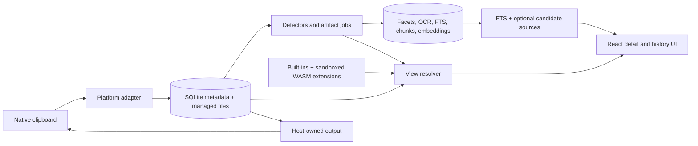
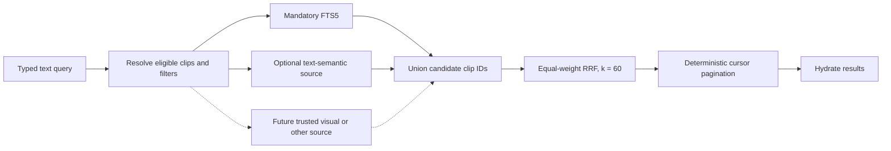

# ClipsX Architecture

ClipsX is a local-first programmable clipboard:

```text
Capture -> Understand -> Render / Transform -> Copy or Paste
```

This is the stable reference for the system that exists today. [MODELS.md](MODELS.md) explains the complete SQLite model and its trade-offs, [ROADMAP.md](ROADMAP.md) contains only unfinished work, and [RELEASE.md](RELEASE.md) contains the installed-build certification matrix.

## System at a glance



React owns interaction and renders typed presentation models. Rust owns native clipboard access, canonical storage, derived work, search, providers, extension isolation, and every clipboard write. The webview never writes to the browser clipboard.

## Core rules

- A clip is one coherent capture with independent raw representations, not one persisted content type.
- Raw representations are canonical. Facets, artifacts, FTS documents, chunks, embeddings, history previews, and transform previews are derived or versioned data.
- Platform adapters alone interpret native clipboard identifiers. ClipsX never guesses UTI, OLE, or equivalent native types.
- Renderer selection is ephemeral UI policy. It never changes canonical data or Original/Plain Text clipboard output.
- Binary payloads live in managed application files; SQLite stores metadata and relative references, never a generic clipboard BLOB.
- The schema is fresh and currently version 8. Older pre-release databases use the explicit reset flow; there are no V1 migrations, compatibility reads, or dual schemas.
- Community extensions are untrusted WebAssembly Components. Providers are host-owned because credentials, consent, scheduling, and vector-space integrity are privileged concerns.

## Capture and persistence

The platform-format matrix is executable capture and reconstruction policy. It defines supported selectors, format families, storage contracts, capture/write priorities, codecs, limits, and settings gates for Windows, macOS, and X11.

On a clipboard change, the adapter reads a stable snapshot with bounded retries. The repository either deduplicates a ready capture or creates canonical rows. Binary bytes are staged, hashed, fsynced, atomically moved to managed storage, and marked ready in transaction order. Clip deletion, clear-history, and retention share one transactional cascade. Final binary-reference deletion enqueues a durable path; an application-owned worker rechecks references, removes the file and empty directories, and retries failures after mutations and startup.

| Storage kind   | Canonical storage                    | Typical examples                 |
| -------------- | ------------------------------------ | -------------------------------- |
| `text`         | normalized UTF-8 in SQLite           | plain text, HTML, RTF            |
| `binary_asset` | immutable managed file plus metadata | images, PDF, Office/native bytes |
| `file_list`    | ordered external references          | copied files                     |

Text normalization preserves semantic content, while adapter-supported binary formats preserve their bytes. Original output reconstructs every explicitly supported captured format; Plain Text chooses only a supported text representation. Self-writes are suppressed using the platform change token with a representation-fingerprint fallback.

## Understanding and derived work

After canonical capture, bounded background work may add facets from built-in or extension detectors, artifacts such as thumbnails and local OCR text, FTS/search projections, semantic chunks and embeddings, and compact presentation caches. Every item records bounded producer/input/version provenance where it matters.

Derived failures never roll back a canonical capture. They are retryable or rebuildable and must leave the clip usable.

OCR provenance version 3 uses one host-owned provider contract and a persistent single-flight artifact queue. Capture commits canonical images before enqueueing OCR; restart recovers interrupted jobs, configuration changes cancel stale work, and results are accepted only while their job and configuration remain current. Inputs are bounded by encoded bytes, dimensions, decoded allocation, and pixel count. Windows image decoding and `Windows.Media.Ocr` recognition run on a dedicated WinRT MTA executor, macOS uses Vision off the UI thread, and Linux invokes system Tesseract directly without a shell. Each provider reports its runtime version, installed languages, availability, and recovery guidance. OCR defaults to automatic language selection, with one optional installed-language override; changing enablement or language invalidates and rebuilds only derived OCR/search data. Canonical images never change when OCR is disabled, unavailable, cancelled, or fails.

Every `ClipSummary` carries one `historyPreview`: a bounded, always-useful leading icon/thumbnail, title, optional subtitle/badge, and accessibility label for the history row. History list pages hydrate tags and compact presentations with page-scoped batch queries; they must not issue those unconditional lookups once per clip. The title is resolved safely from the clip's leading representation (visible text for HTML/RTF, never markup; OCR text or a format label for images; meaningful labels for files, PDFs, Office captures, and unsupported content — never a generic "binary" placeholder). Office-native bytes are preserved for reconstruction but are not presented as a renderable document; when Office supplies a faithful HTML, RTF, image, or PDF alternate, that alternate owns the preview. The leading visual describes the same primary view that opens for the clip: images use their thumbnail, the core color facet uses its validated swatch, built-in semantic views use catalogued host icons, and a primary extension view may use that contribution's validated themed glyph. Thus saved renderer preferences and deterministic facet precedence affect the detail view and history icon together instead of running separate selectors. A cached extension compact-render result with a non-empty title may replace the built-in result wholesale; otherwise built-in text remains. Per-clip compact JSON remains content-only and bounded to 2 KiB; the stored renderer ID is resolved against the installed package when history results cross the IPC presentation boundary, so package SVG assets stay in the extension store and never enter clip rows. Icon-only reuse never exposes decoded semantic content. History previews refresh automatically as OCR and other artifacts complete, and after renderer-preference or extension lifecycle changes.

## Views, previews, transforms, and output

The host creates a `ClipViewSet` from ready representations, facets, installed extension contributions, and saved renderer preferences. The selected clip opens its `primaryViewId`; other compatible views appear as tabs. A view names a source representation, renderer, optional facet, purpose, and placement.

Saved renderer preference is resolved facet first, then capability, then MIME. Without a preference, image/file/document content and renderable Office alternates prefer faithful renderers; text-centric content prefers structured, semantic, faithful, source, then diagnostic renderers. Opaque Office-native bytes remain available through Original details and reconstruction, not a fake preview. Matcher specificity, the host's explicit facet-presentation priority, capture priority, native ordinal, and stable renderer ID make the result deterministic. Known built-in semantic views remain additive. For an otherwise unknown facet, the generic key/value view is a recovery fallback: an enabled compatible extension renderer claiming that exact source/facet suppresses it, and disabling, removing, quarantining, or making that renderer incompatible restores it automatically. A failing extension renderer falls back to a compatible built-in view.

Renderers return the bounded `RenderModel` union, which React renders directly: text, code, Markdown, HTML/rich text in a sanitized sandboxed iframe, tables, trees, compact key/value data, images, files, documents, semantic views, and explicit errors. View descriptors may carry validated light/dark package SVG data and a bounded icon scale for preview tabs and, when that descriptor is the resolved primary view, its history-row glyph. Extension package detail/dialog UI is the exception: it runs in a dedicated child webview with package-scoped assets and no inherited main-webview capability, generic IPC, direct network, filesystem, shell, clipboard, database, popup, or download access. Tauri registers app-command ACLs explicitly: its app-registered package protocol is local, only an `extension-*` child label receives `extension_bridge`, and all normal application commands remain `main`-only. On Windows, Tauri represents registered custom protocols as `http(s)://<protocol>.localhost`; the host navigation guard accepts only that translated form or the native form, with the session token still required in the path. The host injects the scoped bridge at document start before package scripts run, rather than serving privileged SDK code as a package resource. A child remains hidden behind a host loading state until that bridge reports ready; bootstrap failures close it and expose a recoverable host error. Detail views are created without focus so selecting a clip preserves host history navigation; once intentionally focused, their ordinary keyboard input remains local to the view. Explicit dialogs receive focus after readiness and return it to the main webview on close. Its session context receives the currently applied `light` or `dark` theme and active locale, and an open detail view is recreated when either changes.

Transforms are explicit byte-producing operations. The host validates parameters, caches an exact short-lived result, and uses those exact result bytes for preview, Copy, Paste, and Save as New Clip. Declared known text MIME types select their native host renderer directly, so saved typed text and expiring transform previews share one rendering policy without depending on heuristic facets. Raster outputs may be served from that expiring cache through a no-store, opaque transform-result image source; they are not inserted into canonical or artifact storage unless the user saves the result as a new clip. Saving creates a linked canonical clip with transform provenance; it never overwrites the source. At clipboard write time only, a typed source-text representation without a portable native format may receive an identical platform plain-text companion; this does not alter the cached result or canonical saved representation. The output boundary is the only clipboard-write owner.

## Extensions

Built-ins and community packages use one contribution model: detector, renderer, transformer, and contextual action. The public package contract is [Extension API v2](EXTENSION_API_V2.md), with its privilege boundary defined by the [extension threat model](EXTENSION_THREAT_MODEL.md); V1 and the obsolete pre-release v2 draft are rejected. Releases are checksum-pinned and lifecycle-managed independently from canonical clip data. External navigation, HTTPS, credentials, provider generation, settings, and clip output use one host-owned broker; grants bind to a checksum and are revoked on update, disablement, replacement, or removal. Package manifests may declare a complete light/dark identity-icon pair independently from contribution icons.

Repository ownership follows the same boundary. `azure06/clipsx` owns the host,
WIT contract, package CLI, and conformance tests. `azure06/clipsx-extensions`
owns first-party package source and a pinned WIT copy. Compiled `.clipsx`
archives are immutable extension-repository release assets, while
`azure06/clipsx-registry` owns reviewed signed catalog metadata and catalog
icons. Extension build outputs are never vendored into the host repository.

Core owns clipboard fidelity, faithful MIME views, Markdown/JSON/URL/table structure, secret detection, local-path activation, generic fallback, and every privileged host boundary. Byte-producing content converters are optional extension contributions; core supplies their bounded execution, exact-result cache, native MIME-aware preview, and output boundary but does not ship converter implementations. Niche semantic behavior is optional and no package is installed by default. JWT recognition, claim inspection, and payload extraction belong exclusively to JWT Inspector and do not imply signature verification; core has no JWT detector, renderer, or decoder. Base64 recognition, metadata, encoding, and decoding likewise belong exclusively to the Base64 package. Data Tools owns table, structured-data, TypeScript-shape, and URL conversions while reusing core JSON, Markdown, table, code, and text renderers. First-party packages are focused by task, except for cohesive Data Tools. In particular, core Markdown renders Mermaid fences as code; the Mermaid package supplies the offline specific renderer for standalone Mermaid and Mermaid-in-Markdown without placing Mermaid's runtime in the main application bundle.

Package settings are manifest-declared typed values. ClipsX validates and stores overrides in SQLite under stable package and setting IDs, retains them across uninstall/reinstall, and injects resolved non-secret values into custom-view context. Package UI does not own a parallel settings store. Host render models are preferred for compact structured data and lists; isolated custom UI is reserved for interactions such as diagram navigation and must use host theme/locale, remain offline and accessible, and call `ready` only after useful content or a recoverable error is visible.

Packages are checksum-pinned registry or Developer Mode `.clipsx` archives. Registry-owned marketplace metadata is validated and snapshot with installed registry releases, so package identity remains useful offline without trusting the archive. Installed bytes live in app-owned storage; enablement, runtime state, contribution failure streaks, quarantine, compact caches, update preferences, and app-local action shortcuts are profile data. The Extensions UI separates Installed, Discover, Built-ins, and Developer destinations, with Overview, Settings, Permissions, Actions, and Diagnostics on each package detail page. Global automatic updates default off; an opted-in package auto-installs only a newer stable compatible registry release with an unchanged complete permission set, then revokes grants and sessions exactly like a manual update.

The official registry is a signed-byte trust root. ClipsX verifies a detached Ed25519 signature against embedded key IDs before parsing or replacing its cache; overlapping valid signatures permit key rotation. Registry schema v3 pins release archives and light/dark raster catalog icons independently by SHA-256. Catalog icons are bounded, format-sniffed, fetched only from the official registry repository, cached by hash, and reverified before being exposed as data URLs. Signed revocations bind package ID, version, and archive checksum. A matching installed registry release is quarantined and cannot be installed, updated, or manually recovered. Unsigned local archives never enter this path and require Developer Mode.

The main webview has no generic filesystem asset protocol and does not permit inline scripts. Managed binaries are served by opaque database IDs through app-owned protocols. A local file-list image preview crosses a separate core-only IPC boundary: Rust verifies that the exact path belongs to the requested clip, bounds the read to 4 MiB, sniffs an allowed raster format, and returns a data URL. Extensions receive neither this command nor generic file activation.

The v2 runtime has no WASI or ambient host imports. A guest receives only one host-approved representation and optional facet. Contextual actions are discovered across every ready representation in the selected clip: the active view source wins when compatible, otherwise the host binds the action to the highest-priority matching source and preserves that exact scope through state evaluation, consent, invocation, and execution. Renderer choice therefore does not hide an action that can operate on another canonical representation. Fresh Wasmtime stores enforce memory, stack, transfer, fuel, timeout, output-size, and failure limits. Repeated failures quarantine the package; canonical clip data is unaffected.

Local-path opening remains core-only. Extensions receive no generic filesystem activation or native URI-handler capability.

Renderers and detectors are permanently offline. Local transformers and actions are offline and reproducible. Explicit host actions may open isolated, checksum/session-bound dialogs whose only IPC is the extension bridge. That bridge enforces declared HTTPS/navigation origins, checksum grants, scoped credential-header injection, and bounded output through the transform/output boundary. Capability-backed WASM transformers and actions receive only invocation-scoped WIT broker imports for declared HTTPS and `generation.text` capabilities. Configured credential values are injected by the host and reflected-secret responses are rejected. JSON-schema parameter controls are host-rendered and values are validated again in Rust before guest execution.

## Search

Search is derived from preserved clips, not a replacement for them.



`builtin.search.fts` is always enabled. It builds one derived FTS projection per clip from notes, tags, ready textual representations, and completed OCR. HTML and RTF contribute only safely extracted visible text; raw markup/control streams never enter FTS. Equivalent normalized visible text from sibling representations or OCR contributes once, while genuinely distinct text remains searchable. Simple syntax turns whitespace tokens into prefix terms with implicit AND, so `doc` matches `document`; advanced mode passes FTS5 syntax through and reports typed query errors.

Keyword and filter-only search apply eligibility predicates inside SQLite. Semantic filtering resolves matching clip ordinals into a compact bitset; it does not materialize a hash set of every string clip ID. The quantized scan checks this bitset before scoring.

Optional sources run independently over the same eligible set. The current optional source, `builtin.search.semantic_text`, can contribute semantic-only clips. Source failures retain FTS results with diagnostics. Candidate lists are bounded at 5,000 entries per source; results record source ranks, use equal-weight reciprocal-rank fusion, sort deterministically, then paginate. FTS and semantic source participation are persisted separately, so disabling Meaning Search never stops indexing.

### Structure-aware semantic indexing

Semantic inputs are independently built from notes, tags, every ready text representation, and completed OCR artifacts. Equivalent normalized visible text is embedded once, preferring the richest successfully parsed source; genuinely distinct representations remain searchable.

| Input              | Semantic atoms and embedding context                                                      |
| ------------------ | ----------------------------------------------------------------------------------------- |
| HTML and Markdown  | headings, paragraphs, lists, quotes, code, table rows; heading ancestry and table headers |
| JSON               | object subtrees and array ranges; JSON Pointer paths                                      |
| CSV/TSV            | complete rows packed under repeated headers                                               |
| RTF                | extracted paragraphs and text blocks                                                      |
| Code               | declaration/blank-line-aware blocks with inferred language                                |
| OCR and plain text | paragraphs, lines, and sentence-like boundaries                                           |
| Notes and tags     | separate labelled metadata chunks                                                         |

Blocks sharing structural context pack toward 1,536 UTF-8 bytes. A contextual Ollama input never exceeds 2,048 bytes; structural prefixes are bounded to 384 bytes and stored only in the embedding input. Normal structural chunks do not overlap. An oversized atom is split Unicode-safely with at most 256 bytes of overlap, and a reported provider overflow recursively subdivides only the failing chunk.

Large semantic data lives in one disposable `search-index/generation-{id}.sqlite` sidecar per generation. A sidecar stores clean snippets, strategy/source provenance, stable clip/chunk ordinals, one binary routing signature per clip, and normalized float32 chunk vectors for exact reranking. Routing signatures are grouped into pages of at most 256 clips: search reads a few hundred SQLite rows instead of tens of thousands, while an ordinary update rewrites only one small derived page. `clips.db` stores embedding-space identity, generation/job lifecycle, the safe relative sidecar path, size, checkpoint checksum, backend ID, encoding, and candidate policy. Pipeline or model changes create a replacement generation. Ordinary clip changes replace only that clip's rows transactionally in the active generation; the coordinator clears the checkpoint checksum before mutation and may refresh it after a bounded durable checkpoint. SQLite WAL recovery, schema identity, and integrity checks protect the live sidecar between checksums, avoiding a full-generation copy for every clipboard capture.

The only production retrieval path is a dependency-free parallel binary scan of clip routing signatures, followed by exact float32 reranking of every chunk belonging to the 100 shortlisted clips and best-chunk-per-clip reduction. The routing signature is the bitwise majority of that clip's normalized chunk-vector signs; it is only a candidate selector and never supplies the final score. The active generation remains searchable while a replacement builds. Activation occurs only after the sidecar is durable and validated; the old generation is superseded only after the active pointer commits. Missing or corrupt sidecars make the optional semantic source unavailable while FTS continues normally.

Startup recovery requeues interrupted `running` jobs without deleting valid sidecar writes because per-clip replacement is idempotent. A sidecar finalized before an interrupted activation is validated and activated without rebuilding. If an incomplete building sidecar is missing or corrupt, recovery first resets every generation job to `pending` in `clips.db`, then removes and recreates only that disposable sidecar. This database-first ordering ensures a second interruption can never activate an empty replacement using stale completed-job state.

### Providers

Provider contracts exist under `providers/` for text, visual, OCR, and generation capabilities. Ollama endpoint validation, model discovery, bounded HTTP transport, wire types, and typed errors implement both `TextEmbeddingProvider` and `GenerationProvider` under `providers/ollama`. Search owns chunking, generations, jobs, indexing, and retrieval; application state owns its background worker. Device configuration stores generation and embedding endpoint/model/enablement separately; extensions see only provider availability and generated output, never provider configuration.

Configuration sync is record-based and opt-in. SQLite owns a device identity, hybrid-logical clock, monotonic server cursor, transactional outbox, and invalid-remote quarantine. A supported profile mutation and its outbox record commit together. The client synchronizes at startup, after mutations, periodically, on reconnect, and manually; deterministic `(physical time, logical counter, source device)` ordering resolves conflicts and tombstones. The remote contract derives ownership from `auth.uid()` behind RLS and a security-invoker batch RPC. Only explicitly whitelisted profile records cross this boundary. Clips, notes, tags, files, archives, credentials, grants, endpoints/models, jobs, diagnostics, device capture/window configuration, and derived data remain local. Signing out disables local sync but preserves local data.

Hosted providers and visual embedding runtimes are not implemented. They require explicit consent and must never be auto-downloaded or silently receive clipboard data.

## Code and data ownership

| Area              | Main location                | Responsibility                                                              |
| ----------------- | ---------------------------- | --------------------------------------------------------------------------- |
| Desktop/UI        | `src/`                       | React interaction, typed presentation, settings, search and plugin screens  |
| App and IPC       | `src-tauri/src/ipc/`, `app/` | Tauri composition, commands, windows, tray, startup orchestration           |
| Clipboard         | `clipboard/`                 | platform capture, reconstruction, capability matrix, self-write suppression |
| Canonical history | `history/`, `foundation/`    | domain records, SQLite, managed-file lifecycle, settings, reset             |
| Contributions     | `contributions/`             | built-in detectors, renderer resolution, transforms                         |
| Artifacts         | `artifacts/`                 | thumbnails, OCR, artifact lifecycle                                         |
| Search            | `search/`                    | FTS, source planner, semantic generation coordinator and sidecar store      |
| Extensions        | `extensions/`, `wit/`        | manifests, packages, WASM runtime, registry and quarantine                  |
| Providers         | `providers/`                 | host-owned capability contracts and future adapters                         |

SQLite keeps canonical clip tables separate from derived `artifact_*`, `search_*`, and extension runtime/cache tables. Artifacts have an explicit owning clip; input edges are same-clip provenance. Saved transformed clips survive source deletion because live links are nullable and bounded provenance snapshots remain. Managed files are removed only after their final canonical or derived reference disappears. Do not persist renderer trees, JSON ASTs, decoded tokens, parsed URLs, generic metadata blobs, or unsaved transform output as canonical clip metadata.

Semantic sidecars are derived data, not canonical databases. Factory reset removes `search-index/`; “Delete Meaning Search index” removes sidecars and generation/job state without touching clips or FTS. Repeated release-mode physical SQLite qualification at 60,000 clips, 540,000 exact-rerank chunks, and 1,024 dimensions produced a 10,358,784-byte sidecar and measured roughly 75–81 ms p50 / 80–87 ms p95 on the qualification machine. The enforced local physical gate is 100 ms p95, excluding embedding-provider latency. Labelled-corpus routing recall, filters, recovery, peak memory, full realistic vector storage, and every installed release target remain certification gates.

## Legacy reference policy

The read-only `archive/v1-pre-m0` branch/tag may inform visual behavior, keyboard interaction, accessibility, tests, and platform format discovery. It must not be used to restore V1 schemas, IPC payloads, sparse metadata, semantic-model services, entitlement coupling, or compatibility behavior. See [ROADMAP.md](ROADMAP.md#legacy-v1-reference) for the retained reference procedure.
