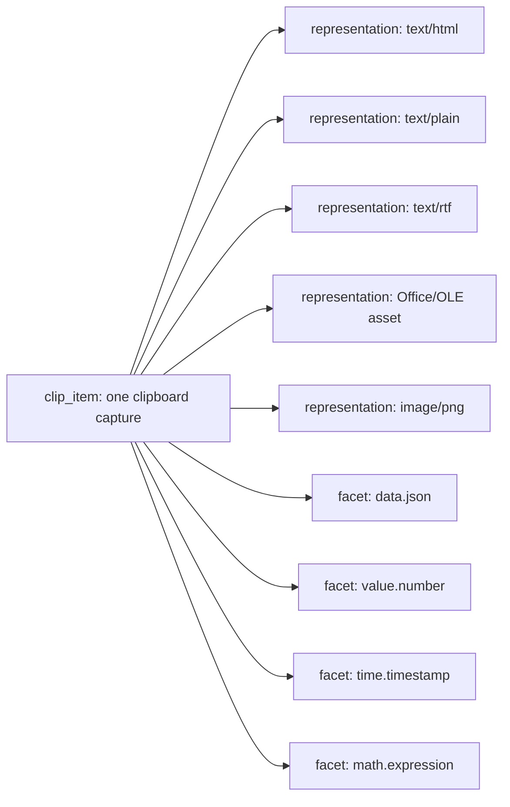
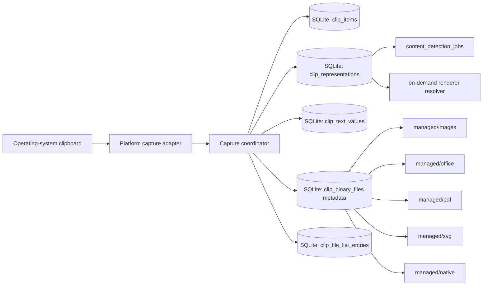
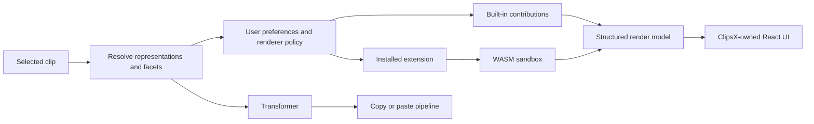
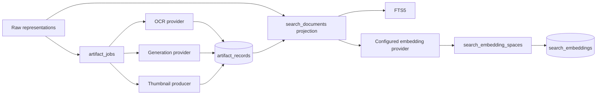

# ClipsX Architecture and Execution Plan

## Purpose

The canonical system design, module boundaries, and runtime flows are in
[ARCHITECTURE.md](ARCHITECTURE.md). This document tracks milestone delivery.

ClipsX will become a local-first programmable clipboard:

`Capture -> Understand -> Render / Transform -> Copy or Paste`

This is a ground-up redesign of local storage and internal boundaries. Existing
local SQLite history is not migrated. The redesign preserves native clipboard
data, especially images and Office/OLE payloads; it removes only persisted
parser and renderer state.

## Decisions Locked for This Program

- SQLite is the catalog, relationship, query, and configuration store.
- Managed application files hold image, Office/OLE, PDF, SVG, unknown native
  formats, and other binary clipboard payloads. SQLite stores only their
  metadata and relative paths; it never stores those payload bytes in a
  generic BLOB table or JSON metadata.
- Plain text, HTML, and RTF are stored in dedicated text-representation rows,
  not as sparse columns on the clip row.
- A clip can own multiple representations and multiple semantic facets.
- Table names use a domain prefix consistently, for example `clip_*`,
  `search_*`, `extension_*`, and `config_*`.
- UI rendering policy is not persisted per clip. It can evolve without a
  database reset.
- Built-ins use the same contribution contracts as extensions. Community code
  runs in sandboxed WASM and returns structured render models; ClipsX owns the
  React UI.
- Transform output is ephemeral by default. Users explicitly choose **Save as
  new clip** when they want a generated result in history.
- AI providers connect directly from the desktop application. v1 has no
  ClipsX model proxy/server.
- Semantic search is provider-first: FTS is always available, no model is
  mandatory, and the first optional embedding provider is user-configured
  Ollama. ClipsX does not retain a hard-wired BGE/SigLIP runtime in its core.
- Visual semantic search is part of delivery, but optional. It first ships as
  an explicitly installed ClipsX local visual-provider package; any later
  provider must prove compatible text-query and image embeddings in one shared
  space.
- Cloud configuration sync, vault sync, and cloud clipboard-history sync are
  out of scope for this program. Configuration is local to the device.
- The extension hub is a reviewed GitHub registry with checksum-pinned
  releases, not a commercial marketplace.
- The supported delivery matrix is macOS, Windows, and Linux/X11.

## High-Level Design

### Clip, representations, and facets

One capture is a `clip_item`. It is not an "HTML clip" or a "JSON clip".
It can have many raw clipboard representations and many additive semantic
facets.



For example, copied HTML commonly contains `text/html` and `text/plain` at
the same time. Both are stored. If the plain text is valid JSON, it also gains
the `data.json` facet. A value may validly have both `value.number` and
`time.timestamp` facets; neither supersedes the other.

### Capture and storage



### Rendering and extensions



### AI, artifacts, and search



## Storage Design

### Managed file layout

```text
clipboard_data/
  managed/
    images/
    office/
    pdf/
    svg/
    native/
  derived/
    thumbnails/
    binary/
  staging/
```

Binary files are immutable, content-addressed objects. A `clip_binary_files`
row records its SHA-256, byte size, relative managed path, and lifecycle state;
it contains no clipboard-format meaning. A representation supplies MIME type,
native type, and the reference to the binary file. Identical bytes may share
one managed file and one `clip_binary_files` row, even when captured by
different clips. A file is deleted only when no representation references it.

The final path is derived from the SHA-256 and is always under the managed
root. It is an implementation detail, not a user-controlled path.

Capture flow:

1. Write binary bytes to a unique file in `staging/`, hash it, and fsync it.
2. In one SQLite transaction, insert or find the `clip_binary_files` row in
   `pending` state and insert the clip and representation references.
3. Atomically rename the staged file to its hash-derived final path, fsync the
   parent directory, then mark the binary-file row `ready`.
4. On startup, reconcile `pending` rows, stale staging files, missing files,
   and unreferenced managed files. Reconciliation is idempotent and never
   deletes a file still referenced by a representation.

### Domain-prefixed SQL tables

All tables are lowercase snake case. The prefix identifies ownership, not a
technical layer.

| Domain | Tables | Purpose |
| --- | --- | --- |
| System | `system_schema_meta` | Fresh-schema identity and version; rejects legacy databases. |
| Clip | `clip_items`, `clip_representations`, `clip_text_values`, `clip_binary_files`, `clip_file_list_entries` | Canonical capture catalog, raw representation references, and managed-file metadata. |
| Content | `content_facet_definitions`, `content_clip_facets`, `content_detection_jobs` | Detector-owned semantic facets and scheduling. |
| Catalog | `catalog_tags`, `catalog_clip_tags` | User organization. |
| Artifact | `artifact_records`, `artifact_inputs`, `artifact_text_values`, `artifact_binary_files`, `artifact_jobs` | OCR, previews/thumbnails, explicit AI output, provenance, binary-derived files, and invalidation. |
| Search | `search_documents`, `search_documents_fts`, `search_embedding_spaces`, `search_embeddings`, `search_index_jobs` | FTS and semantic retrieval. |
| Extension | `extension_installs`, `extension_runtime_state` | Verified local packages, activation, and failure quarantine. |
| Config | `config_profile_values`, `config_device_values` | Local, non-secret configuration. |

### Clip representation constraints

Each `clip_representations` row has:

- `clip_id`
- non-null `format_key`, such as `mime:text/plain` or an exact platform
  format key such as `macos:public.html`
- canonical MIME type, such as `text/plain`, `text/html`, `text/rtf`, or
  `image/png`, when known without guessing
- optional exact native platform type captured from the OS
- storage kind: `text`, `binary_asset`, or `file_list`
- exactly one matching storage reference
- ordinal and capture priority
- lifecycle state: `pending` until storage is complete, then `ready`

Rules:

- A clip may own any number of representations.
- `(clip_id, format_key)` is unique. `format_key` avoids SQLite's `NULL`
  uniqueness behavior and preserves native-only formats without inventing a
  MIME type.
- A binary file path is always relative to the managed root. Its hash and path
  are properties of `clip_binary_files`; MIME and native type are properties
  of the representation.
- Every captured Office/native extra type becomes its own binary asset and
  representation row.
- Unknown native types are retained but written back only when the platform
  adapter explicitly supports their captured type.
- No code may guess UTI, OLE, or other native clipboard types.
- Clip-owned text, file-list, facet, and representation rows cascade on clip
  deletion. The binary-file reconciler removes an unreferenced managed file
  only after the last referencing representation is gone.

Schema enforcement is explicit: text values are one-to-one children keyed by
`representation_id`; file-list entries are keyed by `representation_id` and
ordinal; binary representations carry `binary_file_id`. `CHECK` constraints
reject invalid storage-kind/reference combinations. A representation can move
from `pending` to `ready` only through a SQLite trigger that verifies exactly
the required child/reference exists and, for a binary representation, that its
binary file is `ready`. Only ready representations are visible to renderers,
detectors, search, or clipboard reconstruction.

### Representation byte contract

The storage kind fixes how data is stored, read, rendered, and written back:

| Storage kind | Canonical storage | Read and processing contract | Clipboard reconstruction |
| --- | --- | --- | --- |
| `text` | One `clip_text_values` row containing normalized UTF-8 text, its UTF-8 byte length, and SHA-256. | Detectors, renderers, FTS, and transforms receive UTF-8 text. | The adapter writes normalized text only for a format it explicitly supports. Platform-specific wrappers such as HTML clipboard headers are regenerated by that adapter. |
| `binary_asset` | One `clip_binary_files` reference to immutable bytes in the managed root. | Consumers open the validated relative path, verify ready state, and treat bytes as opaque unless their parser supports the exact format. | The adapter writes the captured exact native type only when it explicitly supports it; it never guesses a UTI, OLE type, or equivalent. |
| `file_list` | Ordered `clip_file_list_entries` records for the copied file URLs/paths; ClipsX does not copy their external file contents. | Renderers treat entries as references that may no longer exist. | The adapter writes supported file-list formats only. |

Normalized text is semantically preserved, not byte-for-byte preserved. If a
platform format requires byte-exact preservation, capture it as a
`binary_asset`; this is mandatory for Office/OLE and unknown native formats.
The supported-format matrix decides which rule applies to each platform format.

### Persisted versus computed data

Never persist the following as canonical clip metadata:

- JSON ASTs or formatted JSON
- Parsed URL/query structures
- Decoded JWT structures
- Renderer trees or renderer state
- Generic transformer output
- Hex-encoded native binary data

Persist only expensive reusable results through `artifact_*` tables. Each
artifact records producer ID/version, input hash, parameter hash, and creation
time. `artifact_inputs` records every ordered representation/artifact input;
text output lives in `artifact_text_values`, and binary output is tracked by
`artifact_binary_files` with a hash, derived-relative path, lifecycle state,
and reconciler. Derived files are never untracked paths.

## Detection, Rendering, and FTS

### Detection

Capture writes raw representations first. Detectors run afterward and never
select one global content type.

Each detector declares accepted representation types, cheap candidate checks,
input limits, timeout, and emitted facets. Candidate routing uses MIME type,
prefix, length, and lightweight signatures before parsing.

### Renderer resolution

Renderer selection is UI policy, not clip state. The resolver uses this order:

1. User preference stored globally by MIME type or facet.
2. Preferred renderer for an available rich/native representation, such as
   Office, image, HTML, or PDF.
3. Preferred renderer for an available facet, such as JSON, JWT, Markdown,
   table, date, or math.
4. Original `text/plain` view.

The active renderer is UI session state. Changing UI heuristics, renderer
priority, or installed renderers does not require a database migration. A new
detector queues compatible history for re-detection from preserved raw data.

### FTS

FTS is compatible with this architecture. `search_documents` is a rebuildable
projection with one row per clip; it is not canonical clipboard storage.

Its document is a deliberate composition: user note, the preferred direct text
representation (`text/plain`, otherwise an approved text representation), and
eligible completed OCR/extraction artifacts. A note augments rather than
replaces captured content. The projection records each included source and its
input hash so a change can rebuild the document deterministically.

If HTML/RTF text extraction is required for search, it is either rebuilt in
the search projection or stored as a versioned extraction artifact. It is not
written into clip metadata. Rebuild a clip's projection whenever an eligible
source changes, and rebuild all projections when the projection algorithm
version changes.

## AI and Model Providers

### Provider interfaces

The desktop app connects directly to providers selected by the user. There is
no ClipsX model proxy/server in v1.

Provider capabilities:

- `TextEmbeddingProvider`
- `MultimodalEmbeddingProvider`
- `GenerationProvider`
- `OcrProvider`

Initial implementations:

- Disabled text-embedding provider, which is the default and leaves FTS fully
  functional
- Ollama text-embedding provider, delivered first
- OpenAI-compatible text-embedding provider, delivered only after the Ollama
  path is validated
- Optional ClipsX local visual-provider package, delivered for visual search;
  it owns its runtime, tokenizer, preprocessing, and model package and is not
  installed automatically

The provider host owns consent, job scheduling, retries, embedding-space
validation, and rebuilds. Each provider owns model invocation, tokenization,
preprocessing, and vector production. A future optional ClipsX local provider
may be added as another provider package; it is not a core dependency and is
never downloaded or selected automatically.

Every embedding provider implements `describe`, `embed_documents`, and
`embed_query`. A multimodal provider additionally implements `embed_images`.
`describe` returns the immutable space fingerprint: provider kind, canonical
endpoint identity when applicable, model ID and revision/digest when available,
modality, dimensions, normalization, and distance metric. A configuration or
descriptor change creates a new embedding space. The host rejects a vector
whose dimension or descriptor does not match that space.

### Configuration and privacy

| Scope | Examples |
| --- | --- |
| Profile | Enabled capability, selected provider/model, safe provider label, renderer preference, transform favorite. |
| Device | Ollama endpoint, selected model, local path, GPU/runtime choice. |
| Secret | API keys and auth tokens in OS secure storage only. |

Rules:

- No model download occurs automatically.
- Remote generation is user-invoked only.
- Remote embedding/indexing needs explicit provider-level opt-in.
- Clipboard content is never sent to hosted providers silently.
- Endpoints, local paths, and credentials never leave the device.

### Embeddings and AI artifacts

`search_embedding_spaces` identifies provider, model, revision, modality,
dimensions, normalization, and distance metric. Queries run only within one
compatible space. Provider/model changes create or select another space and
schedule reindexing.

Vectors remain in `search_embeddings`; they are fixed-size search data, not
clipboard payloads. OCR, explicit summaries, and other expensive model output
are versioned `artifact_records`.

`search_*` is disposable local index state. The user can clear an embedding
space or all semantic-search data and rebuild it from preserved clips. Changing
provider/model creates a new space and queues a rebuild; incompatible vectors
are never mixed.

Initial OCR is native and local only. A platform without a supported local OCR
engine records `unsupported`; it does not fall back to a hosted service. Remote
OCR is a later explicit provider choice. Generation is user-invoked only and
is delivered after semantic search is stable.

### Initial semantic-search scope

M4 delivers text semantic search through Ollama. The user supplies a
local Ollama endpoint and selects an installed model. ClipsX probes the model's
embedding capability instead of assuming capability from its name. If Ollama
is unavailable, the model is unsuitable, or the user disables semantic search,
the app continues with FTS alone.

Current bundled BGE text-search code, model artifacts, and automatic
model-download logic are removed only after the Ollama path has passed its
acceptance tests. The existing visual-model implementation is refactored into
the optional local visual-provider package; image capture, preview, and OCR
remain independent of it.

## Extensions

### Contribution contracts

- Detector: emits additive facets.
- Renderer: returns a structured render model.
- Transformer: produces an explicit output representation.

Built-ins are enabled by default and use the same contracts as public
extensions.

Embedding providers are host-owned for this program. Ollama,
OpenAI-compatible providers, and the optional local visual provider implement
the Rust provider interface. Community WASM packages do not register model
providers; the generic Ollama and OpenAI-compatible integrations are the
supported user/developer route for other models and services.

### WASM runtime and registry

Community extensions run in WASM. They receive explicit input and have no
direct access to clipboard history, SQLite, filesystem, network, shell,
environment, React components, or arbitrary frontend code.

Renderers return `text`, `code`, `markdown`, `table`, `tree`, `key/value`,
`image`, or `error`. ClipsX renders those models with owned React components.

The reviewed GitHub registry publishes package ID/version, release URL,
SHA-256, compatibility, permissions, and contribution metadata. Normal
installation requires a checksum-pinned registry release. Local packages are
available only in Developer Mode with a persistent warning.

## Execution Milestones

### M0 — Foundation and reset

- [ ] Add architecture decision records for storage, renderer policy, WASM,
  providers, and byte-exact versus normalized reconstruction rules.
- [ ] Approve the source-controlled platform format matrix: capture support,
  `format_key`, storage kind, renderer, write-back support, and unsupported
  behavior for macOS, Windows, and Linux/X11.
- [ ] Define typed representation, artifact/job, renderer, transformer,
  preview, paste, provider, and embedding-space contracts before creating the
  baseline schema.
- [ ] Replace legacy migrations with the fresh domain-prefixed baseline.
- [ ] Add legacy-schema detection and an explicit factory-reset flow that
  deletes ClipsX databases, managed and derived files, jobs, indexes,
  configuration, and ClipsX keychain secrets, but never external provider or
  model-service data.
- [ ] Add isolated test data roots and reset scripts.
- [ ] Implement managed-file staging, recovery, and orphan cleanup.

**Exit:** The schema, platform format matrix, representation/artifact/provider
contracts, and reset behavior are approved; fresh setup and reset work
reliably; legacy databases are rejected with a clear reset instruction.

### M1 — Multi-representation capture

- [ ] Replace `ClipItem`, `content_type`, `detected_type`, and `metadata`.
- [ ] Implement the `clip_*` repositories and managed-asset lifecycle.
- [ ] Refactor macOS, Windows, and Linux/X11 capture adapters for multiple
  representations.
- [ ] Preserve HTML/plain/RTF, PNG, PDF, SVG, Office/OLE, file lists, and
  captured native extras independently.
- [ ] Retain tags, notes, favorites, pins, source-app metadata, and limits.
- [ ] Capture one coherent clipboard snapshot; abandon and retry a capture if
  the platform reports that clipboard contents changed while formats were read.
- [ ] Define and enforce retention by clip count, age, and physical managed
  storage bytes; pinned/favorited clips are protected and shared binary bytes
  are counted once on disk.
- [ ] Reconstruct original data only from supported captured types.

**Exit:** A rich Office capture survives restart with all its raw
representations intact.

### M2 — Facets and renderer resolution

- [ ] Define built-in facets and extension namespaces.
- [ ] Implement candidate routing and `content_detection_jobs`.
- [ ] Persist additive facets with source-representation provenance.
- [ ] Implement renderer registry and structured render-model IPC.
- [ ] Replace single-type frontend preview routing.
- [ ] Implement global renderer preferences and historical re-detection.

**Exit:** JSON, HTML, Office, and ambiguous number/date content can expose
multiple views without changing clip storage.

### M3 — Transformer and paste pipeline

- [ ] Implement JSON, Base64, curl-to-fetch, JSON-to-TypeScript,
  HTML-to-Markdown, JWT, and URL utilities.
- [ ] Implement original, plain-text, and transformed paste policies.
- [ ] Use one path for preview, copy transformed, and paste transformed.
- [ ] Add explicit **Save as new clip** and keyboard-first transformation UX.
- [ ] Prevent app-originated clipboard writes from creating accidental clips.

**Exit:** Previewed, copied, and pasted transformed bytes are identical.

### M4 — Artifacts, FTS, and provider foundation

- [ ] Move OCR, thumbnails, and approved model output into `artifact_*`.
- [ ] Build/rebuild `search_documents` from approved sources.
- [ ] Implement native-local OCR with completed, failed, and unsupported
  artifact/job states; do not add hosted OCR fallback.
- [ ] Implement the provider host, provider descriptors, embedding-space
  validation, and the disabled text-embedding provider.
- [ ] Keep FTS usable with all semantic providers disabled.

**Exit:** FTS, local OCR where available, artifact provenance, and the
provider/index lifecycle work without any configured model.

### M4a — Ollama text embeddings

- [ ] Add loopback Ollama endpoint validation, installed-model discovery,
  explicit model selection, and embedding-capability probing. Treat a
  non-loopback endpoint as remote and require the M6 consent flow.
- [ ] Add local provider-profile configuration, embedding spaces, consent, and
  resumable reindexing.
- [ ] Remove hard-wired BGE text-search services, model artifacts, and
  automatic model-download logic after the Ollama acceptance tests pass.

**Exit:** A user can use FTS alone or select an installed Ollama embedding
model; switching or clearing the profile safely rebuilds the local index.

### M4b — Optional local visual provider

- [ ] Refactor the existing visual-model implementation into an optional local
  provider package with manual installation, removal, and version reporting.
- [ ] Publish the official provider/model package through a checksum-pinned,
  signed release manifest; record its license and never download it
  automatically.
- [ ] Generate one canonical, safe preview artifact per eligible image,
  PDF, or Office representation and record its input provenance.
- [ ] Embed previews and text queries only through the same declared
  multimodal space; reject providers that cannot prove this compatibility.
- [ ] Rebuild or clear visual embeddings independently from text embeddings.

**Exit:** Users can opt into local visual search without a mandatory model;
text and visual spaces remain isolated and independently rebuildable.

### M5 — WASM extensions and registry

- [ ] Register built-ins through extension contracts.
- [ ] Validate contracts before freezing Extension API v1.
- [ ] Implement manifest/package validation and WASM resource limits.
- [ ] Implement verified registry installation, cache, failure quarantine, and
  the Extensions UI.

**Exit:** Verified extensions safely detect, render, and transform; invalid
checksums, traps, and timeouts are rejected.

### M6 — Additional user-selected providers and generation

- [ ] Add the OpenAI-compatible text-embedding adapter after the Ollama path
  is stable.
- [ ] Add user-invoked generation through Ollama and OpenAI-compatible
  providers; require explicit remote consent for every hosted request.
- [ ] Store generation results as versioned artifacts; index them only when
  the user explicitly approves them for search.
- [ ] Keep provider configuration local, API keys in OS secure storage, and
  model/service failures non-blocking.

**Exit:** Users can choose disabled, Ollama, or OpenAI-compatible text
providers and explicitly use generation without silent data transmission.

### M7 — Release validation

- [ ] Remove obsolete legacy schema, parser, asset, and frontend type-routing
  code.
- [ ] Document supported formats, reset behavior, providers, extensions, and
  local-configuration limits.
- [ ] Run the full test matrix on macOS, Windows, and Linux/X11.

## Test Plan

### Unit

- [ ] Multi-representation and native-type constraints.
- [ ] Additive facets for ambiguous number/date/timestamp input.
- [ ] Detector routing, malformed input, limits, and timeout behavior.
- [ ] Renderer selection and fallback policy.
- [ ] FTS source ordering and projection rebuilds.
- [ ] Transform validation and deterministic output.
- [ ] Paste reconstruction without type guessing.
- [ ] Artifact invalidation, embedding-space compatibility, and provider
  failure fallback.
- [ ] Representation-ready trigger enforcement and artifact binary/input
  provenance constraints.
- [ ] Ollama endpoint validation, model discovery, capability probing, and
  unavailable-service fallback to FTS.
- [ ] Provider/model switch and explicit index-clear rebuild behavior.
- [ ] Provider descriptor fingerprint, dimension, normalization, modality, and
  query/document compatibility rejection.
- [ ] Native OCR supported, failed, and unsupported outcomes.
- [ ] Visual-provider package installation, preview provenance, and text/image
  shared-space compatibility.
- [ ] Explicit hosted-generation consent, artifact storage, and search-index
  approval behavior.
- [ ] WASM manifest/checksum/sandbox/resource-limit handling.
- [ ] Local configuration validation and secret exclusion.
- [ ] `format_key` uniqueness with absent MIME/native values.
- [ ] FTS composition: note plus raw text plus eligible artifact text.

### Integration

- [ ] Fresh baseline, foreign keys, cascades, transactions, and restart
  recovery.
- [ ] Factory reset removes all ClipsX local databases, managed and derived
  files, jobs, indexes, configuration, and ClipsX keychain secrets without
  touching external provider data.
- [ ] Staged-file interruption, orphan cleanup, missing files, and hash
  mismatch handling.
- [ ] Shared content-addressed file retention after one of several referencing
  clips is deleted.
- [ ] Pending representation/file recovery; incomplete representations never
  appear in the UI, detector, search, or paste path.
- [ ] Clipboard changes during multi-format capture; no clip may combine
  representations from different clipboard snapshots.
- [ ] Disk-full, SQLite-full, managed-root symlink/path-traversal, and locked
  file handling.
- [ ] Multi-representation capture/reconstruction through fake adapters.
- [ ] OCR/artifact-driven FTS updates and provider reindexing.
- [ ] Ollama fixture: text embedding, invalid model, timeout, cancellation,
  interrupted reindex, and no-provider FTS fallback.
- [ ] Optional local visual-provider fixture: package absent, package removed,
  preview generation failure, compatible query/image search, and clear/rebuild.
- [ ] OpenAI-compatible fixture: keychain secret handle, consent denial,
  timeout, malformed response, and user-approved generation artifact.
- [ ] Registry and WASM fixture installation.

### Desktop end-to-end

- [ ] Copy HTML plus plain text and verify both representations.
- [ ] Capture Office content and verify all assets/native types after restart.
- [ ] Verify JSON renderer preference with original text still available.
- [ ] Verify ambiguous numeric/date content exposes applicable views.
- [ ] Transform, preview, copy, paste, and explicitly save output.
- [ ] Validate FTS-only and Ollama embedding configurations.
- [ ] Install the local visual-provider package, search a captured image by
  text, then clear and rebuild its visual index.
- [ ] Validate user-invoked local and hosted generation; hosted content is sent
  only after the explicit request and consent step.
- [ ] Validate extension installation/rejection, local configuration, and
  reset.
- [ ] Run the flow on macOS, Windows, and Linux/X11.

## Completion Criteria

The redesign is complete when raw representations are preserved independently
from facets and rendering; binary/native data remains in managed files;
renderer and extension changes do not require a database reset; FTS and
provider search operate on rebuildable projections; and the complete test
matrix passes on every supported platform.
