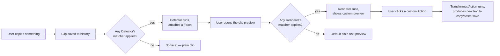
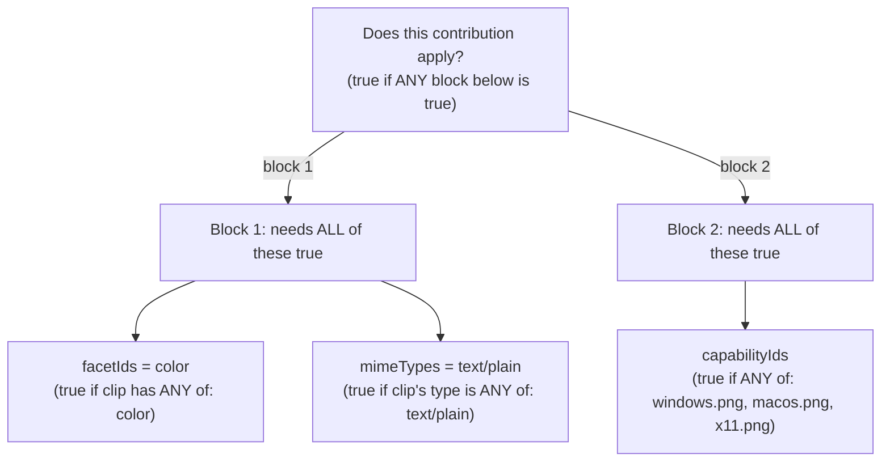
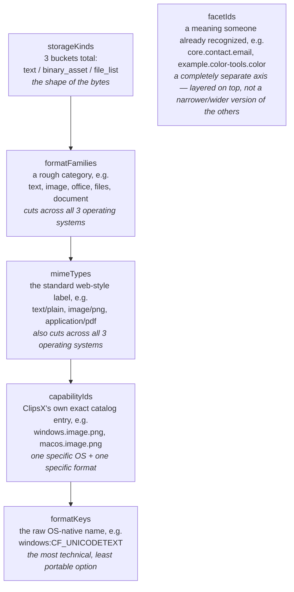
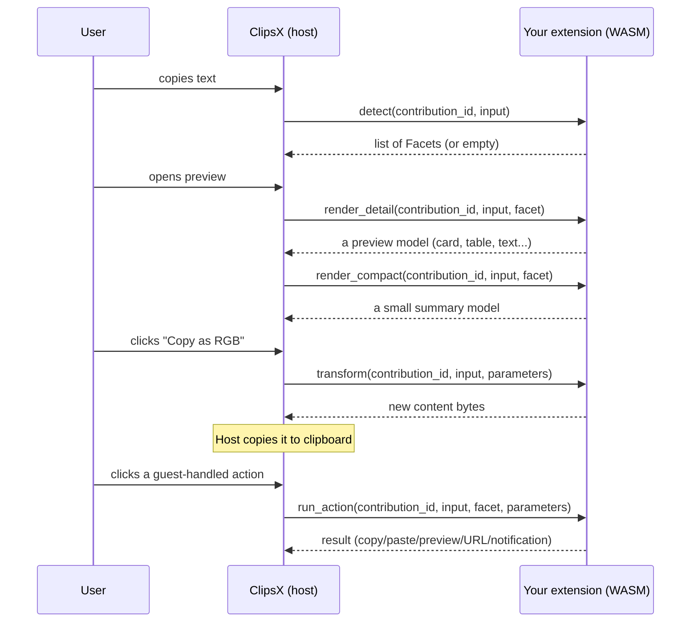
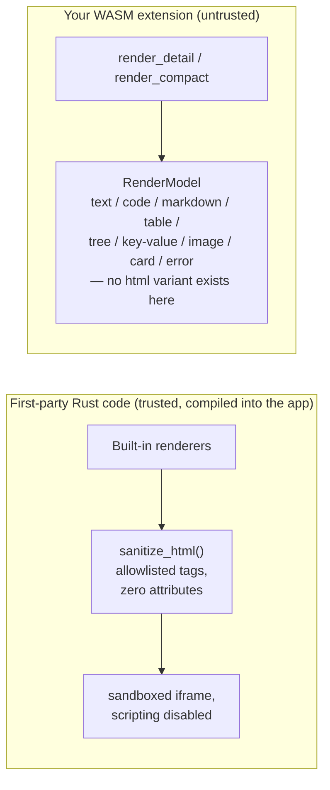
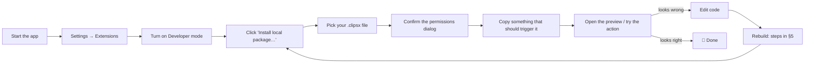

# Building a ClipsX Extension (v2) — A Beginner's Walkthrough

This guide assumes nothing. Every term gets explained in plain English the first time it shows up. If something is still confusing, that's a bug in this doc, not you.

This is the single, complete doc for Extension API v2 — a beginner-friendly walkthrough *and* the full technical reference in one place, so there's nowhere else you need to look. The canonical machine-checked contract is [`src-tauri/wit/clipsx-extension.wit`](../src-tauri/wit/clipsx-extension.wit), if you ever want the raw source of truth behind what's explained here. The working example we'll keep pointing to is [`examples/extensions/color-tools`](../examples/extensions/color-tools) — a real, small extension that recognizes colors (like `#FF0000` or `rgb(255 0 0)`) copied to the clipboard and shows a nice color swatch preview.

## First, the glossary

You'll see these words a lot. Read this once before continuing.

| Word | What it actually means |
|---|---|
| **Extension** | A small add-on program you write that plugs into ClipsX to add new behavior — recognizing new kinds of content, showing custom previews, or converting text into another format. |
| **WASM (WebAssembly)** | A safe, sandboxed program format. Your Rust code gets compiled into a `.wasm` file. "Sandboxed" means it runs in a locked box with no access to your files, network, or clipboard unless ClipsX explicitly hands it something. |
| **Manifest** | A text file (`clipsx-extension.toml`) describing *what your extension is allowed to do* — its name, version, and the list of features it adds. Think of it as the label on a food package: ingredients and nutrition facts, not the food itself. |
| **Contribution** | One single feature your extension adds. Every contribution is one of four kinds: **detector**, **renderer**, **transformer**, or **action** (explained below). One extension can have several contributions. |
| **Facet** | A little sticky note the host attaches to a clip, saying "hey, this looks like a color" (or a URL, or an email, etc.). Detectors create facets; renderers/actions look for them. |
| **Matcher** | A rule that says "this contribution only applies to clips that look like ___." Explained in detail in §3. |
| **Host** | The main ClipsX app itself (not your extension). The host calls into your extension's code and only shows the extension exactly what it needs to see. |

## The big picture — what actually happens when someone copies text



Four kinds of contributions, mapped onto that diagram:

1. **Detector** — looks at the raw clip and decides "does this match something I care about?" If yes, it attaches a **facet** (the sticky note).
2. **Renderer** — looks at a clip (usually one with a specific facet) and produces a nicer preview than plain text — a card, a table, a color swatch, etc.
3. **Transformer** — takes a clip's content and produces *new* content (e.g. turn `#FF0000` into `rgb(255 0 0)`).
4. **Action** — something the user can click, usually built on top of a transformer (e.g. a "Copy as RGB" button in a menu).

## Does this work on macOS, Linux, and Windows?

Yes, on both ends, for two different reasons:

- **The extension you build runs identically everywhere.** Your Rust code compiles into `component.wasm` — a sandboxed WASM file, not a native macOS/Linux/Windows program. ClipsX loads that exact same file on all three operating systems. You build it once; you don't build a separate version per OS.
- **You can *develop* it from any of the three.** Rust, `rustup`, and the `wasm32-wasip2` target all work the same way on macOS, Linux, and Windows. The only thing that changes between operating systems is the *shell command syntax* for everyday tasks like copying a file — not the extension mechanics themselves. Every command block below that has an OS-specific difference shows both a macOS/Linux version and a Windows (PowerShell) version.

One thing that genuinely *is* OS-specific: the `capabilityIds` and `formatKeys` matcher fields from §3 (e.g. `windows.image.png` vs. `macos.image.png` vs. `linux.image.png`). That's not a limitation of your dev machine — it's because the clipboard itself works differently per OS, so those two fields exist specifically to let you target OS-native formats when you need to. If you stick to `mimeTypes`, `formatFamilies`, `storageKinds`, and `facetIds`, your matchers are OS-independent by construction.

## 0. What files make up an extension

A finished extension is just a `.clipsx` file, which is actually a ZIP file (like a `.zip`, just renamed) containing:

- `clipsx-extension.toml` — the manifest (the label).
- `component.wasm` — your compiled code (the actual program, in the sandboxed WASM format).
- Optionally `README.md`, `LICENSE`.

Nothing else is allowed inside. ClipsX checks this and rejects anything else.

## 1. Install the one build tool you need

Your Rust code needs to be compiled to WASM specifically for a target called `wasm32-wasip2`. This one command is identical on macOS, Linux, and Windows — run it in whichever terminal/shell you normally use:

```bash
rustup target add wasm32-wasip2
```

(If you don't have Rust/`rustup` yet, install it from [rust-lang.org](https://www.rust-lang.org/tools/install) first. On Windows, the installer will also prompt you to install the Microsoft C++ Build Tools if you don't already have them — that's a normal Rust-on-Windows requirement, unrelated to ClipsX specifically, and you only need to do it once.)

Also run `npm install` at the repo root once, if you haven't — that gives you the packaging/validation commands used later.

## 2. Copy the example as your starting point

Don't start from a blank file — copy the working example and modify it. This is the fastest way to avoid silly mistakes.

macOS / Linux (bash or zsh):

```bash
cp -r examples/extensions/color-tools examples/extensions/my-extension
cd examples/extensions/my-extension
rm -rf target Cargo.lock
```

Windows (PowerShell):

```powershell
Copy-Item -Recurse examples/extensions/color-tools examples/extensions/my-extension
cd examples/extensions/my-extension
Remove-Item -Recurse -Force target, Cargo.lock -ErrorAction SilentlyContinue
```

Open `Cargo.toml` and just rename things:

```toml
[package]
name = "clipsx-my-extension"
version = "0.1.0"
edition = "2021"

[lib]
crate-type = ["cdylib"]

[dependencies]
serde_json = "1"
wit-bindgen = "0.57.1"

[profile.release]
opt-level = "s"
lto = true
strip = true
```

You don't need to understand every line here — this is boilerplate every extension needs unchanged, except the `name`/`version`.

## 3. The manifest — and what "matchers" really mean

This is the part that confuses people most, so let's go slow.

A **matcher** answers one question: *"does this contribution apply to this particular clip?"*

Each matcher is written as one or more blocks like this:

```toml
[[contributions.matchers]]
mimeTypes = ["text/plain"]
```

You can have several of these blocks under the same contribution, and each block can list several *fields* (`mimeTypes`, `facetIds`, `capabilityIds`, etc.), and each field can list several *values*.

Here's the rule, explained without jargon, using an everyday analogy — **checking if someone is allowed into a club**:

- **Each whole block is a separate "way to get in."** If you satisfy *any one block*, you're in. (Like: "VIP pass holders **OR** people on the guest list get in.")
- **Inside one block, every field listed must be true at once.** (Like: "on the guest list **AND** wearing a suit." Both required, not either.)
- **Inside one field, any single listed value is enough.** (Like: "wearing a suit that is black **OR** navy **OR** grey." Just needs to match one color.)

Picture it as a tree:



Concretely, from the real color-tools example:

```toml
[[contributions.matchers]]
facetIds = ["example.color-tools.color"]
mimeTypes = ["text/plain"]

[[contributions.matchers]]
capabilityIds = ["windows.image.png", "macos.image.png", "linux.image.png"]
```

In plain English this says: **"Show this if the clip has the color facet AND is plain text — OR, separately, if the clip is a PNG image, on whichever of Windows/macOS/Linux it was copied on."**

Two totally different ways to qualify; either is fine.

### The six fields you can match on — what are they, actually?

Every field inside a matcher block looks at the *same clip* but from a different angle. Some are wide nets, some are pinpoint-precise. Here's the honest breakdown, from the widest to the narrowest, plus one field that's completely separate from the rest.



1. **`storageKinds`** — the crudest possible bucket. Every clip is exactly one of three shapes: `text` (a string), `binary_asset` (raw bytes, like an image), or `file_list` (a list of file paths, e.g. from dragging files). This is the *only* field here with a truly fixed, closed list — there will never be a fourth value.

2. **`formatFamilies`** — a rough, human-sized category that groups similar formats together regardless of which OS they came from. Real values that exist today: `text`, `rich_text`, `image`, `document`, `files`, `office`, plus a few narrower ones (`office_metadata`, `office_signal`, `virtual_files`, `transport_metadata`). Use this when you want "any image, I don't care which exact codec" — `formatFamilies = ["image"]` catches PNG, JPEG, TIFF, SVG, DIB, all of it, on every OS.

3. **`mimeTypes`** — the standard web-style type string you already know from HTML/HTTP, e.g. `text/plain`, `text/html`, `image/png`, `application/pdf`. This field is genuinely open-ended (no fixed list — it's just whatever string the source format declares), but in practice you'll only ever see the common, boring ones. Prefer this over `formatFamilies` when you specifically care about "PNG, not any image" but still don't care which OS.

4. **`capabilityIds`** — ClipsX's own precise catalog of "exact format on exact OS," e.g. `windows.image.png`, `macos.image.png`, `linux.image.png`, `windows.files.hdrop`, `macos.office.package`. The full, authoritative list lives in [`docs/platform-format-matrix.json`](./platform-format-matrix.json) — open it and search for `"id"` to see every value that exists today. Use this only when you genuinely need to treat, say, Windows PNGs differently from macOS PNGs; otherwise `mimeTypes` is simpler and already OS-independent.

5. **`formatKeys`** — the rawest, most technical option: literally the operating system's own internal name for the format, in the shape `"<platform>:<native-name>"`, e.g. `"windows:CF_UNICODETEXT"`, `"windows:CF_HDROP"`, `"windows:HTML Format"`. You will almost never need this — it's there for extensions that need to distinguish between two native formats that ClipsX's own `capabilityIds` catalog happens to lump together. Start with `mimeTypes` or `capabilityIds`; only reach for this if those aren't precise enough.

6. **`facetIds`** — the odd one out. This isn't about the *format* of the bytes at all — it's about *meaning* a detector already recognized, regardless of format. ClipsX ships with built-in detectors that already tag common things, all named `core.*`: `core.link.url`, `core.contact.email`, `core.contact.phone`, `core.value.color`, `core.value.number`, `core.data.json`, `core.data.table`, `core.text.code`, `core.text.markdown`, `core.security.secret`, `core.token.jwt`, `core.file.path`, `core.time.date`, `core.math.expression`. Your own detector's facets show up qualified as `yourPackageId/yourLocalId` (matched in your own manifest using the fully-qualified form, as in the color-tools example: `facetIds = ["example.color-tools.color"]`). Use this when you want to build a *renderer* or *action* on top of something a detector (yours or the built-in ones) already found — which is most of the time, once you're past the detector itself.

**Rule of thumb for which one to reach for:**

- Writing a **detector** that inspects raw, un-tagged clips → use `mimeTypes` and/or `storageKinds` (you haven't got a facet yet — nobody's tagged this clip as anything).
- Writing a **renderer** or **action** for something already tagged → use `facetIds`, optionally narrowed further with `mimeTypes`.
- Need OS-specific behavior (e.g. "only on Windows") → use `capabilityIds`.
- Everything else → you're probably overthinking it; `mimeTypes` alone covers most cases.

### The rest of the manifest fields

At the top of the file, identity info:

| Field | What it means |
|---|---|
| `schemaVersion` | Always `2` for this version of the extension system. |
| `packageId` | A unique name for your extension, lowercase letters/digits/`.`/`-`/`_` only, e.g. `example.my-extension`. |
| `version` | Your extension's own version number, e.g. `"0.1.0"`. |
| `apiVersion` | Which version of *ClipsX's* extension system you're targeting, e.g. `"^2.0"` (the `^` means "2.0 or any compatible later 2.x"). |
| `displayName` | The friendly name users see. |
| `description`, `license` | Optional, human-readable. |

Then, one `[[contributions]]` block per feature you're adding:

| Field | What it means |
|---|---|
| `id` | A short local name for this one feature, e.g. `"detect-thing"`. |
| `kind` | One of `"detector"`, `"renderer"`, `"transformer"`, `"action"`. |
| `displayName` | Friendly name for this feature. |
| `matchers` | The rule from above — required for `renderer` and `action` (there's no "match everything"). |

Extra fields depending on `kind`:

- **detector**: `emitsFacetIds` — list of facet names this detector is allowed to create.
- **renderer**: `purpose` (pick exactly one word describing the *style* of preview: `faithful`, `structured`, `semantic`, `source`, or `diagnostic`), `surfaces` (list containing `detail` and/or `compact` — detail is the big preview, compact is the small thumbnail-style row in history), `icon` (must be one of a fixed list ClipsX provides — see below, you can't bring your own icon image).
- **transformer**: `parameterSchema` — describes what options the transform takes (e.g. "format: hex, rgb, or hsl"); also `execution`, either `local` (default — offline, runs entirely in the sandbox, works today) or `capability_backed` (intended for transforms that need to call out to an external HTTPS API — see the permissions note below; this is validated but **not runnable yet**, since the broker that would make outbound calls on your behalf hasn't shipped. Stick to `local` for anything you want users to actually use today).
- **action**: `icon`, `effects` (what kinds of results this action is allowed to produce — `copy`, `paste`, `preview`, `save_as_clip`, `open_https_url`, `notification`), and `handler` — see below.

### Declaring network access (roadmap feature — not usable yet)

The manifest schema already has a top-level `[permissions]` section for extensions that will eventually need to call an external HTTPS API (e.g. a translation service, a currency-conversion API):

```toml
[[permissions.http]]
origin = "https://api.example.com"
methods = ["GET"]
maxResponseBytes = 1048576

[[permissions.credentials]]
id = "example-api-key"
label = "Example API Key"
placement = "header:Authorization"
```

Be honest with yourself about whether you need this today: **declaring this does not make network access work.** ClipsX validates the declaration and shows it to the user in the install disclosure dialog, but the actual broker that would enforce origin/method allowlists, size limits, timeouts, and inject stored credentials into requests without ever exposing them to your WASM code hasn't been built yet. Any `capability_backed` transformer or action that depends on this is installed but marked **unavailable** until that ships. If your extension doesn't need network access, just omit `[permissions]` entirely — that's the common case, and it's what the color-tools example does.

**Allowed icons** (exact spelling, nothing else works): `braces`, `code`, `database`, `file`, `globe`, `hash`, `key`, `link`, `palette`, `table`, `terminal`, `text`.

**Action handlers**, two flavors:

1. `{ kind = "transformer_preset", transformerId = "...", parameters = { ... }, disposition = "copy" }` — the easy way. You point at a transformer you already wrote, give it fixed parameters, and say what to do with the result (`copy` to clipboard, `paste`, `preview`, or `save_as_clip`). No extra Rust code needed.
2. `{ kind = "guest" }` — the extension's own code decides what happens, via the `run_action` function (§4).

A complete minimal example (a detector + a preview renderer, nothing fancy):

```toml
schemaVersion = 2
packageId = "example.my-extension"
version = "0.1.0"
apiVersion = "^2.0"
displayName = "My Extension"
description = "Does a thing."
license = "MIT"

[[contributions]]
id = "detect-thing"
kind = "detector"
displayName = "Thing detector"
emitsFacetIds = ["thing"]

[[contributions.matchers]]
mimeTypes = ["text/plain"]

[[contributions]]
id = "thing-card"
kind = "renderer"
displayName = "Thing"
purpose = "structured"
surfaces = ["detail", "compact"]
icon = "hash"

[[contributions.matchers]]
facetIds = ["example.my-extension.thing"]
```

## 4. Writing the code — five functions, called at five different moments

Your `component.wasm` must provide up to five functions. You only need to actually *do something* in the ones your contributions use — for the rest, just return "not supported."



Boilerplate every extension needs, unchanged except the struct name:

```rust
mod bindings {
    use super::MyExtension;
    wit_bindgen::generate!({ path: "../../../src-tauri/wit", world: "extension" });
    export!(MyExtension);
}

use bindings::clipsx::extension::types::{
    Facet, GuestError, GuestErrorCode, Representation, RenderModel, CompactModel,
    OutputRepresentation, ActionResult,
};

struct MyExtension;

impl bindings::Guest for MyExtension {
    fn detect(contribution_id: String, input: Representation) -> Result<Vec<Facet>, GuestError> {
        // "no match" = Ok(empty list), NOT an error
        Ok(Vec::new())
    }

    fn render_detail(contribution_id: String, input: Representation, facet: Option<Facet>) -> Result<RenderModel, GuestError> {
        Err(GuestError { code: GuestErrorCode::Unsupported, message: "not implemented".into() })
    }

    fn render_compact(contribution_id: String, input: Representation, facet: Option<Facet>) -> Result<CompactModel, GuestError> {
        Err(GuestError { code: GuestErrorCode::Unsupported, message: "not implemented".into() })
    }

    fn transform(contribution_id: String, input: Representation, parameters_json: String) -> Result<Vec<OutputRepresentation>, GuestError> {
        Err(GuestError { code: GuestErrorCode::Unsupported, message: "not implemented".into() })
    }

    fn run_action(contribution_id: String, input: Representation, facet: Option<Facet>, parameters_json: String) -> Result<ActionResult, GuestError> {
        Err(GuestError { code: GuestErrorCode::Unsupported, message: "not implemented".into() })
    }
}
```

What each function is actually for, in plain words:

- **`detect`** — "Look at this clip. Do you recognize it? If yes, attach a note (facet) describing what you found." Every function receives a `contribution_id` because one `.wasm` file can implement several contributions — the very first thing you do is check `if contribution_id != "detect-thing" { return Ok(Vec::new()) }` so you only act on the calls meant for you.
- **`render_detail`** — "Build the big preview shown when someone opens this clip." Return one of: plain `text`, `code` (with syntax highlighting), `markdown`, a `table`, a `tree`, `key-value` pairs, an `image` (only a thumbnail the *host* already has — you can't hand it a picture of your own), a `card` (title + subtitle + a few fields + an icon/color swatch), or an `error`.
- **`render_compact`** — "Build the small summary shown while scrolling through history." Must include a text description for accessibility (`accessibility_label`) even if everything else is visual.
- **`transform`** — "Take this clip's content and turn it into something else." Returns actual new content (bytes), not instructions.
- **`run_action`** — only used for `{ kind = "guest" }` actions. "The user clicked your button — do the thing and tell me the result": either output to copy/paste/preview/save, or a notification, or a link to open (must be a secure `https://` link).

### The render-output contract — what shapes can a renderer actually produce?

The right mental model here isn't "the UI is fixed" (too vague) — it's: **a renderer never draws anything itself; it only fills out one of a handful of pre-defined *shapes*, and the host draws every one of those shapes the same way for every extension.** That closed list of shapes is called `RenderModel` in the WIT contract, and right now it has exactly nine members: `text`, `code`, `markdown`, `table`, `tree`, `key-value`, `image`, `card`, `error`. There is no `html`, `component`, or `custom` shape in that list, and extensions have no way to add one. Concretely, that means an extension **cannot** ship HTML, React, CSS, SVG, JavaScript, or point at an arbitrary image/asset URL — those words never appear anywhere in what a `Guest` implementation is allowed to return.

What you actually control, per shape, is data — never markup or styling:

- *which* shape you return (a card vs. a table vs. plain text),
- the text that goes into that shape's fields (title, subtitle, table cells, etc.),
- one icon, chosen from the fixed catalog (`braces`, `code`, `database`, `file`, `globe`, `hash`, `key`, `link`, `palette`, `table`, `terminal`, `text`),
- or, for a `card`/`compact` leading visual, a color swatch (`Rgba { red, green, blue, alpha }`) or a one/two-character monogram instead of an icon.

Everything else — the exact card layout, fonts, spacing, light/dark theming, animations — is the host's job, identical for every extension. That's *why* every extension's preview automatically looks like it belongs in ClipsX, and it's also the security property: an extension can't build a fake password prompt or a fake OS dialog, because there's no shape in the contract expressive enough to build one.

#### "But `markdown` is text-with-formatting — couldn't that smuggle in HTML?"

No — and this is worth actually understanding rather than taking on faith, because "no script, so it's probably fine" is a common but wrong intuition. Two independent things stop it:

1. The markdown renderer ClipsX uses (`react-markdown`) parses raw HTML tags inside markdown source as literal, inert text, not as elements — there's no opt-in step turning that back on. So writing `` inside your `markdown(string)` output just prints those literal characters on screen; it doesn't create an image.
2. Even if it did render, the app's Content-Security-Policy locks image/media loading to the app's own local resources (`self`, `data:`, `blob:`, and its own asset protocol) — so an `` beacon, the classic HTML-email tracking/exfiltration trick, would be blocked at the network layer regardless.

That second point is the actual reason "plain HTML, no `<script>`" isn't automatically safe: **HTML without any JavaScript can still exfiltrate data and phish**, using only tags and attributes — an `` or CSS `background: url(...)` that silently pings an attacker's server, a `<meta http-equiv="refresh">` that redirects the page, a fake `<input>`/`<form>` styled to look like a real dialog. None of that needs `<script>`. The dangerous part of HTML isn't the scripting language sitting next to it — it's *attributes that name a destination* (`src`, `href`, `action`, `style` with a `url()`) plus something willing to act on them (fetch it, navigate to it, submit to it).

Interestingly, ClipsX's own first-party (non-extension) code already has to solve exactly this problem for a couple of its built-in renderers, and the answer it landed on is instructive: a hand-written HTML sanitizer (`sanitize_html`, in `src-tauri/src/contributions/host.rs`) that keeps a small allowlist of purely structural tags (`p`, `strong`, `em`, `code`, lists, headings, basic table tags, etc.) and — this is the important part — **strips every single attribute, on every tag, with no exceptions.** No `href`, no `src`, no `style`, no `class`. A tag with nothing to point anywhere is structurally incapable of exfiltrating or navigating, script or no script. That sanitized output is then rendered inside a sandboxed `<iframe>` that also has scripting disabled at the iframe level, as a second independent layer.

That capability exists in the codebase today, but it is **not** currently exposed through the extension contract — it backs a couple of built-in, first-party renderers only; there's no `RenderModel::Html` or `RenderModel::RichText` variant an extension's WASM code can return. So the honest, complete answer to "should plain HTML be fine for extensions": *attribute-free* HTML — exactly what that existing sanitizer already produces — would be genuinely safe to add as a tenth `RenderModel` shape, for the reasons above. HTML *with* attributes intact would reopen the exfiltration/phishing surface regardless of whether `<script>` is present, so that's the line worth holding if this shape ever gets added for extensions.



### What if two different extensions' renderers both match the same clip?

Only one detail view can be "the" preview shown at once, so ClipsX has a fixed pecking order when more than one renderer's matcher applies to the same clip:

1. If the user has previously and explicitly picked a preferred view for this facet/capability/MIME type, that saved preference wins outright.
2. Otherwise, it depends on the *kind* of content: image/file/document/Office content prefers a `faithful` (as-close-to-original) view; text content prefers, in order, `structured` → `semantic` → `faithful` → `source` → `diagnostic`.
3. If it's still tied after that, the more specific matcher wins (a matcher naming an exact facet beats one only naming a broad MIME type), then whichever renderer's contribution was registered with a higher internal priority, then insertion order, then finally the contribution's own stable ID as a last-resort tiebreaker.

In practice: pick the `purpose` that honestly describes your renderer (don't claim `faithful` for a heavily-reinterpreted view just to try to "win"), write a matcher that's as specific as you can honestly make it (prefer `facetIds` over a bare `mimeTypes`), and don't worry about the rest — this only matters when two *different* extensions genuinely both claim the same clip, which is uncommon.

A few important safety rules baked into the sandbox — not up to you to enforce, but good to know why some things aren't possible:

- Your code never sees the whole clipboard history, filesystem, network, or credentials — only the one clip content it's handed, and it's capped at 1 MiB.
- Never `panic!()` or `.unwrap()` on data you didn't create yourself (i.e., anything from `input`). If parsing fails, return `Err(...)` instead — a crash counts against you (see quarantine, §6), a returned error just quietly falls back to the default behavior.

## 5. Turning your code into an installable file

Four steps, always in this order: **build → copy the file → pack → validate.** Steps 3 and 4 are plain `npm run` commands, identical on every OS — only step 2's file copy needs an OS-specific command.

macOS / Linux (bash or zsh):

```bash
# 1. Compile your Rust code to WASM
cargo build --manifest-path examples/extensions/my-extension/Cargo.toml \
  --target wasm32-wasip2 --release

# 2. Copy the compiled file next to your manifest, renamed to component.wasm
cp examples/extensions/my-extension/target/wasm32-wasip2/release/clipsx_my_extension.wasm \
  examples/extensions/my-extension/component.wasm

# 3. Zip the manifest + component.wasm into a single .clipsx file
npm run extension:pack -- examples/extensions/my-extension dist/my-extension.clipsx

# 4. Double-check everything is valid before trying to install it
npm run extension:validate -- dist/my-extension.clipsx
```

Windows (PowerShell):

```powershell
# 1. Compile your Rust code to WASM
cargo build --manifest-path examples/extensions/my-extension/Cargo.toml --target wasm32-wasip2 --release

# 2. Copy the compiled file next to your manifest, renamed to component.wasm
Copy-Item examples/extensions/my-extension/target/wasm32-wasip2/release/clipsx_my_extension.wasm examples/extensions/my-extension/component.wasm

# 3. Zip the manifest + component.wasm into a single .clipsx file
npm run extension:pack -- examples/extensions/my-extension dist/my-extension.clipsx

# 4. Double-check everything is valid before trying to install it
npm run extension:validate -- dist/my-extension.clipsx
```

If step 4 complains, it's telling you something is genuinely wrong (bad manifest field, missing matcher, wrong file inside the zip, etc.) — read the message, it's the same check the real app runs at install time, so fixing it here saves a round trip.

One naming detail that trips people up on every OS equally: the compiled file's name comes from your crate's `name` in `Cargo.toml`, with dashes turned into underscores. `clipsx-my-extension` in `Cargo.toml` produces `clipsx_my_extension.wasm` in `target/wasm32-wasip2/release/`. Adjust the filename in step 2 to match whatever you named your crate.

## 6. Installing and testing inside the actual app



Step by step:

1. Start the app (however you normally run it in dev, e.g. `npm run tauri dev`).
2. Go to **Settings → Extensions**.
3. Turn on the **Developer mode** switch. (This is required to install anything that isn't from the official reviewed registry.)
4. Click **Install local package…** and choose your `.clipsx` file.
5. A dialog pops up showing what the extension declares (any network addresses it wants to reach, any credentials it wants — for a simple extension like ours, this should say "none"). Confirm.
6. Copy some text that should match your detector's matcher (for color-tools, copy `#FF0000`).
7. Open that clip's preview and check your renderer's tab/icon appears with the content you expect.
8. If you added actions, look for them in the clip's action menu. From the Extensions settings page, a user can also assign a keyboard shortcut to any action — this is entirely device-local (not something your extension declares or controls), ClipsX rejects duplicate key combinations, the shortcut only ever targets whichever clip is currently selected, and it only works while the app is focused (there is no *global*, app-wide shortcut in v2 — your extension has no way to trigger itself in the background).

There is **no hot-reload** — every code change means repeating the build steps from §5 and reinstalling. Reinstalling with the same `packageId` just updates it in place, so you don't need to uninstall first.

### Where does "the store" come from, and can I point it at my own repo?

The **Extensions** page shows two lists: your installed extensions, and a browsable "registry" of extensions you haven't installed yet. That registry isn't bundled with the app or read from a local file — it's a live fetch to one specific, hardcoded URL (a JSON index file hosted at `raw.githubusercontent.com/azure06/clipsx-registry`), with the last successful fetch cached locally so browsing still works offline.

That URL is currently a constant compiled into the app — it isn't a setting, an environment variable, or a config file entry anywhere. So, directly answering "can I use a different repo for developing": **not by pointing ClipsX at it, no** — there's no supported way to swap in your own registry index today. What you *can* do, and what this entire guide has walked through, is the other, fully-supported install path: **Developer Mode + "Install local package…"**, which skips the registry lookup entirely and installs straight from a `.clipsx` file on your disk. That local path has no dependency on the registry at all — it's not a limited/fallback version of "the real thing," it's simply the intended way to build, iterate, and test an extension before (if ever) it goes through the official reviewed registry. If you're developing an extension, that's the path to use; you never need registry access for it.

### If something's not working

- If nothing happens at all (no facet, no custom preview): your **matcher** almost certainly doesn't match the content you copied. Re-read §3 and double check the exact `mimeTypes`/`facetIds` you're comparing against.
- ClipsX never crashes because of a broken extension — a bad result, a crash inside your code, or running too slow/too long is treated as a quiet failure, and the app just falls back to its normal built-in behavior instead. So "nothing special happened" is the *symptom* of a bug, not a separate kind of problem — check your matcher first, then your function logic.
- If your extension fails repeatedly, ClipsX will **quarantine** it (temporarily disable it automatically). You'll need to explicitly recover it from quarantine in the Extensions settings page after fixing the bug.
- Turning an extension off or uninstalling it never deletes or changes your actual copied clips — it only removes cached previews and any keyboard shortcuts you assigned. Safe to toggle on/off freely while testing.
- There's no `println!`-style logging available from inside the sandbox (that's what "no WASI/system access" means in practice). So: write and test your parsing/formatting logic as normal Rust functions with `cargo test` *before* wiring them into the `Guest` trait. By the time it's plugged into `detect`/`render_detail`/etc., that logic should already be proven correct — the WASM wrapper is just "call the function I already tested, and translate its answer into the right shape."

## 7. Before you call it done

Quick checklist:

- [ ] Every renderer and action has at least one matcher block (they can't be empty).
- [ ] Your code never panics/unwraps on the clip content — always returns `Err(...)` on bad input instead.
- [ ] Actions only list `effects` they genuinely produce.
- [ ] Any `open_https_url` action only ever opens real `https://` links.
- [ ] `npm run extension:validate -- dist/my-extension.clipsx` passes cleanly, run fresh, right before you share the file.

## Appendix — background facts you don't need day-to-day, but should know exist

Everything above is what you'll actually touch while building an extension. These are true, occasionally-relevant facts about how ClipsX handles extensions behind the scenes — worth skimming once, not worth memorizing.

- **Old (v1) packages are rejected outright**, with an explicit message telling the author to rebuild for v2 — there's no silent partial compatibility to worry about.
- **The registry already exists as a live fetch** (see §6) — it's not just a future plan — but its *presentation* is intentionally minimal today: no update notifications, no compatibility diagnostics, no way to point it at a different index. Registry installs are meant to be checksum-pinned (the exact bytes reviewed are the exact bytes installed, no swap-after-review) once that review process is real; until then, treat the registry as "browsable, single-source, not yet the primary distribution path" — local sideloading via Developer Mode is the path this whole guide is built around, and it doesn't touch the registry at all.
- **Where extension state lives**: your installed `.clipsx` bytes live in ClipsX's own app-managed storage (not wherever you dragged the file from — it's copied in). Whether an extension is enabled, any runtime failures it's had, and quarantine status are tracked in ClipsX's local SQLite database. None of this is something you configure — it's purely so you understand that uninstalling/reinstalling is safe and that your original `.clipsx` file being deleted or moved afterward doesn't affect an already-installed copy.
- **Exact list of what counts as a "failure"** (triggers the silent-fallback behavior, and repeatedly triggers quarantine, mentioned earlier): returning a malformed/unparseable result, declaring an effect but returning a different one, a Rust panic/trap, running past the time or memory budget the host allots per call, or returning more output than the host allows. Any one of these on a given call just makes that one call fail gracefully; it's *repeated* failures that quarantine the whole package.
- **A contribution's own `version` field** (separate from the package's overall `version`) feeds into cache invalidation for anything derived from it — the compact-render cache mentioned in §4 is keyed partly on this, so bumping it is how you force previously-cached compact previews to be recomputed after you change what a renderer produces.
