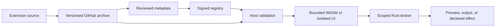

# ClipsX Extension API v3

Extension API v3 is the sole extension contract. Packages use schema version 3, contract revision 1, and the v3 WIT.

Extensions add detectors, views, conversions, and actions. Rust validates their
input, permissions, and output. Registry approval does not make package code trusted.

The **host** is ClipsX. The **guest** is extension code running in WebAssembly
(WASM). The **broker** is the Rust service that checks permissions before
performing an operation for a package.



## Package and lifecycle

| Item                      | Contract                                                                    |
| ------------------------- | --------------------------------------------------------------------------- |
| Archive                   | `.clipsx` ZIP                                                               |
| Required file             | `clipsx-extension.toml`                                                     |
| Optional files            | `component.wasm`, `README.md`, `LICENSE`, bounded `icons/` and `ui/` assets |
| API                       | `schemaVersion = 3`, `contractRevision = 1`, compatible `apiVersion`        |
| Release identity          | `(packageId, version, archive SHA-256)`                                     |
| Package ID                | Permanent `<publisher>.<package>`; lowercase ASCII kebab-case segments      |
| Contribution / setting ID | Package-local kebab-case                                                    |
| Host contribution ID      | `<package-id>/<contribution-id>`                                            |
| Host facet ID             | `<package-id>.<facet-id>`                                                   |

Unsupported schemas/revisions are rejected; there is no compatibility runtime.
WASM is required when the manifest declares guest logic.

```toml
schemaVersion = 3
contractRevision = 1
packageId = "example.hello-world"
version = "1.0.0"
apiVersion = "^3.0"
displayName = "Hello World"
iconAssets = { light = "icons/package-light.svg", dark = "icons/package-dark.svg" }

[[contributions]]
id = "ask-chatgpt"
kind = "action"
displayName = "Ask ChatGPT"
placements = ["preview_toolbar", "action_menu"]
effects = ["open_https_url"]
handler = { kind = "guest" }

[[contributions.matchers]]
mimeTypes = ["text/plain"]

[[permissions.externalNavigation]]
origin = "https://chatgpt.com"
```

This guest-action manifest requires a matching WASM implementation.

| Lifecycle                        | Behaviour                                                                                                                                |
| -------------------------------- | ---------------------------------------------------------------------------------------------------------------------------------------- |
| Installed state                  | Enabled, disabled, quarantined, or incompatible                                                                                          |
| Registry install                 | Snapshot reviewed marketplace metadata for offline identity                                                                              |
| Manual update                    | Show release, checksum, and permission changes                                                                                           |
| Automatic update                 | Off globally by default; opted-in, enabled/ready registry packages only; newer stable compatible version with identical full permissions |
| Developer Mode                   | Unsigned local install/replacement; no registry auto-update                                                                              |
| Update, disable, remove, replace | Revoke grants/sessions and invalidate package-derived data                                                                               |
| Signed revocation                | Block exact package/version/checksum; quarantine installed match; manual recovery cannot bypass revocation                               |

Canonical clips and saved output survive lifecycle changes. Derived facets and
views may be invalidated and rebuilt.

## Contributions and actions

| Kind                        | Role                                        | User surface                                         |
| --------------------------- | ------------------------------------------- | ---------------------------------------------------- |
| Detector                    | Add semantic facets                         | Background understanding                             |
| Renderer                    | Present a representation/facet              | Compatible detail views; cached compact presentation |
| Transformer                 | Produce new bytes                           | Transform menu and temporary or durable result       |
| Action                      | Perform a declared operation                | Toolbar and/or Actions menu                          |
| `transformer_preset` action | Invoke a transformer with preset parameters | Displayed as a transform                             |

Actions declare `preview_toolbar`, `action_menu`, or both. The host owns
overflow, pinning, and keyboard access. `exposeInMenu = false` hides a transformer
as a standalone entry; transformer presets expose its conversion instead.
Detail renderers and dialogs are not transforms.

```text
Match across all ready representations
  -> prefer matching active-view source, otherwise highest-priority match
  -> action-state: hidden | disabled(reason) | enabled
  -> host validates input, provider, grant, session
  -> consent/invocation/execution use the same bound source
  -> host validates result and declared effect
```

The host can only downgrade guest availability and rechecks it before execution.
A failed `action-state` probe records a diagnostic and disables that action for
the request. It alone does not quarantine a package or remove facets. Integrity,
revocation, or repeated execution failures can quarantine a package.

| Result                                   | Behaviour                                   |
| ---------------------------------------- | ------------------------------------------- |
| Preview                                  | Open temporary result tab or queued result  |
| Copy, paste, save new clip               | Host output service; keep current view      |
| Declared HTTPS URL, notification, dialog | Perform permitted effect; keep current view |
| Failure                                  | Report error without an empty result tab    |

Packages cannot update/delete existing clips, browse arbitrary history, or
directly access filesystem, shell, database, host clipboard, or native URI
handlers. Temporary outputs enter the transform cache. A transformer with
`resultLifetime = "source_clip"` stores output in host-owned artifact records
attached to its source clip; completed output survives package disablement,
updates, and uninstall. Source deletion removes attached output. Promotion
creates an independent canonical clip with provenance in one transaction.

### Capture activation and durable jobs

`clip.created` means an accepted external capture occurrence, including a copy
that reuses an existing history row. It excludes ClipsX clipboard writes and
promoted output. The capture transaction records eligible activation intents
with an immutable source application snapshot. The coordinator drains these
intents after commit and again on startup. Automation requires a declared
representation matcher, `source_clip` transformer, checksum-bound background
grant, and enabled device-local application rule. Application selectors match
exact platform and ID pairs. Browser-hosted products retain the browser's ID.

`prepare-transform` runs offline with the selected representation and bounded
JSON context. It can skip or return normalized parameters. `transform` receives
the same context with an opaque operation ID, manual/background origin, and
source application only when permitted. Neither export receives history access.
The host runs automatic and manual durable work through SQLite-backed jobs;
matching pending or completed jobs reuse output. Regenerate makes a distinct
job. Automatic completion only attaches a result. Copy, paste, delete, and
promotion require later user actions.

### Runtime limits

Limits apply at different boundaries; a larger input allowance does not override
output, memory, or timeout limits.

| Boundary                       | Limit                                                                 |
| ------------------------------ | --------------------------------------------------------------------- |
| Input representation           | 1 MiB default; manifest `inputLimitBytes` may opt into at most 10 MiB |
| WASM transformer/action output | 1–8 representations, at most 14 MiB combined                          |
| Guest-to-host lifting budget   | 16 MiB per lift/hostcall, including transferred structure             |
| Guest linear memory            | 64 MiB                                                                |
| Custom UI `submitText`         | 10 MiB and declared effect                                            |
| Custom UI generation prompt    | 1 MiB                                                                 |
| Archive / expanded archive     | 16 MiB / 32 MiB; at most 256 entries                                  |
| Component / UI asset           | 8 MiB / 4 MiB                                                         |
| Catalog icon                   | 256 KiB                                                               |

The 14 MiB output allowance accommodates Base64 expansion of a 10 MiB input.
The contribution must still declare a sufficient input limit.

Each invocation gets a fresh Wasmtime store with memory, stack, table, instance,
and execution bounds. No WASI or ambient host imports are available.
Local work uses epoch interruption and an input-aware capped timeout.
Capability-backed actions/transformers retain instruction fuel and a longer
broker-aware timeout. Renderer/detector execution stays offline.

## Icons

| Icon                      | Owner and use                                                                               |
| ------------------------- | ------------------------------------------------------------------------------------------- |
| Package `iconAssets`      | Complete light/dark SVG pair under `icons/`; installed package identity                     |
| Contribution `iconAssets` | Light/dark SVG pair for a view/action                                                       |
| Contribution `iconAsset`  | Single theme-neutral fallback                                                               |
| Catalog icon              | Registry-owned PNG/WebP, signed descriptor `{ url, sha256 }`; shown before package download |

`iconScale` accepts 0.75–2 for assets with intentional viewBox padding.
The host scales without cropping or rewriting. Renderer icons appear on tabs;
only the resolved primary renderer can supply the history glyph.

Installation rejects SVG scripts, entities, handlers, CSS URLs, foreignObject,
animation, embedded HTML, and external references. Static local fragments such
as `url(#gradient)` are allowed. Icons render as images, not injected DOM.

## Settings

Settings use bounded boolean, finite number/integer, string, primitive enum,
array, and declared object schemas. Arrays require `maxItems`; objects reject
undeclared properties. The host limits nesting to four levels, objects to 32
properties, arrays to 64 items, and effective package settings to 64 KiB.
Rust validates overrides, persists them by package/setting ID, and exposes nonsecret values as
`ClipsX.context.settings`. Settings survive uninstall; credentials and grants
are removed by default. UI must not keep a competing settings store in
localStorage, IndexedDB, or package files.

Portability defaults to false. Only reviewed boolean/number declarations in
signed registry schema v4 may sync; installation checks them against the manifest.
After catalog publication, the registry dispatches its commit and index digest
to `clipsx-web`. That repository verifies both, selects latest stable unrevoked
packages, and transactionally reconciles the private approval catalog. The
registry publication workflow waits for the correlated downstream run and fails
if reconciliation or its post-commit readback fails. The cross-repository token
and production database URI are one-time operational secrets, not per-release
inputs.
The signed registry is authoritative; the server catalog enforces sync eligibility.

Package state is declared by key and remains device-local. The broker exposes
`state-get`, `state-set`, and `state-delete` only to that package. Each value is
limited to 8 KiB, with 64 keys and a 128 KiB package limit. State is for small
operational preferences; generated output belongs in host-owned results.

## Custom UI and broker

`uiEntry = "ui/index.html"` and `uiSurfaces = ["detail", "dialog"]` enable bundled
UI in a dedicated Tauri child webview. Compact rows, toolbar chrome, and consent
prompts remain host-rendered. Prefer host render models for ordinary content;
use custom UI for interactions such as diagram navigation.

```text
Main webview: application commands and host controls
Extension child: package assets + session-authenticated extension_bridge
  └── no inherited app IPC, direct network, filesystem, shell, clipboard,
      database, popups, downloads, or arbitrary navigation
```

The package protocol is app-local. Windows may represent it as
`http(s)://<protocol>.localhost`; navigation accepts that form or the native
protocol only with the correct session path. Normal commands are `main`-only;
only `extension-*` labels receive the bridge.

| UI contract         | Behaviour                                                                                                  |
| ------------------- | ---------------------------------------------------------------------------------------------------------- |
| Bridge injection    | At document start, before package scripts; do not bundle privileged SDK code                               |
| Context             | Selected representation/facet, applied light/dark theme, locale, nonsecret settings                        |
| Methods             | `ready`, `https`, `openExternal`, `generateText`, `submitText`, `close`; session permissions govern access |
| Loading             | Child hidden until `ready`; bootstrap/resource/timeout failure becomes recoverable host error              |
| Readiness           | Signal first useful frame or actionable error, not just HTML bootstrap                                     |
| Detail focus        | No focus theft on load; intentional focus gives ordinary keys, including arrows/Home/End, to the child     |
| Dialog focus        | Focus after ready; restore main-webview focus on close                                                     |
| Theme/locale change | Recreate open detail session                                                                               |
| Teardown            | Deselect/close removes the surface                                                                         |
| Accessibility       | Host theme/locale, keyboard focus, reduced motion                                                          |
| Heavy work          | Parse/render in child view or WASM, away from main UI                                                      |

Custom detail renderers may declare only the supported `copy` effect and call
`submitText("text/plain", value, "copy")`. They cannot request paste, save,
navigation, generation, or privileged dialog authorization.

Only an explicit host-rendered action creates a privileged dialog session.
Package scripts/assets remain offline; declared external operations go through
the broker.

```text
Declared permission + checksum-bound grant + host-issued invocation
  -> session bound to package/checksum/contribution/clip/source/child/token
  -> broker validation -> bounded operation
```

| Broker operation    | Rule                                                                                                                       |
| ------------------- | -------------------------------------------------------------------------------------------------------------------------- |
| HTTPS               | Exact declared HTTPS origin; no redirects or private/loopback/link-local/metadata destinations                             |
| Credential header   | Host injects secret into one declared header/origin; UI/WASM never receives the value; reflected-secret responses rejected |
| External navigation | Declared HTTPS origins only                                                                                                |
| `generation.text`   | Configured host provider; unavailable reason until configured; no provider endpoint/model access                           |
| Output              | Validate effect, MIME, and size; store temporary or source-owned result before host output                                |
| Parameters          | Host controls for bounded primitive JSON-schema fields; validate again in Rust                                             |

Capability-backed WASM actions/transformers receive invocation-scoped WIT
imports. Local Ollama is the shipped generation adapter; extensions get output,
not localhost access.

## Security and threat model

Protected assets: canonical clips, managed files, database, credentials, provider
configuration, network identity, privileged IPC, package identity, and catalog
integrity. Archives, code, UI, remote responses, and outputs remain untrusted.

### Catalog and archive validation

```text
Compiled registry URL + trusted Ed25519 key IDs
  -> bounded index/signature download, no redirects
  -> verify signature over exact bytes before parsing/caching
  -> verify again on offline-cache load
  -> download signed release URL
  -> verify archive size/hash, paths/count/expansion, identity,
     permission fingerprint, portable declarations, assets, WASM component
  -> activate
```

Environment variables cannot replace registry trust roots.
Release downloads use HTTPS, a small GitHub host allowlist, at most five
redirects, and streamed size bounds. Catalog icons use only the official
registry raw-content origin, format checks, signed hashes, and reverified cache.

| Threat                                      | Boundary                                                         | Remaining risk / response                                                                      |
| ------------------------------------------- | ---------------------------------------------------------------- | ---------------------------------------------------------------------------------------------- |
| Hostile package                             | Bounded WASM, isolated UI, scoped broker/output                  | Test platform isolation and resource exhaustion on installed builds                            |
| Compromised package repository              | Signed catalog pins exact archive                                | Deletion can deny installs; changed bytes fail validation                                      |
| Compromised registry repository without key | Signature verification; retain verified cache                    | Refresh can be denied                                                                          |
| Redirect outside release hosts              | HTTPS allowlist, redirect/size bounds, final hash                | Reject download                                                                                |
| Modified local cache                        | Reverify signatures and icon hashes                              | Fail closed; refresh                                                                           |
| Compromised signing key                     | Protected signer and offline backup are operational requirements | Stop publication; ship replacement trust key; sole compromised key cannot safely revoke itself |

Multiple signatures allow key overlap: ship the new trusted public key before
switching catalog signatures. New releases must be GitHub-immutable. Five exact
initial releases are checksum-pinned exceptions; deletion/replacement can still
deny installation. Revoke bad releases and publish a higher version; never
overwrite published bytes.

Protected signing environments, reviewed pinned signing actions, branch
protection, required CI, and app signing are operational release controls.
Their deployment must be verified. Sole-maintainer approval prevents accidental
publication but is not independent review.

| Severity | Capability gained                                                         |
| -------- | ------------------------------------------------------------------------- |
| Critical | Registry signing key or released host compromise                          |
| High     | Sandbox escape, privileged IPC, credentials, unauthorized clip disclosure |
| Medium   | Reachable transport/parser/resource-boundary failure                      |
| Low      | Fail-closed corruption or bounded self-only disruption                    |

An authorized operation within its consent is not a security failure.

## First-party packages and acceptance examples

| Package       | Owns / verify                                                                                                              |
| ------------- | -------------------------------------------------------------------------------------------------------------------------- |
| JWT Inspector | JWT detection, unverified claims/timestamps, payload extraction; never imply signature verification                        |
| Base64        | Detection, metadata, UTF-8/binary-aware encoding/decoding                                                                  |
| Data Tools    | Tables, JSON/YAML/TOML, TypeScript shapes, URL conversions; uses native host views                                         |
| Mermaid       | Standalone and Markdown diagrams, offline navigation, theme-aware detail/dialog, accessible source fallback, host settings |
| Ask AI        | Selected text -> ChatGPT/Claude URL; Unicode/size bounds, icons, declared origin, first-use consent                        |
| Rewrite       | Text transformation with Business, Casual, Concise, Improve Writing, Translate, and Custom presets; durable results        |

Core owns common Markdown/JSON/URL/table views and secret detection. Without
Mermaid, diagram fences remain code. No optional package is installed by default.
Unknown-facet fallback follows the [view-selection rules](ARCHITECTURE.md#views-and-output).

| Repository                                                                  | Owns                                                |
| --------------------------------------------------------------------------- | --------------------------------------------------- |
| `azure06/clipsx`                                                            | Host, WIT contract, package CLI, conformance tests  |
| [`azure06/clipsx-extensions`](https://github.com/azure06/clipsx-extensions) | Source, pinned WIT copy, immutable release archives |
| `azure06/clipsx-registry`                                                   | Reviewed signed metadata, icons, revocations        |

Official IDs use `infiniti.<package>` and verified publisher `infiniti`
(display name Infiniti). Repository owner, publisher, package ID, and signature
are separate identity checks. Generated WASM, archives, target, and dist outputs
are not vendored into the host.
