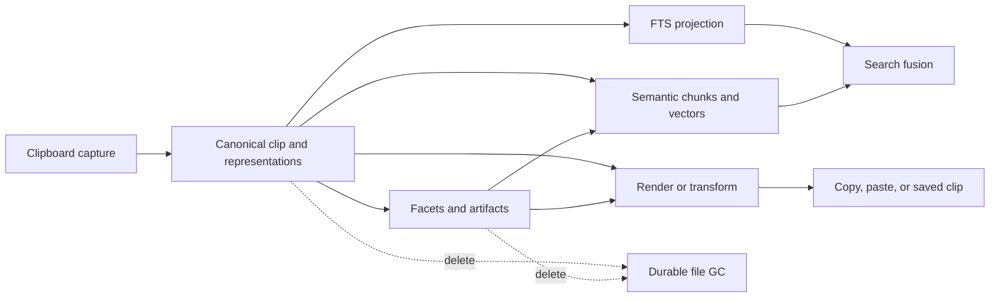
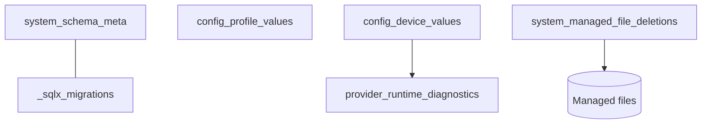
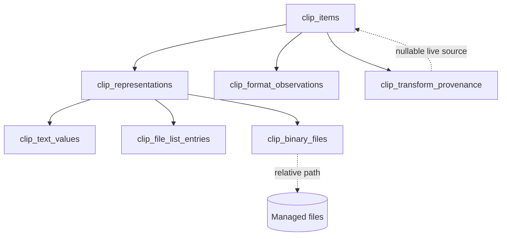
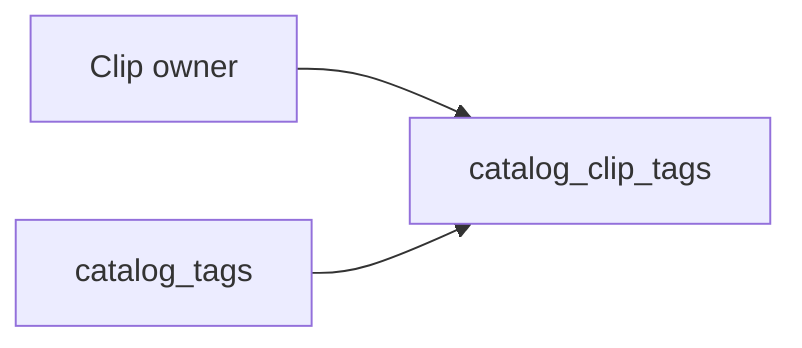
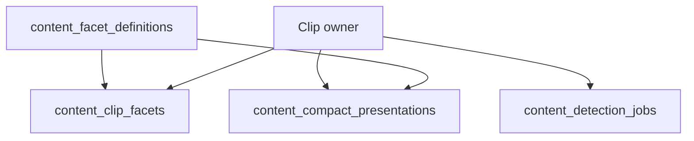
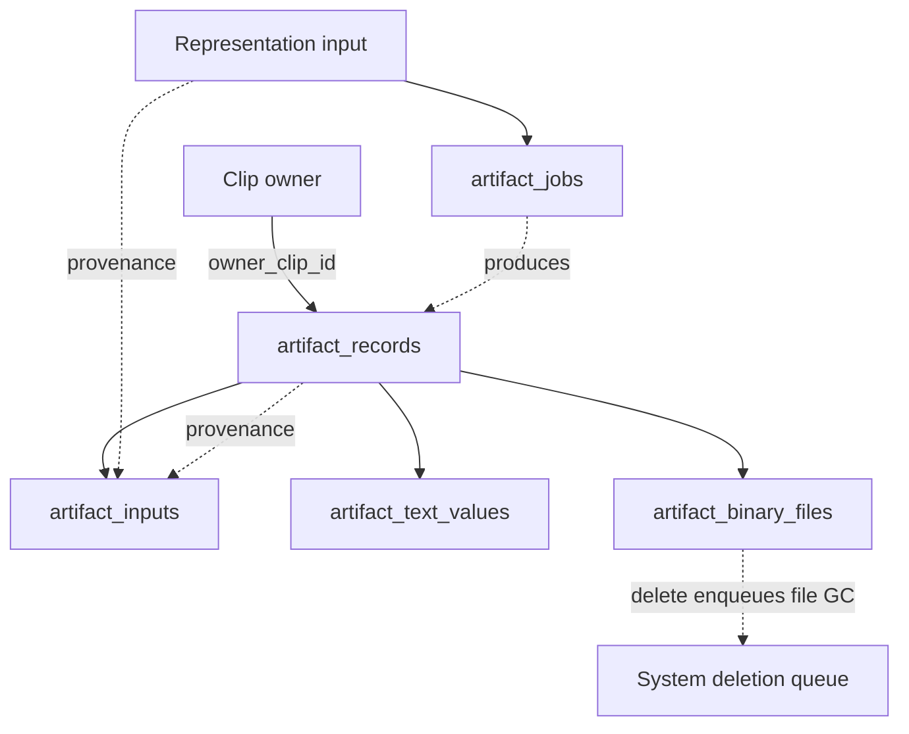
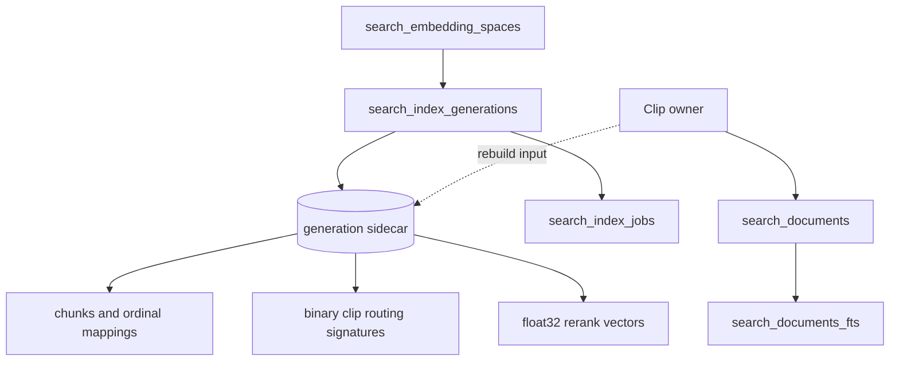
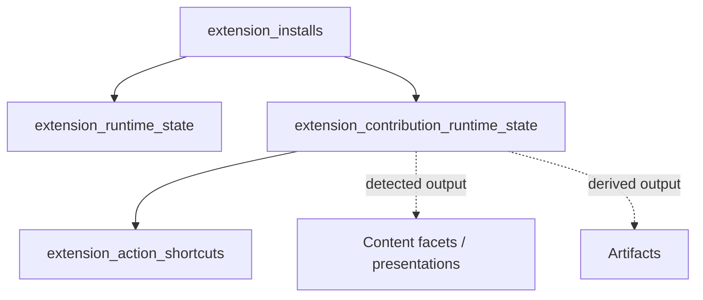

# ClipsX data model

ClipsX stores metadata and text in one local SQLite database. Canonical and derived binary bytes live below the app-managed clipboard directory; SQLite stores hashes and safe relative paths. The executable definition is [`src-tauri/migrations`](../src-tauri/migrations). Runtime boundaries are in [ARCHITECTURE.md](ARCHITECTURE.md).

Table prefixes are logical domains, not separate SQLite schemas. Foreign keys are enabled on every connection. Schema version 8 is a fresh baseline: pre-release databases use factory reset, with no compatibility reads or dual writes.

## Data flow

ClipsX tables fall into five broad classes. **Canonical** data records captured or user-authored truth. **Configuration** records profile or device choices. **Derived** data can be regenerated from canonical inputs. **Operational** data coordinates work, retries, diagnostics, and recovery. **Infrastructure** data supports the database or application runtime itself.

Unless noted otherwise, every application table below—including the FTS5 virtual table—is defined by ClipsX code in `src-tauri/migrations` and provisioned when SQLx runs those migrations. `_sqlx_migrations` is the schema-level exception: SQLx creates and maintains it. At runtime, SQLite FTS5 maintains the index content of `search_documents_fts` through ClipsX-defined triggers.

**Write authority and lifecycle ownership are different concepts.** Write authority identifies the subsystem responsible for mutating a row. Lifecycle ownership identifies the entity or boundary that determines how long the row exists. A provenance reference does not imply ownership unless explicitly stated.

## 1. System and configuration

| Table | Class | Purpose | Write authority | Lifecycle / ownership |
| --- | --- | --- | --- | --- |
| `system_schema_meta` | Infrastructure | Identifies the fresh schema baseline expected by this application build. | ClipsX foundation startup (`foundation`) | Database-scoped infrastructure retained for the lifetime of the database. |
| `_sqlx_migrations` | Infrastructure | Records which migration files have been applied. | SQLx migration runner | Framework-owned bookkeeping. Application features must not write it directly. |
| `config_profile_values` | Configuration | Stores profile-wide settings as namespaced JSON values, including UI behavior, enabled search sources, contribution preferences, and FTS mode. | Seeded by the ClipsX config migration; subsequently written by the settings IPC/history repository and the subsystem that owns each key | Profile-scoped. Values persist until changed or reset; each owning subsystem defines the key's type, validation, and default. |
| `config_device_values` | Configuration | Stores machine-local settings such as capture limits and the active provider endpoint/model. | Seeded by the ClipsX config migration; subsequently written by the settings IPC/history repository and device-specific services such as semantic search | Device-scoped. Kept separate because endpoints and hardware capabilities may differ between machines. |
| `provider_runtime_diagnostics` | Operational | Records the latest provider health and diagnostic observations. | Semantic-search provider probing/service code | Replaceable operational state. Safe to overwrite or clear; not user configuration. |
| `system_managed_file_deletions` | Operational | Durably records managed files that should be deleted after database changes commit. | Database deletion triggers; consumed by the managed-file GC worker | Queue entries remain until cleanup succeeds. The worker rechecks references and retries failures to avoid orphaned files after crashes. |

### Why settings are stored as JSON values in SQLite

ClipsX uses JSON as the **settings format**, but SQLite as the **persistence layer**. Each setting is stored under a stable namespaced key in either profile or device scope.

Keeping settings in SQLite lets them share the application's existing atomic writes, locking, timestamps, backup/reset boundary, and persistence lifecycle. A standalone `settings.json` would be easier to inspect manually, but ClipsX would then need a second mechanism for crash-safe writes, concurrent access, migration, and synchronization with database reset.

The tradeoff is validation. SQLite stores the JSON value but does not enforce the schema expected by each setting key, and the current schema does not add a `json_valid(value_json)` constraint. Rust/TypeScript contracts and repository code provide types, defaults, serialization, and deserialization; malformed values written outside those code paths can fail when read. Adding a JSON-validity constraint and explicit per-key validation are reasonable future hardening steps.

Data with its own **identity, lifecycle, or relationships** does not belong in settings JSON. Provider diagnostics, semantic index generations, jobs, and similar records remain relational.

> **Rule of thumb:** user or device choice → namespaced settings JSON; identity, lifecycle, or relationships → relational table.

## 2. Clips

| Table | Class | Purpose | Write authority | Lifecycle / ownership |
| --- | --- | --- | --- | --- |
| `clip_items` | Canonical | Defines the identity and top-level metadata of one captured or saved clip. | History repository on behalf of clipboard capture or “Save as New Clip” | Root owner for clip-scoped data. Deleting a clip starts cascades and managed-file cleanup. |
| `clip_representations` | Canonical | Records each independent native or canonical representation available for a clip. | History repository from platform-adapter capture or transform output | Owned by its clip and cascades with it. Preserves format fidelity instead of collapsing content into one type. |
| `clip_text_values` | Canonical | Stores the typed textual payload of a representation. | Capture persistence for text-bearing representations | Owned by its representation and cascades with it. Canonical representation data, not sparse metadata. |
| `clip_file_list_entries` | Canonical | Stores ordered paths to external files that the user copied as a file list. | Capture persistence for file-list representations | Owned by the representation. These are references to the user's original files; ClipsX does not copy their bytes into managed storage. Order is preserved for clipboard reconstruction. |
| `clip_binary_files` | Canonical | Tracks hashes, sizes, and safe relative paths to binary payload bytes copied into ClipsX-managed storage. | Capture/transform persistence, deduplicated by canonical byte identity | Shared by representations that contain identical bytes. When unreferenced, the row is removed and its managed path is queued for durable file GC. |
| `clip_format_observations` | Canonical | Records exact native formats observed and the policy decision made for each. | Platform capture adapters and capture policy | Owned by the clip and cascades with it. Preserves diagnostic provenance for captured, skipped, or normalized formats. |
| `clip_transform_provenance` | Canonical | Links a saved output clip to its source and transform description. | “Save as New Clip” after a successful transform | Owned by the saved output clip. Source links become null if the source is deleted; bounded snapshots preserve provenance. |

Renderer choice is deliberately absent: it is UI policy, not persisted clip state. Shared binary rows outlive one clip when another representation still references the same hash.

### File lists versus managed binary payloads

The two file-related tables represent different clipboard concepts:

- `clip_file_list_entries` records the paths in a clipboard **file-list representation**—for example, copying `C:\Reports\budget.xlsx` in Explorer. The path points to a file owned outside ClipsX. ClipsX persists the ordered path string so it can reconstruct the file-list clipboard format, but it does not preserve the file's contents if the original is moved, changed, or deleted.
- `clip_binary_files` records where ClipsX stored the actual bytes of a **binary representation**—for example, PNG image bytes, a PDF payload, SVG data, or an application-native clipboard payload. Its `relative_path` is resolved below the ClipsX-managed clipboard directory; the hash supports deduplication and integrity.

Therefore, `clip_file_list_entries.path` means “the external file selected by the user,” while `clip_binary_files.relative_path` means “the internal managed file containing captured clipboard bytes.”

## 3. Catalog

| Table | Class | Purpose | Write authority | Lifecycle / ownership |
| --- | --- | --- | --- | --- |
| `catalog_tags` | Canonical | Defines reusable user-created tag identities and labels. | History repository on behalf of user tag actions | User-owned catalog data. Deleting a tag removes memberships but does not delete clips. |
| `catalog_clip_tags` | Canonical | Joins clips to tags for organization, filtering, and search eligibility. | History repository on behalf of user membership actions | Relationship row owned by both referenced sides; cascades when either the clip or tag is deleted. |

## 4. Content understanding

| Table | Class | Purpose | Write authority | Lifecycle / ownership |
| --- | --- | --- | --- | --- |
| `content_facet_definitions` | Infrastructure | Registers the identity, owner, version, and display contract of each semantic facet detector. | Host startup and extension contribution registration | Refreshed from installed contributions. Versioning makes stale detected output discoverable. |
| `content_clip_facets` | Derived | Stores additive semantic findings for a clip with detector provenance. | Built-in or extension detectors through the host validation boundary | Owned by its clip and source representation and cascades with either. The referenced facet definition cannot be deleted while a facet uses it. Rebuildable/redetectable. |
| `content_detection_jobs` | Operational | Tracks detector attempts, completion, unsupported inputs, and errors. | Detection scheduler/workers | Retryable recovery state owned by its target representation; cascades when that representation is deleted. |
| `content_compact_presentations` | Derived | Caches bounded models used to render compact clip cards. | Extension contributions through the host validation boundary | Replaceable UI-derived data owned by its clip and contribution; never canonical clip state. |

Facets never replace representations. They explain content without changing captured bytes.

## 5. Artifacts

| Table | Class | Purpose | Write authority | Lifecycle / ownership |
| --- | --- | --- | --- | --- |
| `artifact_records` | Derived | Identifies one derived result, such as OCR text or a thumbnail, and records its producer/version. | Built-in or extension artifact producers through host services | Explicitly owned by one clip. Rebuildable and cascades when that clip is deleted. |
| `artifact_inputs` | Derived | Records provenance edges to representations or earlier artifacts used to produce an artifact. | Artifact production pipeline | Owned by the artifact row. Inputs describe derivation but do not own the output; cross-clip edges are rejected. |
| `artifact_text_values` | Derived | Stores textual derived output such as OCR text. | Artifact producers through typed persistence APIs | Owned by the artifact and rebuildable. Kept separate from canonical representation text. |
| `artifact_binary_files` | Derived | Stores metadata and relative paths for derived binary output such as thumbnails. | Artifact producers and managed-file persistence | Owned by the artifact. Bytes live in managed files; deletion durably enqueues the path for GC. |
| `artifact_jobs` | Operational | Tracks production state, attempts, and errors for a target representation. | Artifact scheduler/workers | Retryable operational state scoped to the target representation; cascades with it. |

Artifact inputs record provenance, not ownership. This distinction lets a clip own and delete all its derived work without treating every input edge as a second owner.

## 6. Search

| Table | Class | Purpose | Write authority | Lifecycle / ownership |
| --- | --- | --- | --- | --- |
| `search_documents` | Derived | Stores the normalized per-clip text document used by lexical search. | Search projection/indexing services | Owned by the clip, rebuildable, and deleted by cascade. Database triggers keep FTS synchronized. |
| `search_documents_fts` | Derived | Provides the FTS5 inverted index queried for lexical candidates. | SQLite FTS5 through ClipsX-defined synchronization triggers | Framework-maintained projection of `search_documents`; rebuildable and never canonical content. |
| `search_embedding_spaces` | Infrastructure | Identifies an immutable provider/model vector space, including revision, dimensions, normalization, and distance metric. | Provider discovery/probing and semantic-index setup | Long-lived compatibility boundary. Prevents embeddings from incompatible vector spaces being mixed. |
| `search_index_generations` | Operational | Tracks lifecycle plus backend ID, encoding, candidate count, safe sidecar path, byte size, and checkpoint checksum. | Semantic indexing coordinator | Generation-scoped lifecycle supports validated activation and retention of the previous active sidecar. The checksum is cleared before an active-generation clip update and can be refreshed at a later durable checkpoint. |
| `search_index_jobs` | Operational | Tracks per-generation, per-clip indexing progress, attempts, and failures. | Semantic indexing coordinator/workers | Retryable recovery state owned by its generation/clip scope; cascades with either side. |
| Generation sidecar | Derived file | Stores bounded chunks, provenance, stable ordinals, paged binary clip-routing signatures, normalized float32 chunk vectors, and mappings for exactly one generation. | `SemanticIndexStore` only | Rebuildable and generation-owned. Pages hold at most 256 clips, avoiding per-row scan overhead while keeping updates local. It contains no canonical clip data and is addressed only by an owned relative path from `search_index_generations`. |

Promotion is atomic: a building generation becomes active only after every job succeeds; otherwise the previous active generation remains searchable. Reindexing replaces a clip’s chunks transactionally.

Release search builds a compact eligible-clip ordinal bitset, scans one binary routing signature per clip in parallel, retains 100 clips, then reranks every chunk of those clips with exact float32 cosine similarity. This remains linear in clip count, but it is deterministic, dependency-free, immediately mutable, and has no trained graph. The full-generation float32 scan exists only as a test oracle.

## 7. Extensions

| Table | Class | Purpose | Write authority | Lifecycle / ownership |
| --- | --- | --- | --- | --- |
| `extension_installs` | Infrastructure | Records installed package identity, version, manifest, integrity, and managed location. | Extension installation/update services acting on a user request | Authoritative local installation state. Uninstall cascades runtime and contribution state. |
| `extension_runtime_state` | Operational | Tracks install-level enablement, quarantine, and failure counters. | Extension runtime host and enable/disable actions | Owned by the install. Operational state is recreated when an install is replaced. |
| `extension_contribution_runtime_state` | Operational | Tracks per-contribution enablement, ordering, and diagnostics. | Manifest refresh plus extension runtime host | Owned by the install and refreshable from its manifest; the host remains authoritative over execution. |
| `extension_action_shortcuts` | Configuration | Maps keyboard shortcuts to enabled action contributions. | User shortcut configuration services | User configuration scoped to a contribution; cascades when that contribution disappears. |

Extension tables store package/runtime infrastructure, not arbitrary extension-owned database schemas. Sandboxed contributions emit host-validated facets, presentations, artifacts, or transformed outputs into the owning host domains.

## Lifecycle assessment

The architecture is appropriate for a local-first pre-1.0 clipboard: canonical truth is normalized, configuration has explicit scope, derived data is rebuildable, operational state is recoverable, ownership is enforceable, and files are deleted durably after database commits. The main cost is more lifecycle tables and joins, accepted in exchange for recovery and provenance.

The deliberate limits are measurable: binary clip-routing recall requires labelled certification, JSON preferences depend on typed application validation, and factory reset remains acceptable only before the first stable release. These are explicit boundaries, not hidden data-model debt.
