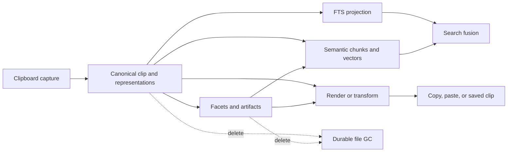
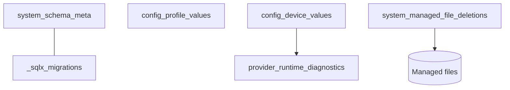
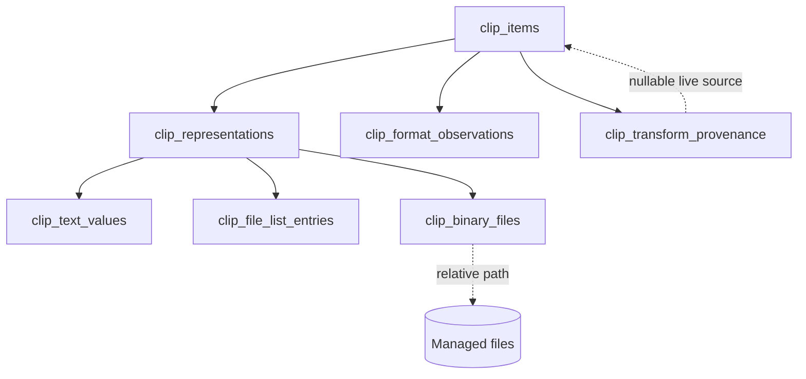
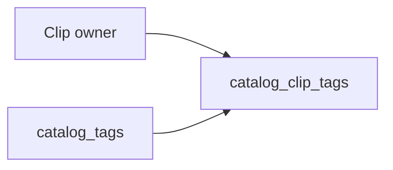
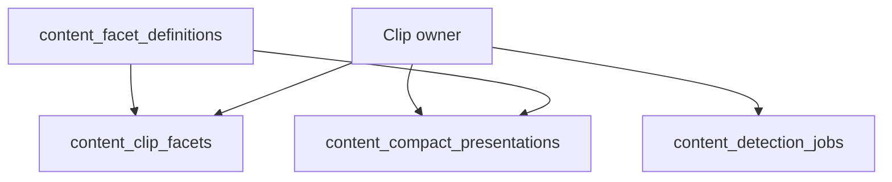
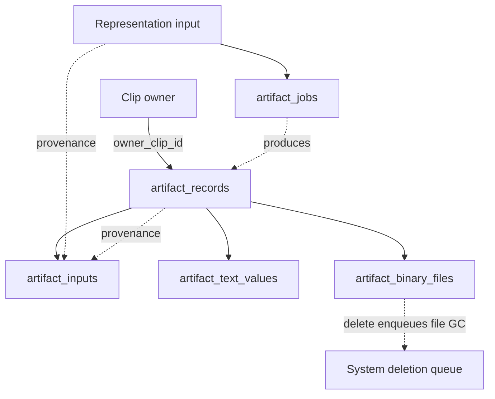
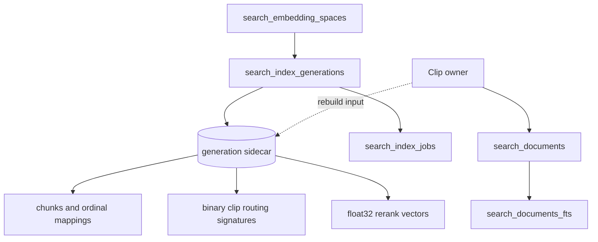
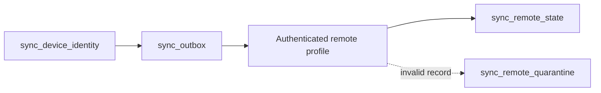
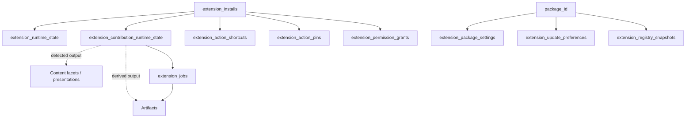

# ClipsX data model

ClipsX stores metadata and text in one local SQLite database. Canonical and derived binary bytes live below the app-managed clipboard directory; SQLite stores hashes and safe relative paths. The executable definition is [`src-tauri/migrations`](../src-tauri/migrations).

Table prefixes are logical domains, not separate SQLite schemas. Foreign keys are enabled on every connection. The published baseline is `clipsx-local-v3`, schema version 15. Development and production use the same database; build mode and release version do not affect compatibility. Published SQL migrations are immutable and future schema changes use appended forward migrations. Older binaries block newer schemas without suggesting a reset.

## Data flow


```mermaid
flowchart LR
    C[Clipboard capture] --> K[Canonical clip and representations]
    K --> U[Facets and artifacts]
    K --> F[FTS projection]
    K --> S[Semantic chunks and vectors]
    U --> S
    F --> Q[Search fusion]
    S --> Q
    K --> O[Render or transform]
    U --> O
    O --> W[Copy, paste, or saved clip]
    K -. delete .-> G[Durable file GC]
    U -. delete .-> G
```

ClipsX tables fall into five broad classes. **Canonical** data records captured or user-authored truth. **Configuration** records profile or device choices. **Derived** data can be regenerated from canonical inputs. **Operational** data coordinates work, retries, diagnostics, and recovery. **Infrastructure** data supports the database or application runtime itself.

Unless noted otherwise, every application table below—including the FTS5 virtual table—is defined by ClipsX code in `src-tauri/migrations` and provisioned when SQLx runs those migrations. `_sqlx_migrations` is the schema-level exception: SQLx creates and maintains it. At runtime, SQLite FTS5 maintains the index content of `search_documents_fts` through ClipsX-defined triggers.

**Write authority and lifecycle ownership are different concepts.** Write authority identifies the subsystem responsible for mutating a row. Lifecycle ownership identifies the entity or boundary that determines how long the row exists. A provenance reference does not imply ownership unless explicitly stated.

## 1. System and configuration


```mermaid
flowchart TB
    M[system_schema_meta] --- L[_sqlx_migrations]
    P[config_profile_values]
    D[config_device_values]
    D --> R[provider_runtime_diagnostics]
    Q[system_managed_file_deletions] --> FS[(Managed files)]
```

| Table | Class | Purpose | Write authority | Lifecycle / ownership |
| --- | --- | --- | --- | --- |
| `system_schema_meta` | Infrastructure | Identifies the fresh schema baseline expected by this application build. | ClipsX foundation startup (`foundation`) | Database-scoped infrastructure retained for the lifetime of the database. |
| `_sqlx_migrations` | Infrastructure | Records which migration files have been applied. | SQLx migration runner | Framework-owned bookkeeping. Application features must not write it directly. Foundation alone may transactionally canonicalize the exact published LF/CRLF checksum pairs, after a consistent SQLite backup including WAL contents. |
| `config_profile_values` | Configuration | Stores profile-wide settings as namespaced JSON values, including UI behavior, enabled search sources, contribution preferences, and FTS mode. | Seeded by the ClipsX config migration; subsequently written by the settings IPC/history repository and the subsystem that owns each key | Profile-scoped. Values persist until changed or reset; each owning subsystem defines the key's type, validation, and default. |
| `config_device_values` | Configuration | Stores machine-local settings such as capture limits, the shared Ollama connection, and independent model-capability assignments. | Seeded by the ClipsX config migration; subsequently written by the settings IPC/history repository and the owning device-specific services | Device-scoped. Kept separate because endpoints, installed models, and hardware capabilities may differ between machines. |
| `provider_runtime_diagnostics` | Operational | Records the latest model-provider connection and capability health observations. | Provider catalog, embedding, and generation services | Replaceable operational state. Safe to overwrite or clear; not user configuration. |
| `system_managed_file_deletions` | Operational | Durably records managed files that should be deleted after database changes commit. | Database deletion triggers; consumed by the managed-file GC worker | Queue entries remain until cleanup succeeds. The worker rechecks references and retries failures to avoid orphaned files after crashes. |

Model configuration uses three device-local keys with distinct ownership:

| Key | Owner | Stored value |
| --- | --- | --- |
| `providers.ollama.connection` | Model-provider connection | The validated loopback endpoint. |
| `providers.text_embedding.active` | Semantic Search | Provider ID, model ID, enablement, and similarity threshold; never an endpoint. |
| `providers.generation.text.active` | Local Text Generation | Provider ID, model ID, and enablement; never an endpoint. |

Installed-model inventory, model digests, capability inspection results, and connection health are derived observations rather than settings. The application refreshes them from Ollama and may discard them at any time. Changing the endpoint retains capability assignments so a missing model is visible and recoverable instead of being silently replaced.

Published migrations are append-only. Startup validates migration history and preserves all data on errors. Only known line-ending checksum equivalents from `published-v0.1.0.json` are repaired after backup; arbitrary checksum changes are blocked with the affected migration version. A factory reset is an explicit last-resort action, never an automatic compatibility mechanism.

Diagnostic logging uses the device-local boolean `diagnostics.logging_enabled`
(default true). Settings reset restores its default; exports and sync never carry
it. Settings read a consistent SQLite snapshot and commit host-validated patches
with their sync outbox entries atomically.

### Why settings are stored as JSON values in SQLite

ClipsX uses JSON as the **settings format**, but SQLite as the **persistence layer**. Each setting is stored under a stable namespaced key in either profile or device scope.

Keeping settings in SQLite lets them share the application's existing atomic writes, locking, timestamps, backup/reset boundary, and persistence lifecycle. A standalone `settings.json` would be easier to inspect manually, but ClipsX would then need a second mechanism for crash-safe writes, concurrent access, migration, and synchronization with database reset.

The tradeoff is validation. SQLite stores the JSON value but does not enforce the schema expected by each setting key, and the current schema does not add a `json_valid(value_json)` constraint. Rust/TypeScript contracts and repository code provide types, defaults, serialization, and deserialization; malformed values written outside those code paths can fail when read. Adding a JSON-validity constraint and explicit per-key validation are reasonable future hardening steps.

Data with its own **identity, lifecycle, or relationships** does not belong in settings JSON. Provider diagnostics, semantic index generations, jobs, and similar records remain relational.

> **Rule of thumb:** user or device choice → namespaced settings JSON; identity, lifecycle, or relationships → relational table.

## 2. Clips


```mermaid
flowchart TB
    C[clip_items] --> R[clip_representations]
    R --> T[clip_text_values]
    R --> F[clip_file_list_entries]
    R --> B[clip_binary_files]
    C --> O[clip_format_observations]
    C --> P[clip_transform_provenance]
    P -. nullable live source .-> C
    B -. relative path .-> FS[(Managed files)]
```

| Table | Class | Purpose | Write authority | Lifecycle / ownership |
| --- | --- | --- | --- | --- |
| `clip_items` | Canonical | Defines the identity and top-level metadata of one captured or saved clip. | History repository on behalf of clipboard capture or “Save as New Clip” | Root owner for clip-scoped data. Deleting a clip starts cascades and managed-file cleanup. |
| `clip_representations` | Canonical | Records each independent native or canonical representation available for a clip. | History repository from platform-adapter capture or transform output | Owned by its clip and cascades with it. Preserves format fidelity instead of collapsing content into one type. |
| `clip_text_values` | Canonical | Stores the typed textual payload of a representation. | Capture persistence for text-bearing representations | Owned by its representation and cascades with it. Canonical representation data, not sparse metadata. |
| `clip_file_list_entries` | Canonical | Stores ordered paths to external files that the user copied as a file list. | Capture persistence for file-list representations | Owned by the representation. These are references to the user's original files; ClipsX does not copy their bytes into managed storage. Order is preserved for clipboard reconstruction. |
| `clip_binary_files` | Canonical | Tracks hashes, sizes, and safe relative paths to binary payload bytes copied into ClipsX-managed storage. | Capture/transform persistence, deduplicated by canonical byte identity | Shared by representations that contain identical bytes. When unreferenced, the row is removed and its managed path is queued for durable file GC. |
| `clip_format_observations` | Canonical | Records exact native formats observed and the policy decision made for each. | Platform capture adapters and capture policy | Owned by the clip and cascades with it. Preserves diagnostic provenance for captured, skipped, or normalized formats. |
| `clip_transform_provenance` | Canonical | Links a saved output clip to its source and transform description. | “Save as New Clip” after a successful transform | Owned by the saved output clip. Source links become null if the source is deleted; bounded snapshots preserve provenance. |

Renderer choice is deliberately absent: it is UI policy, not persisted clip state. Shared binary rows outlive one clip when another representation still references the same hash.

### File lists versus managed binary payloads

The two file-related tables represent different clipboard concepts:

- `clip_file_list_entries` records the paths in a clipboard **file-list representation**—for example, copying `C:\Reports\budget.xlsx` in Explorer. The path points to a file owned outside ClipsX. ClipsX persists the ordered path string so it can reconstruct the file-list clipboard format, but it does not preserve the file's contents if the original is moved, changed, or deleted.
- `clip_binary_files` records where ClipsX stored the actual bytes of a **binary representation**—for example, PNG image bytes, a PDF payload, SVG data, or an application-native clipboard payload. Its `relative_path` is resolved below the ClipsX-managed clipboard directory; the hash supports deduplication and integrity.

Therefore, `clip_file_list_entries.path` means “the external file selected by the user,” while `clip_binary_files.relative_path` means “the internal managed file containing captured clipboard bytes.”

## 3. Catalog


```mermaid
flowchart LR
    C[Clip owner] --> J[catalog_clip_tags]
    T[catalog_tags] --> J
```

| Table | Class | Purpose | Write authority | Lifecycle / ownership |
| --- | --- | --- | --- | --- |
| `catalog_tags` | Canonical | Defines reusable user-created tag identities and labels. | History repository on behalf of user tag actions | User-owned catalog data. Deleting a tag removes memberships but does not delete clips. |
| `catalog_clip_tags` | Canonical | Joins clips to tags for organization, filtering, and search eligibility. | History repository on behalf of user membership actions | Relationship row owned by both referenced sides; cascades when either the clip or tag is deleted. |

## 4. Content understanding


```mermaid
flowchart TB
    D[content_facet_definitions] --> F[content_clip_facets]
    C[Clip owner] --> F
    C --> J[content_detection_jobs]
    C --> P[content_compact_presentations]
    D --> P
```

| Table | Class | Purpose | Write authority | Lifecycle / ownership |
| --- | --- | --- | --- | --- |
| `content_facet_definitions` | Infrastructure | Registers the identity, owner, version, and display contract of each semantic facet detector. | Host startup and extension contribution registration | Refreshed from installed contributions. Versioning makes stale detected output discoverable. |
| `content_clip_facets` | Derived | Stores additive semantic findings for a clip with detector provenance. | Built-in or extension detectors through the host validation boundary | Owned by its clip and source representation and cascades with either. The referenced facet definition cannot be deleted while a facet uses it. Rebuildable/redetectable. |
| `content_detection_jobs` | Operational | Tracks detector attempts, completion, unsupported inputs, and errors. | Detection scheduler/workers | Retryable recovery state owned by its target representation; cascades when that representation is deleted. |
| `content_compact_presentations` | Derived | Caches bounded models used to render compact clip cards. | Extension contributions through the host validation boundary | Replaceable UI-derived data owned by its clip and contribution; never canonical clip state. |

Facets never replace representations. They explain content without changing captured bytes.

## 5. Artifacts


```mermaid
flowchart TB
    C[Clip owner] -->|owner_clip_id| A[artifact_records]
    A --> I[artifact_inputs]
    A --> T[artifact_text_values]
    A --> B[artifact_binary_files]
    R[Representation input] -. provenance .-> I
    A -. provenance .-> I
    R --> J[artifact_jobs]
    J -. produces .-> A
    B -. delete enqueues file GC .-> G[System deletion queue]
```

| Table | Class | Purpose | Write authority | Lifecycle / ownership |
| --- | --- | --- | --- | --- |
| `artifact_records` | Derived | Identifies one derived result, such as OCR text or a thumbnail, and records its producer/version. | Built-in or extension artifact producers through host services | Explicitly owned by one clip. Rebuildable and cascades when that clip is deleted. |
| `artifact_inputs` | Derived | Records provenance edges to representations or earlier artifacts used to produce an artifact. | Artifact production pipeline | Owned by the artifact row. Inputs describe derivation but do not own the output; cross-clip edges are rejected. |
| `artifact_text_values` | Derived | Stores textual derived output such as OCR text. | Artifact producers through typed persistence APIs | Owned by the artifact and rebuildable. Kept separate from canonical representation text. |
| `artifact_binary_files` | Derived | Stores metadata and relative paths for derived binary output such as thumbnails. | Artifact producers and managed-file persistence | Owned by the artifact. Bytes live in managed files; deletion durably enqueues the path for GC. |
| `artifact_jobs` | Operational | Tracks production state, attempts, and errors for a target representation. | Artifact scheduler/workers | Retryable operational state scoped to the target representation; cascades with it. |

Artifact inputs record provenance, not ownership. This distinction lets a clip own and delete all its derived work without treating every input edge as a second owner.

## 6. Search


```mermaid
flowchart TB
    C[Clip owner] --> D[search_documents]
    D --> F[search_documents_fts]
    S[search_embedding_spaces] --> G[search_index_generations]
    G --> J[search_index_jobs]
    G --> X[(generation sidecar)]
    C -. rebuild input .-> X
    X --> H[chunks and ordinal mappings]
    X --> Q[binary clip routing signatures]
    X --> V[float32 rerank vectors]
```

| Table | Class | Purpose | Write authority | Lifecycle / ownership |
| --- | --- | --- | --- | --- |
| `search_documents` | Derived | Stores the normalized per-clip text document used by lexical search. | Search projection/indexing services | Owned by the clip, rebuildable, and deleted by cascade. Database triggers keep FTS synchronized. |
| `search_documents_fts` | Derived | Provides the FTS5 inverted index queried for lexical candidates. | SQLite FTS5 through ClipsX-defined synchronization triggers | Framework-maintained projection of `search_documents`; rebuildable and never canonical content. |
| `search_embedding_spaces` | Infrastructure | Identifies an immutable provider/model vector space, including revision, dimensions, normalization, and distance metric. | Provider discovery/probing and semantic-index setup | Long-lived compatibility boundary. Prevents embeddings from incompatible vector spaces being mixed. |
| `search_index_generations` | Operational | Tracks lifecycle plus backend ID, encoding, candidate count, safe sidecar path, byte size, and checkpoint checksum. | Semantic indexing coordinator | Generation-scoped lifecycle supports validated activation and retention of the previous active sidecar. The checksum is cleared before an active-generation clip update and can be refreshed at a later durable checkpoint. |
| `search_index_jobs` | Operational | Tracks per-generation, per-clip indexing progress, attempts, and failures. | Semantic indexing coordinator/workers | Retryable recovery state owned by its generation/clip scope; cascades with either side. |
| Generation sidecar | Derived file | Stores bounded chunks, provenance, stable ordinals, paged binary clip-routing signatures, normalized float32 chunk vectors, and mappings for exactly one generation. | `SemanticIndexStore` only | Rebuildable and generation-owned. Pages hold at most 256 clips, avoiding per-row scan overhead while keeping updates local. It contains no canonical clip data and is addressed only by an owned relative path from `search_index_generations`. |

Promotion is atomic: a building generation becomes active only after every job succeeds; otherwise the previous active generation remains searchable. Reindexing replaces a clip’s chunks transactionally.

Release search builds a compact eligible-clip ordinal bitset, scans one binary routing signature per clip in parallel, retains 100 clips, then reranks every chunk of those clips with exact float32 cosine similarity. This remains linear in clip count, but it is deterministic, dependency-free, immediately mutable, and has no trained graph. The full-generation float32 scan exists only as a test oracle.

## 7. Configuration sync


```mermaid
flowchart LR
    D[sync_device_identity] --> O[sync_outbox]
    O --> R[Authenticated remote profile]
    R --> S[sync_remote_state]
    R -. invalid record .-> Q[sync_remote_quarantine]
```

| Table | Class | Purpose | Write authority | Lifecycle / ownership |
| --- | --- | --- | --- | --- |
| `sync_device_identity` | Infrastructure | Stores the device ID, display name, and hybrid-logical-clock state used to order local mutations. | Configuration-sync service | Device-scoped singleton retained until reset or device-forget operations replace it. |
| `sync_outbox` | Operational | Stores the latest pending revision for each supported configuration record, including tombstones and retry state. | The owning settings mutation and sync service in the same local transaction | One row per record kind/key remains until an accepted server response supersedes or acknowledges it. Clipboard content cannot enter this table. |
| `sync_remote_state` | Operational | Stores opt-in state, active account, monotonic server cursor, and latest synchronization status. | Configuration-sync service | Device-scoped singleton. Signing out disables sync without deleting local settings. |
| `sync_pending_effects` | Operational | Stores unapplied package/setting/shortcut intent and its recovery reason. `local_import` distinguishes manually imported intent from remote restore. | Sync or portable import in the same transaction as portable values | Survives restart. Local-import effects can be retried without an account and never auto-install packages, including after matching cloud echoes. |
| `sync_remote_quarantine` | Operational security state | Retains bounded diagnostics for invalid or unsupported remote records instead of applying them. | Configuration-sync response validator | Local diagnostic evidence retained until explicit recovery/reset policy clears it. |

The schema can represent future configuration record kinds, but the current
runtime allowlist synchronizes only theme, language, OCR enablement, and OCR
language. Expanding that allowlist requires a versioned server contract and
owner-specific validation; it is not implied by the table shape.

## 8. Extensions


```mermaid
flowchart TB
    I[extension_installs] --> R[extension_runtime_state]
    I --> C[extension_contribution_runtime_state]
    I --> S[extension_action_shortcuts]
    I --> P[extension_action_pins]
    I --> G[extension_permission_grants]
    M[package_id] --> V[extension_package_settings]
    M --> U[extension_update_preferences]
    M --> N[extension_registry_snapshots]
    C -. detected output .-> F[Content facets / presentations]
    C -. derived output .-> A[Artifacts]
    C --> J[extension_jobs]
    J --> A
```

| Table | Class | Purpose | Write authority | Lifecycle / ownership |
| --- | --- | --- | --- | --- |
| `extension_installs` | Infrastructure | Records installed package identity, version, integrity, managed location, source, and enablement. | Extension installation/update services acting on a user request | Authoritative local installation state. Uninstall cascades install-owned runtime, grants, and shortcuts. |
| `extension_runtime_state` | Operational | Tracks whether an installation is ready, quarantined, or incompatible. | Extension runtime host and lifecycle actions | Owned by the install. Operational state is recreated when an install is replaced. |
| `extension_contribution_runtime_state` | Operational | Tracks per-contribution failure streaks and the latest diagnostic. | Manifest refresh plus extension runtime host | Owned by the install and refreshable from its manifest; the host remains authoritative over execution. |
| `extension_action_shortcuts` | Configuration | Maps keyboard shortcuts to enabled action contributions. | User shortcut configuration services | User configuration scoped to a contribution; cascades when that contribution disappears. |
| `extension_transform_setups` | Configuration | Stores device-local user labels, validated parameters, preferred result view, and revisions for reusable transformer setups. | Host setup editor with expected-revision checks | A setup creates no output until run. Existing jobs snapshot its label and parameters. Incompatible setups remain visible; uninstall removes them. |
| `extension_permission_grants` | Operational security state | Records consent for one exact package checksum and declared navigation, HTTPS, or provider permission. | Extension broker after a host-owned consent flow | Install-owned and checksum-bound. Update, disablement, replacement, or removal revokes it. Never synchronized. |
| `extension_registry_snapshots` | Infrastructure | Preserves the reviewed registry identity displayed for an installed registry release. | Registry-backed install/update service | Keyed by stable package ID and replaceable from newly verified signed registry metadata. It is not trusted package-authored metadata. |
| `extension_update_preferences` | Configuration | Stores the package-specific automatic-update override. | Extension update settings | Stable package preference retained independently from installed bytes. |
| `extension_package_settings` | Configuration | Stores manifest-declared non-secret settings by stable package and setting IDs. | Extension settings service after manifest/type validation | Retained across uninstall/reinstall; package bytes do not own it. |
| `extension_jobs` / `extension_result_outputs` | Operational / derived | Durable manual and automatic transformation work, setup/display snapshots, controls, and ordered links to typed artifact payloads. | Shared extension coordinator | Owned by the source clip. Completed output remains readable after package removal; unfinished work is cancelled. |
| `extension_job_steps` | Operational | Bounded requests, continuations, responses and dispatch claims for ordered read/model/write steps. | Shared operation executor | Completed writes are never replayed; uncertain non-idempotent delivery pauses for review. |
| `extension_activation_events` | Operational | Durable capture-occurrence intents, including immutable safe application context and resolved setup parameters, label and view. | Capture and extension activation dispatcher | Cascades with the source clip and is pruned after terminal processing. |
| `extension_automation_rules` | Configuration | Device-local exact application rules referencing a built-in or saved setup, with host-maintained resolved parameters, label, view and inactive reason. | Host settings UI | Setup edits update future capture snapshots atomically; deletion/incompatibility disables rules. Retained but inactive while a package is absent or unauthorized. |
| `extension_package_state` | Configuration | Small, declared, quota-limited package key/value state. | Capability broker | Retained across updates and disablement, deleted on uninstall, never synchronized. |

Extension tables store package/runtime infrastructure, not arbitrary extension-owned database schemas. Sandboxed contributions emit host-validated facets, presentations, artifacts, or transformed outputs into the owning host domains.

## Lifecycle assessment

The architecture is appropriate for a local-first pre-1.0 clipboard: canonical truth is normalized, configuration has explicit scope, derived data is rebuildable, operational state is recoverable, ownership is enforceable, and files are deleted durably after database commits. The main cost is more lifecycle tables and joins, accepted in exchange for recovery and provenance.

The deliberate limits are measurable: binary clip-routing recall requires labelled certification, JSON preferences depend on typed application validation, and schema incompatibility preserves user data and factory reset remains an explicitly confirmed last resort. These are explicit boundaries, not hidden data-model debt.


## Capture and recovery contract

### Capture, recovery, deletion

```text
Stable native snapshot (bounded retries)
  -> deduplicate a ready capture, or create new records
  -> stage binary files -> hash + fsync -> atomic move -> mark ready
  -> schedule derived work
```

| Event                            | Behaviour                                                                  |
| -------------------------------- | -------------------------------------------------------------------------- |
| Startup                          | Recover staging and incomplete records; do not rehash all ready files      |
| Access to ready binary           | Verify SHA-256                                                             |
| Background maintenance           | Recheck references, remove orphans/empty directories, retry failed cleanup |
| Delete, clear history, retention | One transactional cascade                                                  |
| Final file reference removed     | Managed file becomes eligible for deletion                                 |
| Derived job fails                | Preserve the captured clip; expose retry/rebuild                           |

Extension detection records each detector/representation outcome in
`content_detection_jobs`. Both `completed` (including empty results) and
`unsupported` are terminal for the current detector version. Selector mismatches,
oversized inputs, and guest-reported unsupported inputs atomically clear obsolete
facets and record `unsupported`. Operational failures retain retry and quarantine
handling.

Startup recovery uses cursor batches of 100 and only the selected detector's
unfinished representations. Completed and unsupported pairs do not call guests
again until the detector version changes or explicit redetection forces the shared
path. Existing installations converge when missing unsupported outcomes are first
recorded. Compact presentations refresh only after detection state or facets change;
the existing facet event refreshes visible history.

Artifacts belong to a clip; their input references stay within that clip.
A saved transform survives deletion of its source through nullable live links
and a bounded provenance snapshot.

Clip deletion also writes semantic cleanup intent in the same transaction.
That intent survives the clip cascade and restart. The single semantic writer
removes the clip, chunks, routing entries, and unused vectors from retained
indexes, checkpoints complete indexes, then acknowledges cleanup. This runs
before provider validation, including when Meaning Search is unavailable.

Notes, tags, and OCR changes refresh search projections. Extension lifecycle
changes invalidate its derived facets, views, sessions, and grants.
`clip-facets-updated` refreshes the matching preview; `clipId: null` refreshes
loaded summaries and the open preview.

## Settings, account, and sync

| Screen       | Owns                                                                                        |
| ------------ | ------------------------------------------------------------------------------------------- |
| Clips        | History and preview                                                                         |
| Intelligence | Models, provider health, indexing, search, OCR                                              |
| Extensions   | Installed, Discover, Built-ins, Developer; package settings/permissions/actions/diagnostics |
| Settings     | General, Clipboard, Keyboard, Storage, Privacy, Sync, Account, Advanced                     |

List pages show identity, health, and next action; detail pages hold configuration
and diagnostics. SQLite is the live settings store; JSON is the validated value
and export format.

| Data class            | Examples                                                                                                  | Travels through configuration sync?                |
| --------------------- | --------------------------------------------------------------------------------------------------------- | -------------------------------------------------- |
| Portable preferences  | Theme, language, output/copy UI, search, OCR, renderer preference                                         | Explicit allowlist only                            |
| Portable intent       | Signed-registry extensions, approved boolean/number settings, app shortcuts                               | Yes, subject to local validation and fresh consent |
| Device settings       | Window geometry, autostart, capture limits, provider endpoint/model, similarity floor, local package path | No                                                 |
| Secrets               | Account sessions, API credentials                                                                         | No; OS-protected storage                           |
| Consent / operations  | Grants, tokens, quarantine, jobs, health, cursor                                                          | No                                                 |
| Clip and derived data | Clips, notes, tags, files, OCR, caches, indexes                                                           | No                                                 |

Extension setting portability and approval rules live in the
[Extension API](EXTENSION_API_V3.md#settings).

### Account storage

The Supabase client owns Google/GitHub sign-in choice, PKCE, session serialization,
refresh, and local sign-out. Provider choice is per attempt, not a preference.
Rust exposes an allowlisted opaque key/value adapter.

| Platform      | Session storage                                                                            |
| ------------- | ------------------------------------------------------------------------------------------ |
| Windows       | Versioned map in private app data, encrypted and integrity-protected by current-user DPAPI |
| macOS / Linux | Native credential store                                                                    |

This protects against other ordinary OS users, not malicious code running as
the signed-in user or a compromised ClipsX process.

### Configuration sync v1

Sync is opt-in and account-protected, independent of browser vault and billing.

```text
Local settings transaction + outbox
  -> event-driven coordinator -> owner-scoped server RPC
  -> staged cloud records -> validated local application -> pending effects/recovery
```

SQLite owns the clock, cursor, per-account/generation outbox, exact-revision
acknowledgements, staged first restore, invalid-record quarantine, and pending
effects. Triggers commit settings and outbox together.

| Trigger                  | Schedule                                                                                    |
| ------------------------ | ------------------------------------------------------------------------------------------- |
| Startup / manual request | Synchronize                                                                                 |
| Eligible local mutations | 5-second debounce; 30-second maximum wait                                                   |
| Active reconnect         | Synchronize                                                                                 |
| Window activation        | Wait 2 seconds; cancel on blur; pull only if last automatic pull is at least 15 minutes old |
| Idle/hidden app          | No periodic polling                                                                         |

Conflicts use deterministic `(physical time, logical counter, source device)`
ordering. Received clocks are observed; excessive future clocks use server-time
correction. Reset/replacement increments profile generation so offline devices
cannot resurrect cleared state. Late responses must match account, generation,
and local session epoch.

First connection defaults to cloud restore. Empty-cloud initialization and
explicit replacement are atomic snapshots; paged restores stage before replacing
local portable values. Sign-out disables sync and preserves local data. Sync
does not upgrade installed extensions or transfer grants. Unavailable packages
and unknown/conflicting commands remain pending.

The sibling `clipsx-web` repository owns Supabase migrations, tests, deployment,
and [backend protocol](../../clipsx-web/docs/backend/configuration-sync.md).
Desktop owns the client, generated types, secure session storage, and local
coordinator. Backend RPCs enforce ownership over `sync_profiles`,
`sync_devices`, and `sync_records`; clients have no raw table access.
Internal operations use a NOLOGIN/NOBYPASSRLS role. Enrollment requires a live
Auth session; revoked sessions cannot replace their device identity.

### Settings changes and recovery

| Operation                    | Guarantee                                                                                                                                                     |
| ---------------------------- | ------------------------------------------------------------------------------------------------------------------------------------------------------------- |
| Read                         | Coherent SQLite snapshot                                                                                                                                      |
| Save                         | Host validates patch against latest values under one lifecycle lock; commits capture/profile/device values and outbox together                                |
| Frontend edits               | Serialized; display committed values; preserve unedited fields, including exact byte limits                                                                   |
| Native effects               | Startup reconciles autostart, shortcuts, window behaviour, logging, retention; failures have Retry                                                            |
| Shortcut edit                | Register replacement before removing old binding; persist after success; restore old registration if save fails and report failed rollback                    |
| Retention failure after save | Report failed effect, not an unsaved setting                                                                                                                  |
| Reset settings               | Restore defaults and logging; clear built-in shortcut overrides/pending intent; preserve clips, account, Intelligence, renderer/extension settings and grants |
| App language change          | Atomically invalidate automatic-language OCR; recover interrupted jobs after restart                                                                          |

The command registry defines stable IDs, contexts, defaults, overrides,
conflicts, and labels. Rust owns configurable built-in bindings; portable
`Primary` overrides live in `config_command_shortcuts`. UI records keys and
requires Save; restoring a default deletes its override. Fixed navigation is
separate. Extension shortcuts use their contribution-owned table/lifecycle.
Context-only commands are explicitly configurable, menu-only, or unbound.

Portable import/export works without an account:

| Contract   | Value                                                                                                |
| ---------- | ---------------------------------------------------------------------------------------------------- |
| Envelope   | `format: "clipsx-portable-settings"`, `version: 1`                                                   |
| Records    | Only `kind`, `key`, `payload`, `tombstone`                                                           |
| Limits     | 4 MiB, 1,000 records, existing per-record bounds                                                     |
| Validation | Whole document before commit; reject duplicates/unknown fields; validate signed-package declarations |
| Merge      | Apply supplied records/tombstones; preserve omitted records and device settings                      |

Import uses the same domain application as sync; local triggers publish eligible
changes when sync is enabled. OCR invalidation is atomic; workers/UI refresh
after commit. Pending imports remain recoverable while signed out. Their origin
survives matching cloud echoes: import and retry never auto-install packages.
Users install through Extensions and review fresh permissions. No legacy
settings-file import exists.

### OCR

```text
Commit image -> persistent single-flight queue -> bounded native OCR
             -> accept only current job/configuration -> OCR artifact -> search
```

| Platform | Provider                                                               |
| -------- | ---------------------------------------------------------------------- |
| Windows  | Image decoding and Windows.Media.Ocr on a dedicated WinRT MTA executor |
| macOS    | Vision off the UI thread                                               |
| Linux    | System Tesseract, invoked without a shell                              |

OCR provenance is version 3. Input limits cover encoded bytes, dimensions,
decoded allocation, and pixels. Providers report runtime version, installed
languages, availability, and recovery instructions. Automatic language is the
default; an installed-language override is optional.

Restart recovers interrupted jobs. Configuration changes cancel stale work;
enablement/language changes rebuild only OCR and related search data. Image
bytes remain unchanged on failure, cancellation, or disablement.
