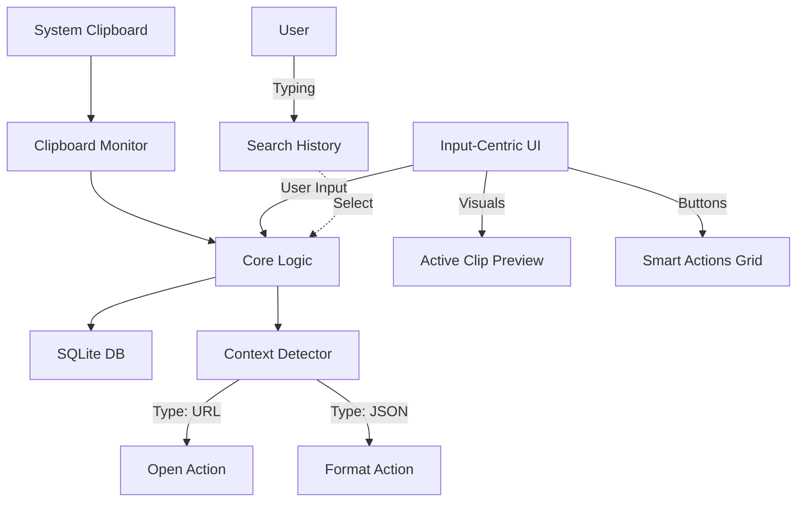

# Semantic Workflow Hub - Product Vision

*Last Updated: February 15, 2026*

---

## 🎯 Philosophy: From "Storage" to "Action"

Traditional clipboard managers focused on **history** ("What did I copy an hour ago?").
**Clips Next** focuses on **workflow** ("What can I *do* with what I just copied?").

**The Core Shift:**
- **Old:** Passive storage. User must search to find value.
- **New:** Active intelligence. The app suggests the next step based on content.

---

## 🖥️ User Experience (UX)

### 1. The "Input-Centric" Interface
Inspired by Spotlight, Raycast, and Alfred. The UI is ephemeral, fast, and keyboard-driven.

**Aesthetics:**
-   **Glassmorphism:** Subtle frosted glass effect (backdrop-filter) for a modern, native feel.
-   **Minimalist:** content-first, low chrome.
-   **Dark Mode:** Deep, contrast-rich dark theme by default.

**Default State (No Typing):**
1.  **Input Bar (Top):** Large, focused search/command bar. Always the primary focus.
2.  **Active Clip Preview:** A rich, prominent preview of the *current* clipboard content.
    -   *Code:* Syntax highlighted code (supported languages).
    -   *Data:* JSON Tree view, CSV Table view.
    -   *Visuals:* Mermaid diagrams, Color swatches, Image previews.
    -   *Web:* URL Metadata Cards (Title, Description, Favicon, Open Graph Image).

3.  **Smart Actions Grid:** A grid of relevant actions based on the active clip.
    -   *URL:* "Open in Browser", "Copy Title", "Copy Markdown Link", "Shorten", "Archive (Wayback Machine)".
    -   *File/Path:* "Open File", "Show in Folder", "Copy Absolute Path", "Share", "Quick Look", "Open in Terminal".
    -   *Image:* "Copy Text (OCR)", "Resize", "Convert Format (PNG/JPG)", "Remove Background".
    -   *CSV/Excel:* "View as Table", "Convert to JSON", "Copy as Markdown Table", "Plot Chart".
    -   *Mermaid:* "Render Diagram", "Copy Image", "Edit Source".
    -   *Date/Time:* "Convert to Local Time", "Show Relative Time", "Copy ISO Format", "Add to Calendar".

**Search State (Typing):**
-   As soon as the user types, the **History List** slides in or fades in below the input action area.
-   The UI transforms into a search interface for finding past clips.
-   Selecting a past clip brings it to the "Active" state, showing its specific Smart Actions.

---

## ⚡ Smart Actions Engine

The heart of the new workflow is the **Context Engine**.

### 1. Content Detectors
Analyzers that run instantly on clipboard content to determine its *semantic type*.

| Detector | Triggers On | Example |
| :--- | :--- | :--- |
| **URL** | Web links | `https://github.com/rust-lang/rust` |
| **Color** | Hex, RGB, HSL | `#ff0000`, `rgb(255, 0, 0)` |
| **Code** | Programming syntax | `fn main() { println!("Hello"); }` |
| **Email** | Email addresses | `user@example.com` |
| **Path** | File system paths | `/usr/local/bin`, `C:\Windows` |
| **JSON** | Valid JSON text | `{"key": "value"}` |
| **JWT** | JWT tokens | `eyJhbGciOiJIUzI1Ni...` |

### 2. Action Registry
Actions are dynamic commands available based on the detected type.

-   **Universal Actions:**
    -   "Paste" (Primary Action)
    -   "Paste as Plain Text"
    -   "Edit"
    -   "Favorite/Pin"

-   **Type-Specific Actions:**
    -   *Code:* "Copy Minified", "Create Gist", "Explain Code (AI)"
    -   *Color:* "Copy Hex", "Copy RGB", "Copy Swift/SwiftUI Color", "Copy CSS"
    -   *Path:* "Open in Finder/Explorer", "Open in Terminal", "Copy Absolute Path"
    -   *Text:* "Summarize (AI)", "Fix Grammar (AI)", "Translate", "Typosquash"

---

## 🧠 AI Intelligence (Phase 2)

AI is not just a chatbot; it's a **transformation engine**.

-   **Local/Cloud Hybrid:** Use local small models (e.g., Llama 3 8B via Ollama) for speed/privacy, or cloud (OpenAI/Anthropic) for complex tasks.
-   **Semantic Search:** "Find that code I copied about sorting arrays" (even if the word "sorting" wasn't used).
-   **Generative Transform:**
    -   "Turn this JSON into a TypeScript Interface"
    -   "Rewrite this email to be more polite"
    -   "Extract all email addresses from this text"

---

## ✨ Important Features

| Detected Type | Target Audience | Visual Renderer (Preview) | The "Time-Saver" Action (Value Add) | Rationale (Why this wins) |
| :--- | :--- | :--- | :--- | :--- |
| **Secrets / Password** | Everyone (100%) | Obfuscated (••••••••) | • **Security:** DO NOT SAVE to history (Transient mode). • **Auto-Clear:** Remove from clipboard after 30s. • **Reveal:** Toggle visibility (requires biometric/auth). | Preventing accidental leaks (e.g., pasting a password into Slack) is a safety net users will rely on. |
| **JWT Token** | Developers, DevOps | Decoded Header & Payload (formatted JSON) | • **Expiration Check:** Show "Expires in 2 hours" (Human readable). • **Copy Payload:** Extract just the JSON data. • **Copy Token:** Copy the raw string for headers. | Developers constantly paste tokens into jwt.io to check expiry. Doing this offline/locally is faster and safer. |
| **URL (Link)** | Everyone (100%) | Page Title + Domain Icon (Favicon) | • **Strip Tracking:** Remove `?utm_`, `fbclid` automatically. • **Copy as Markdown:** `[Title](URL)` for tickets/docs. | Everyone hates messy links. Cleaning them automatically is a "magical" quality-of-life upgrade. |
| **Color (Hex/RGB)** | Designers, Frontend | Large Color Swatch (fills card background) | • **Convert Format:** One-click Hex ↔ RGB ↔ HSL. • **Copy for CSS:** `rgba(255,0,0,1)`. | Designers constantly switch tools. Bridging the format gap saves 10+ seconds per copy. |
| **JSON / Code** | Developers, Data | Syntax Highlighted Block (First 5 lines) | • **Prettify/Minify:** Toggle readability. • **Copy as String:** Escape quotes for code (`"{\"a\":1}"`). | Reading raw JSON is painful. Instant formatting prevents context switching. |
| **Unix Timestamp** | Devs, SysAdmins | Human-Readable Date (e.g., "Feb 16, 10:45 PM") | • **Relative Time:** Show "2 hours ago". • **Copy ISO 8601:** Standardize format for DBs/Logs. | Debugging logs often involves cryptic numbers. Decoding them in-place is a huge relief. |
| **Image (Bitmap)** | Everyone (100%) | Thumbnail Preview | • **OCR:** "Copy Text from Image" (extract errors/content). • **Convert:** PNG ↔ JPG. | Screenshots are often used to capture error messages. OCR is the "killer feature." |
| **Email / Contact** | Everyone (100%) | Avatar (Gravatar) + Name | • **Compose:** `mailto:` trigger. • **Copy Domain:** Extract `@company.com`. | Quick actions streamline communication workflows. |
| **CSV / Excel** | Analysts, Ops | Mini Table Grid (First 3 rows) | • **Convert to Markdown:** For GitHub/Notion tables. • **Convert to JSON:** For API usage. | Data often "dies" in spreadsheets. Making it portable to other tools is a massive booster. |

## 🗺️ Roadmap

### Phase 1: The Foundation (Current Focus)
-   [x] **UI Redesign:** Build the new Input + Active Preview + Actions layout.
-   [x] **Action Registry:** Create the internal architecture for registering detectors and actions.
-   [x] **Basic Detectors:** Implement URL, Color, and Code detection.
-   [x] **Core Actions:** Implement "Open", "Copy Plain", and "Edit".

### Phase 2: Intelligence & Scripting (Next Focus)
-   [ ] **AI Integration:** Connect to LLM providers (e.g. OpenRouter) for "Smart Transform" actions.
-   [ ] **User Scripts:** Allow users to write simple JS/Lua scripts to add custom actions.
-   [ ] **Keyboard Efficiency:** Vim-like navigation for actions and history.

### Phase 3: Ecosystem
-   [ ] **Plugin System:** Allow community to share Action Packs.
-   [ ] **Deep Integrations:** specialized actions for tools like VS Code, Obsidian, Notion.

---

## 🔍 Intelligence Engine — Detector Status

*Last Updated: February 17, 2026*

All detectors are implemented in Rust (`src-tauri/src/services/intelligence.rs`) as pure functions.
Detection runs on **all text-bearing clips** (text, HTML plain text, RTF plain text) during clipboard ingestion.

| Detector | Strategy | Confidence | Heuristic Limitations / TODO |
| :--- | :--- | :--- | :--- |
| **URL** | Regex + `url::Url::parse` | ✅ 1.0 | Fully parsed. No tracking-param stripping yet. |
| **Color** | Regex (hex, rgb, rgba, hsl, hsla) | ✅ 1.0 | Standard CSS colors supported. |
| **Email** | Regex | ✅ 1.0 | Standard email validation. |
| **JSON** | `serde_json::from_str` | ✅ 1.0 | Real parser, zero false positives. |
| **Path** | Regex (Unix + Windows) | ✅ 1.0 | Path patterns detected and verified. |
| **JWT** | Pattern match (`eyJ` + 3 base64url segments) | ✅ 1.0 | Detected and parsed. |
| **Timestamp** | Numeric range check (2001–2040) | ✅ 0.95 | High confidence heuristic. |
| **Code** | Keyword + structure scoring per language | ✅ 0.95 | Advanced syntax detection. |
| **Secret** | Regex (AWS, GitHub, Stripe, Private Key) | ✅ 1.0 | Transient mode trigger. High confidence patterns. |
| **CSV** | Delimiter consistency check (, ; \t \|) | ✅ 0.95 | Requires >= 2 lines and consistent columns. |
| **Phone** | Regex (US + Intl E.164) | ✅ 0.95 | Validates length and common formats. |
| **Math** | Regex (Simple arithmetic) | ✅ 0.9 | Detects basic expressions like `10 + 5 * 2`. |
| **Date** | Regex (ISO 8601 + Slash formats) | ✅ 0.95 | Covers ISO 8601 and common slash formats. |
| **Text** | Fallback (always matches) | ✅ 1.0 | Default when no other detector matches. |

---

## 🏗️ Architecture

