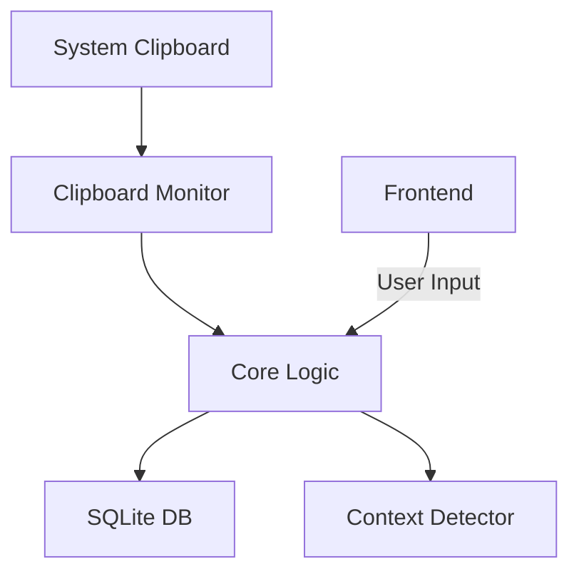

# ClipsX Product Direction

*Last Updated: June 19, 2026*

---

## Purpose

ClipsX is a local-first clipboard manager focused on fast retrieval and practical workflows.

Near-term product direction is intentionally narrow:
- reliable clipboard capture and storage
- strong text and semantic search
- content-aware previews and actions
- lightweight organization
- OCR for image-based clips

---

## Working Principles

- **Local-first:** user data stays on device unless a future feature explicitly requires otherwise.
- **Trustworthy:** startup state, settings persistence, and search behavior should be predictable.
- **Fast:** search, preview rendering, and common actions should feel instant.
- **Small increments:** build reviewable milestones and commit each cohesive step.

---

## Current Baseline

The current branch already includes:
- clipboard monitoring for multiple formats
- SQLite-backed history and full-text search
- semantic search persistence and startup recovery
- semantic reindexing for existing clips
- richer semantic model status in the UI
- detector-driven content previews and actions
- repaired frontend and Rust test baseline
- tags and notes per clip with FTS indexing and tag filter
- automatic OCR for image and office clips with queued/running/done status
- in-app updater wiring for release builds

Known limitations on this branch: none.

---

## Active Roadmap

### Done
- [x] Semantic search persistence across restarts
- [x] Test baseline repair
- [x] Search filter and semantic behavior cleanup
- [x] Semantic reindex for older clips
- [x] Semantic model status and search UX improvements
- [x] Tags and notes: per-clip labels with color, inline editor, tag filter, FTS-indexed notes (collections dropped as redundant)
- [x] Apply `tag_filter` inside semantic search so search results match browse/FTS filtering
- [x] OCR workflows for image clips

### Next
- [ ] Keyboard-first navigation and quick actions
- [ ] User scripts or lightweight extensibility hooks
- [ ] Release hardening and smoke-test coverage across macOS, Windows, and Linux

### Later
- [ ] Plugin system
- [ ] Deep integrations with external tools
- [ ] Bigger differentiators after the core roadmap is complete

### Not In Current Scope
- cloud sync
- generative text transforms
- Smart Paste
- team features

---

## Implemented Detectors

Detection runs in Rust during clipboard ingestion for text-bearing clips.

- URL
- Color
- Email
- JSON
- Path
- JWT
- Timestamp
- Code
- Secret
- CSV
- Phone
- Math
- Date
- Text fallback

Source of truth: `src-tauri/src/services/intelligence.rs`

---

## Architecture

```mermaid
graph TD
    Clipboard[System Clipboard] --> Monitor[Clipboard Monitor]
    Monitor --> Logic[Core Logic]
    Logic --> Storage[SQLite DB]
    Logic --> Detector[Context Detector]
    UI[Frontend] -->|User Input| Logic
```

---

## v1.1 Post-Stabilization Roadmap

### Completed (v1 to v1.1 Transition)

**Phase 1: Core Bug Fixes**
- [x] **OCR Empty-Result Bug**: Fixed `update_after_ocr()` to preserve original content placeholder when OCR yields empty text. Only updates and marks `primary_text_source='ocr'` on successful non-empty results. (commit 695e807)
- [x] **Image Preview as Thumbnail**: Implemented circular (8x8px) image thumbnails in clipboard history list view with Tauri `convertFileSrc()` for safe path resolution and fallback to ContentIcon on load failure. (commit e1d4abc)
- [x] **Clear-on-Exit Reliability**: Replaced blocking `block_in_place()` with `async_runtime::spawn()` to prevent window event handler hang during cleanup. Process: fetch all clips → delete files (images/PDF/SVG/attachments) → clear DB. (commit 005ffa4)

**Phase 4: QR Detection Infrastructure**
- [x] **Service Stub**: Created `src-tauri/src/services/qr_decoder.rs` with public API (`decode_qr_from_bytes()`, `decode_qr_from_path()`) and infrastructure test. Returns `Ok(None)` placeholder. (commit d380999)
- [x] **Tauri Command**: Added `decode_qr_code(clip_id)` command to bridge frontend → service. Validates image clip type, retrieves path, calls decoder, returns string or error.
- [x] **Dependency**: Added `rqrr = "0.8"` to Cargo.toml for QR detection library.
- [x] **UI Styling**: Circular image thumbnails with `rounded-full` to match icon visual style. (commit ae15d59, 0dd7a14)

### In Progress

**Phase 2: QR Code Detection - Full Implementation**
- [ ] **Implement QR Library Integration**: Replace stub functions in `qr_decoder.rs` with rqrr library calls
  - `decode_qr_from_bytes()`: Load image bytes → rqrr decode → extract payload
  - `decode_qr_from_path()`: Read file → call `decode_qr_from_bytes()`
  - Error handling and logging for decode failures
- [ ] **Automatic QR Detection During OCR Worker**: Extend OCR worker (2-sec pass) to also attempt QR detection on image clips
  - Store result in new DB field: `qr_payload` (TEXT, nullable)
  - Mark status in UI: success, attempted-none-found, failed
- [ ] **Manual "Decode QR" UI Action**: Add button/action in image detail pane to trigger `decode_qr_code()` command
  - Show result in toast notification or inline detail panel
  - Lazy decode for clips not auto-scanned (e.g., recently added)
- [ ] **DB Schema**: Add `qr_payload` column to clips table with migration
  - Index payload for search queries
- [ ] **Tests**: Comprehensive unit + integration tests for auto-detect and manual-action paths
  - Mock rqrr behavior, verify DB persistence, test error cases

**Phase 3: Internationalization (i18n)**
- [ ] **Setup i18n Stack**
  - Install `react-i18next` + `i18next` packages
  - Create locale JSON file structure: `src/locales/{en,es,ja,zh}/translation.json`
  - Configure i18next in `src/main.tsx` with fallback chain: user preference → browser lang → EN
- [ ] **Extract UI Strings**
  - Audit all components for hardcoded strings
  - Externalize to locale files with REQ-XXX keys
  - Maintain key namespacing: `common.`, `search.`, `actions.`, `settings.`, etc.
- [ ] **Target Languages**
  - EN (English) - source
  - ES (Spanish)
  - JA (Japanese)
  - ZH (Chinese Simplified)
- [ ] **Locale Switcher**: Add language selector in Settings pane
  - Persist selection to `settingsStore`
  - Live switch without reload (where feasible)
- [ ] **Tests**: Locale loading tests, string key coverage audit, RTL readiness (if Arabic added later)

### Not Yet Scheduled

**Phase 5: Sign-in / Sync Architecture (Design Phase)**
- [ ] **Documentation Only** (no implementation):
  - Define webhook strategy for clip sync across devices
  - Document multi-device sync protocol (conflict resolution, ordering)
  - Sketch user authentication flow (if sync requires server)
  - Security model for synced data
  - **Note**: Implementation deferred until core features mature and user demand validated

### Open Questions / Blocked
- QR detection library performance on large image files (may need optimization)
- Locale string volume estimate (full audit needed before Phase 3 start)
- Sync architecture dependencies (awaiting feature maturity metrics)
