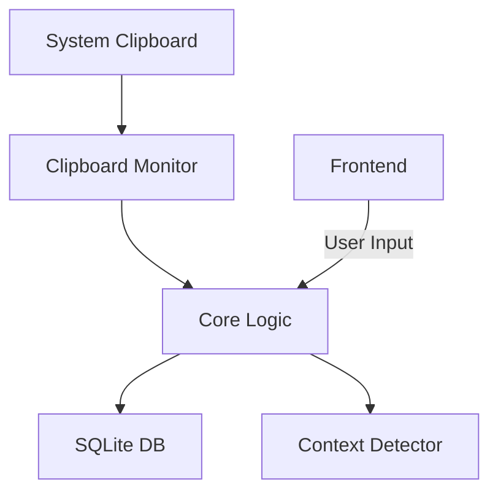

# ClipsX Product Direction

*Last Updated: May 11, 2026*

---

## Purpose

ClipsX is a local-first clipboard manager focused on fast retrieval and practical workflows.

Near-term product direction is intentionally narrow:
- reliable clipboard capture and storage
- strong text and semantic search
- content-aware previews and actions
- lightweight organization
- OCR for image-based clips

---

## Working Principles

- **Local-first:** user data stays on device unless a future feature explicitly requires otherwise.
- **Trustworthy:** startup state, settings persistence, and search behavior should be predictable.
- **Fast:** search, preview rendering, and common actions should feel instant.
- **Small increments:** build reviewable milestones and commit each cohesive step.

---

## Current Baseline

The current branch already includes:
- clipboard monitoring for multiple formats
- SQLite-backed history and full-text search
- semantic search persistence and startup recovery
- semantic reindexing for existing clips
- richer semantic model status in the UI
- detector-driven content previews and actions
- repaired frontend and Rust test baseline
- tags and notes per clip with FTS indexing and tag filter

Known limitations on this branch: none.

---

## Active Roadmap

### Done
- [x] Semantic search persistence across restarts
- [x] Test baseline repair
- [x] Search filter and semantic behavior cleanup
- [x] Semantic reindex for older clips
- [x] Semantic model status and search UX improvements
- [x] Tags and notes: per-clip labels with color, inline editor, tag filter, FTS-indexed notes (collections dropped as redundant)
- [x] Apply `tag_filter` inside semantic search so search results match browse/FTS filtering

### Next
- [ ] OCR workflows for image clips
- [ ] Keyboard-first navigation and quick actions
- [ ] User scripts or lightweight extensibility hooks

### Later
- [ ] Plugin system
- [ ] Deep integrations with external tools
- [ ] Bigger differentiators after the core roadmap is complete

### Not In Current Scope
- cloud sync
- generative text transforms
- Smart Paste
- team features

---

## Implemented Detectors

Detection runs in Rust during clipboard ingestion for text-bearing clips.

- URL
- Color
- Email
- JSON
- Path
- JWT
- Timestamp
- Code
- Secret
- CSV
- Phone
- Math
- Date
- Text fallback

Source of truth: `src-tauri/src/services/intelligence.rs`

---

## Architecture

```mermaid
graph TD
    Clipboard[System Clipboard] --> Monitor[Clipboard Monitor]
    Monitor --> Logic[Core Logic]
    Logic --> Storage[SQLite DB]
    Logic --> Detector[Context Detector]
    UI[Frontend] -->|User Input| Logic
```
