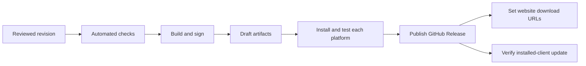

# Release and platform validation

A release is ready when its exact artifacts pass automated checks and installed
tests on every advertised platform. This checklist is not a record of a passed
release. Open shipping work belongs in [ROADMAP.md](ROADMAP.md).



## Scope

| Target                 | Required coverage                                                                                             |
| ---------------------- | ------------------------------------------------------------------------------------------------------------- |
| Windows x64            | Installer, Authenticode, native behaviour                                                                     |
| macOS arm64 and x64    | Developer ID, notarization, stapling, native behaviour on both architectures                                  |
| Linux/X11 x64          | .deb and AppImage, dependencies, desktop integration                                                          |
| Outside current claims | Wayland, hosted/visual model runtimes, additional generation providers, desktop Vault, clipboard-content sync |

Advertise only demonstrated capabilities. Configuration sync and local Ollama
generation require installed tests like other features. Windows OCR is
release-blocking until its real lifecycle passes.

Preserve the current schema/reset contract in [Architecture](ARCHITECTURE.md).
Release notes must explain incompatible-schema resets; packaging is not a reason
to add compatibility reads.

## Build and publication

Source: [CI](../.github/workflows/ci.yml),
[release workflow](../.github/workflows/release.yml),
[Tauri configuration](../src-tauri/tauri.conf.json).

| Trigger                    | Current workflow behaviour                                 |
| -------------------------- | ---------------------------------------------------------- |
| Push/PR to main or develop | CI; no release publication                                 |
| Manual release workflow    | Build candidate artifacts; no GitHub Release publication   |
| Matching `v<version>` tag  | Preflight and four build jobs; create/upload draft release |
| Publish draft              | Separate release decision after certification              |

The matrix uses hosted Windows, Linux, and macOS runners; macOS arm64/x64 are
separate build targets. Local hardware is still needed for installed testing.

### Configuration that must be verified before shipping

| Area                     | Current source / required action                                                                                                                                                                    |
| ------------------------ | --------------------------------------------------------------------------------------------------------------------------------------------------------------------------------------------------- |
| Production account build | Supply public Auth/site values below; generate and pass production CSP/config. Current release jobs do not explicitly wire these values or the production config overlay                            |
| Windows signing          | No Authenticode signing configuration in the checked-in workflow/base config; configure and verify signed executable/installer                                                                      |
| macOS signing            | Base config has `signingIdentity: "-"`, `hardenedRuntime: false`; configure Developer ID, hardened runtime, notarization, stapling                                                                  |
| Updater                  | `createUpdaterArtifacts: true`, embedded public key, GitHub `latest.json` endpoint; jobs reference private-key secrets. Verify actual key availability, matching signatures, and published metadata |
| Artifact checks          | Workflow records file inventory and hashes; this does not prove expected packages, content safety, or size budgets                                                                                  |
| Rust application tests   | CI uses `--bin clipsx`; release jobs currently use unqualified `cargo test`. Confirm the intended tests execute on every runner, including Windows                                                  |

Repository source cannot prove that signing secrets, certificates, server
settings, or release artifacts are configured correctly.

| Build value                                                       | Purpose                                             |
| ----------------------------------------------------------------- | --------------------------------------------------- |
| `VITE_SUPABASE_URL`                                               | Production Auth/API origin                          |
| `VITE_SUPABASE_PUBLISHABLE_KEY`                                   | Public client key; never a secret/service-role key  |
| `VITE_NEXT_PUBLIC_SITE_URL`                                       | Production site and hosted callback origin          |
| `SENTRY_AUTH_TOKEN`                                               | Private release/source-map upload token              |
| `SENTRY_DSN`, `VITE_SENTRY_DSN`                                  | Public desktop ingestion DSN                         |
| `SENTRY_RELEASE`, `VITE_SENTRY_RELEASE`                          | Identical `clipsx-desktop@<version>+<sha>` identity  |
| `TAURI_SIGNING_PRIVATE_KEY`, `TAURI_SIGNING_PRIVATE_KEY_PASSWORD` | Updater signing secrets                             |
| Embedded updater `pubkey` and endpoint                            | Installed client's trust root and metadata location |

The workflow also passes `TAURI_UPDATER_PUBLIC_KEY`; verify the final Tauri
configuration rather than assuming that environment variable replaces the
embedded key. Registry keys are separate compiled public trust roots.

Keep private keys in the signing environment and secure backup. Windows/Apple
code signing, Tauri updater signing, and extension catalog signing are separate.
Before release, verify the updater private key matches the embedded public key.
Future clients must continue to trust updates; key rotation needs an explicit
transition, not an arbitrary replacement.

Sentry releases use `clipsx-desktop@<app-version>+<full-git-sha>`. Generate this
once per build and use it for both native and webview SDKs, source maps, commit
association, and deployment records. Release checkout requires full Git history.
Keep `SENTRY_AUTH_TOKEN` in GitHub secrets and public DSNs in repository or
environment variables. Development, tests, forks, and ordinary manual candidate
builds do not transmit unless `CLIPSX_SENTRY_ENABLED`/`VITE_SENTRY_ENABLED` is
explicitly set for a controlled verification build.

### Production smoke build

With production values in the ignored `.env`:

```sh
npm run tauri:build:production:smoke
```

This validates HTTPS non-loopback origins/public keys, generates matching CSP,
uses the hosted PKCE production path, and builds a release executable without
installers or a development server. On Windows, run
`src-tauri/target/release/clipsx.exe`. Use isolated test data.

`tauri:dev:production` still uses Vite and does not certify the hosted callback.
`tauri:build:production` requests bundles, but bundles still need signing and
installed certification.

## Automated preflight

Run against a clean checkout of the candidate revision:

```sh
npm ci
npm run type-check
npm run lint
npm run format:check
npm test -- --run
npm run build
cargo fmt --all --manifest-path src-tauri/Cargo.toml -- --check
cargo clippy --manifest-path src-tauri/Cargo.toml --all-targets --all-features -- -D warnings
cargo test --manifest-path src-tauri/Cargo.toml --all-features --bin clipsx
cargo test --manifest-path src-tauri/Cargo.toml --bin clipsx-extension-tool
```

| Gate                  | Required checks                                                                                                                                                                           |
| --------------------- | ----------------------------------------------------------------------------------------------------------------------------------------------------------------------------------------- |
| Application contracts | Command registration, schema/reset, managed-file recovery, render models, artifacts/OCR, extension sandbox, output policy                                                                 |
| Settings / mutations  | Atomic save/reset/outbox, import round trips/exclusions, pending recovery, cloud-echo no-auto-install, edit ordering; deletion/invalidation of clips, tags, notes, OCR, files and indexes |
| Clipboard fixtures    | Restart round trip, Unicode/HTML/RTF/file ordering, binary bytes, wrapper offsets, observed native identities, self-write paths, bounded unsupported-format observations                  |
| UI / native effects   | Splitter geometry/persistence, command save/reset/conflicts, all-or-nothing share preparation                                                                                             |
| Supply chain          | Dependency audit, licenses, SBOM, secret scan, built-artifact and log inspection                                                                                                          |
| Security              | Review actionable findings against source/tests; resolve high-severity findings                                                                                                           |
| Search capacity       | Run [qualification tests](SEMANTIC_SEARCH_ARCHITECTURE.md#qualification); retain output                                                                                                   |

Tests establish only the behaviour they exercise. Old test counts and developer
timings are not certification of the current release.

Extension build/publication belongs to `clipsx-extensions`; reviewed signed
catalog publication belongs to `clipsx-registry`. Use their package-validation
workflows and confirm the production catalog/approval sync. App CI does not
publish extension releases.

## Native clipboard sequence

The [platform-format matrix](platform-format-matrix.json), its
[schema](platform-format-matrix.schema.json), and compiled codecs define support.
Change policy and fixtures together; never infer native identifiers.

```text
Place fixture with alternates -> capture -> inspect identity/order/storage/source
  -> restart -> Original reconstruction -> inspect native formats/bytes/references
  -> Plain Text independently of renderer -> verify no self-write duplicate
  -> paste into real application -> verify content, focus, permissions, diagnostics
```

Run this sequence for every supported format. Unsupported formats must follow
the declared skip/reject policy.

| Platform  | Required fixtures                                                                                                                                                                                              |
| --------- | -------------------------------------------------------------------------------------------------------------------------------------------------------------------------------------------------------------- |
| Windows   | CF_UNICODETEXT; HTML Format; Rich Text Format; ordered CF_HDROP; PNG/normalized CF_DIB; registered PDF/SVG; supported Office/native formats and alternates; private Office noise retained only as observations |
| macOS     | public.utf8-plain-text, public.html, public.rtf, ordered public.file-url; PNG/JPEG/TIFF; PDF/SVG; supported Microsoft/native UTIs and alternates                                                               |
| Linux/X11 | UTF8_STRING; text/html; text/rtf and application/rtf; image/png; text/uri-list                                                                                                                                 |

### Platform-specific checks

| Platform               | Verify in installed artifacts                                                                                                                                                                                                                 |
| ---------------------- | --------------------------------------------------------------------------------------------------------------------------------------------------------------------------------------------------------------------------------------------- |
| Windows clipboard      | Registered writeback/wrappers; screenshot PNG preview/reconstruction after restart; PNG/SVG custom-protocol origins and format tabs; editable Word selections/tables, Excel formulas/formatting, PowerPoint shapes and single/multiple slides |
| Windows window         | Foreground restoration/synthetic paste; minimize, maximize, close, snap                                                                                                                                                                       |
| Windows account        | Session larger than Credential Manager limit; restart/refresh/sign-out; corrupted DPAPI and unwritable auth directory recover through Reset local sign-in without deleting history/settings/other credentials                                 |
| Windows OCR / share    | WinRT availability/language discovery; Share Sheet receives URL links, exact text, existing/exported file items without closing preview                                                                                                       |
| macOS clipboard/window | Ordered multifile reconstruction; supported UTIs only; frontmost-app restoration and Accessibility permission recovery                                                                                                                        |
| macOS OCR / share      | Vision language selection/bounded execution on both architectures; native picker handles URL, text, single/ordered multiple files without closing preview                                                                                     |
| Linux clipboard/window | X11 selection ownership lasts through consumer read; XTest quick paste/focus on advertised desktops                                                                                                                                           |
| Linux OCR              | Tesseract discovery/version/languages; missing-runtime recovery; .deb recommends tesseract-ocr, tesseract-ocr-eng, tesseract-ocr-jpn                                                                                                          |
| Linux packages/share   | Test .deb and AppImage integration; portal application choice for each explicit share; harmless cancellation                                                                                                                                  |

AppImage uses host Tesseract. Without it, the app stays usable and explains
installation; on Debian/Ubuntu:
`sudo apt install tesseract-ocr tesseract-ocr-eng tesseract-ocr-jpn`.
Refresh/restart must restore OCR without reinstalling ClipsX. Use the equivalent
packages elsewhere. Wayland is not covered.

## Shared installed checks

Run on every advertised platform using isolated test profiles. A checkbox is
complete only when linked evidence identifies the artifact and result.

- [ ] **Desktop:** tray, global shortcut/toggle, focus, close-to-tray, explicit
      quit, second launch, autostart, deep links, file dialogs; shortcut conflicts,
      OS refusal, save/rollback failure, Retry.
- [ ] **Capture/output:** exclusions, deduplication, retention, self-write
      suppression; Original/Plain Text with alternate renderer selected; periodic
      clear and explicit-quit clear.
- [ ] **Reset:** first launch, incompatible schema, incorrect confirmation,
      partial failure without automatic restart.
- [ ] **Settings:** validate/change/restart every setting; splitter pointer and
      keyboard behaviour in wide/narrow windows; reset restores native defaults,
      logging, built-in shortcuts while preserving the documented data.
- [ ] **Import/export:** signed out and sync enabled; invalid documents,
      exclusions, pending packages/commands, recovery, no automatic installs or
      copied credentials/grants.
- [ ] **Logging:** toggle/restart; exercise capture/render/auth/native failures
      with sensitive sentinels; verify no contents, secrets, tokens, auth URLs, or
      unnecessary paths in development/production output and artifacts.
- [ ] **Auth:** Google and GitHub, hosted PKCE, clipsx:// callback, refresh,
      restart/sign-out; reject invalid callbacks; development loopback listener
      stays path-bounded and expires.
- [ ] **Two-device sync:** advertised platforms; restore, concurrent/offline
      edits, clock skew, tombstones, interruption, sign-out, revocation, remote reset,
      unavailable/quarantined packages; only allowlisted configuration travels.
- [ ] **Hosted account:** verify deployed Auth origins/redirects, migrations,
      grants/advisors and account-deletion behaviour against clipsx-web evidence.
- [ ] **OCR:** disabled/queued/running/empty/success/unsupported/failure/retry;
      cancellation, deletion, restart recovery; Automatic/English/Japanese and
      language changes; exactly-once search refresh with unchanged image bytes.
- [ ] **Search/Recall:** configuration, provider failure/recovery, exact
      identifiers, filters, citation support, cancellation, self-write checks;
      [capacity qualification](SEMANTIC_SEARCH_ARCHITECTURE.md#qualification) before
      capacity claims.
- [ ] **Sharing:** Unicode, URLs, existing/missing files, images, PDFs, typed
      documents, unsupported native data; duplicate clicks, corrupt assets,
      cancellation; exports exclude notes/tags/source metadata/OCR/extension views.
- [ ] **Extensions:** incompatible API rejection and manifest validation;
      registry and Developer Mode install/use/disable/re-enable/update/quarantine/
      recovery/uninstall; disclosed permissions, fresh consent, offline catalog.
- [ ] **Extension UI:** bounds, focus, keyboard/screen-reader labels, theme/locale,
      teardown, loading/error recovery; no inherited main-webview commands.
- [ ] **Package behaviour:** Ask AI Unicode URL bounds; Mermaid standalone/pie/
      comments/init/front matter and Markdown, one themed Mermaid tab, hostile input
      offline, source fallback and restored generic details on disable; other
      catalog packages' declared operations.
- [ ] **Derived failures:** renderer/transform/provider/extension/OCR failures
      preserve originals; compact cache survives restart/scroll without WASM;
      malformed compact output falls back.
- [ ] **Accessibility:** English/Japanese and keyboard-only history, previews,
      actions, settings, Intelligence, Extensions, transforms, recovery; NVDA,
      VoiceOver, Orca on their respective platforms.
- [ ] **Public links:** website/downloads/docs and Sponsors button once enabled.

## Packaging and updates

| Platform | Required result                                                                                         |
| -------- | ------------------------------------------------------------------------------------------------------- |
| Windows  | Valid executable/installer signatures; clean install, upgrade, downgrade rejection, uninstall, metadata |
| macOS    | Developer ID, hardened runtime, notarization/stapling; clean-machine install on each architecture       |
| Linux    | Correct dependencies and desktop integration per package; verify supported update path per format       |

- [ ] Inspect actual package contents/hashes and confirm expected platform assets.
- [ ] Verify updater signatures and `latest.json` match the distributed bytes.
- [ ] Test an older installed candidate -> newer candidate with the retained
      updater trust key; then test the published endpoint.
- [ ] Missing updater configuration reports unavailable without breaking startup.
- [ ] Exercise failed/interrupted update and document a working recovery path;
      do not assume automatic downgrade or rollback exists.
- [ ] Retain installed data across the supported update; document any schema
      reset requirement explicitly.

A manual candidate build does not establish that release `latest.json` was
published. Check metadata and every platform URL on the draft/tag publication
path, then on the public release.

## Evidence and sign-off

Store evidence with the candidate/release and link it here. No installed
cross-platform sign-off is recorded by this checklist.

| Field       | Record                                                             |
| ----------- | ------------------------------------------------------------------ |
| Identity    | Source revision, package version, artifact hash                    |
| Environment | OS version, CPU architecture, desktop/session type                 |
| Test        | Fixture/action, expected result, actual result                     |
| Evidence    | CI/test output, signing/notarization results, redacted diagnostics |
| Decision    | Pass/fail, remaining blocker, evidence URL/path                    |

Publish only when the applicable checks pass, required
[roadmap work](ROADMAP.md) is complete, and no high-severity finding remains.
Release notes state verified platforms/features, limitations, reset implications,
and updater compatibility. Finalize website URLs after assets are public.
