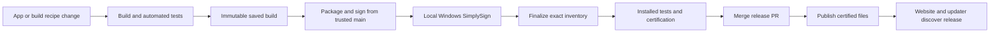

# Release and platform validation

A release is ready when its exact artifacts pass automated checks and installed
tests on every advertised platform. This checklist is not a record of a passed
release. Open shipping work belongs in [ROADMAP.md](ROADMAP.md).


```mermaid
flowchart LR
    App[App or build recipe change] --> Build[Build and automated tests]
    Build --> Save[Immutable saved build]
    Save --> Prepare[Package and sign from trusted main]
    Prepare --> Win[Local Windows SimplySign]
    Win --> Final[Finalize exact inventory]
    Final --> Test[Installed tests and certification]
    Test --> Merge[Merge release PR]
    Merge --> Publish[Publish certified files]
    Publish --> Web[Website and updater discover release]
```

## Scope

| Target                 | Required coverage                                                                                             |
| ---------------------- | ------------------------------------------------------------------------------------------------------------- |
| Windows x64            | Installer, Authenticode, native behaviour                                                                     |
| macOS arm64 and x64    | Developer ID, notarization, stapling, native behaviour on both architectures                                  |
| Linux/X11 x64          | .deb and AppImage, dependencies, desktop integration                                                          |
| Outside current claims | Wayland, hosted/visual model runtimes, additional generation providers, desktop Vault, clipboard-content sync |

Advertise only demonstrated capabilities. Configuration sync and local Ollama
generation require installed tests like other features. Windows OCR is
release-blocking until its real lifecycle passes.

Preserve the current schema/reset contract in [Architecture](ARCHITECTURE.md).
Release notes must explain incompatible-schema resets; packaging is not a reason
to add compatibility reads.

Extension API v3.2 releases must certify durable Rewrite and local transformer jobs across restart, exact source-application attribution, source deletion, package update/uninstall, typed output rendering, and explicit promotion. The fresh database baseline is version 15 and requires an explicit reset. Discover shows only current-contract releases and rejects incompatible archives with an upgrade message.

## Build and publication

Compilation and release preparation are separate. Keep app source and release
tooling in this repository. Release packaging, readiness, certification and
publication execute trusted default-branch scripts. Packaging takes an explicit
successful build ID; it never compiles the app/frontend or runs application tests.

| Workflow / trigger                                                                                         | Result                                                                                                                      |
| ---------------------------------------------------------------------------------------------------------- | --------------------------------------------------------------------------------------------------------------------------- |
| **Build release app**: `release/<version>` push affecting app/build inputs; manual dispatch on that branch | Frontend checks and production frontend once; native tests and optimized compilation once per target; immutable saved build |
| **Prepare release candidate**: successful build completion; manual dispatch on `main`                      | Download selected build; package/sign/notarize missing platforms; preserve successful outputs                               |
| Local Windows helper                                                                                       | Package CI executable without recompilation; sign app, NSIS installer and uninstaller; upload and dispatch finalization     |
| **Finalize release candidate**: dispatch on `main`                                                         | Verify Windows installation and original executable; finalize complete inventory and updater signatures                     |
| **Certify candidate**: dispatch on `main`                                                                  | Bind exact candidate, release PR, notes, inventory and real installed/upgrade evidence                                      |
| Release PR merge into `main`                                                                               | Publish the certified existing draft and tag the merged commit; no rebuild/re-sign                                          |
| Ordinary merges or tag pushes                                                                              | No desktop release build/publication                                                                                        |

### Routing and identity

`scripts/release/inputs.mjs` is the single file classification. App inputs include
source, public assets, Rust migrations/permissions/configuration, dependencies and
lockfiles, compiler/frontend settings and production environment/CSP generators.
Unknown files are conservatively app inputs. Compilation workflows and build
helpers are recipes: release-branch changes trigger a new build. Docs and
packaging/signing/upload helpers skip expensive app checks. Ordinary PRs run
application checks for app changes and focused tooling checks for infrastructure
changes. Both routes report the aggregate required `CI` gate.

The app-input inventory contains tracked paths, modes and Git blobs, including
new/deleted files. Its digest compares a saved build with release source; it is
not a cross-commit build cache. Reuse always selects a build explicitly. Changes
to public production variables require an explicit new build and fail reuse.

Internal `candidate.json` schema **2** records build source revision/tree,
successful build run/attempt, immutable artifact IDs/digests, frontend/generated
configuration, compiler and public environment provenance, and per-platform
binary hashes. Preparation records its separate trusted tooling revision and run.
It never attributes old binaries to a newer commit. Notes are captured and hashed
at preparation. Public `downloads.json` remains schema **1**.

Successful native builds save executables after tests and optimized compilation.
Debug tests and production builds have separate profiles. Native matrix
`fail-fast` is disabled. Artifacts expire after 30 days; expired/incomplete builds
must be rebuilt rather than guessed or combined with another run.

### Select and retry preparation

On GitHub Actions, choose **Prepare release candidate → Run workflow → main**.
Enter the successful `build_run_id`. Leave `candidate_id` empty for a new candidate;
enter the exact existing ID to resume it. `target=missing` preserves completed
platforms. Explicitly select a platform (or `all`) to replace its bytes before
finalization. Workflow summaries print the build, candidate and next action.

```sh
gh workflow run release-prepare.yml --repo azure06/clipsx --ref main -f build_run_id=<build-id> -f candidate_id=<existing-candidate-id> -f target=missing -f pr_number=<release-pr>
```

After correcting release scripts, deploy them to `main`, then dispatch preparation
against the same build/candidate. Successful Mac/Linux packages remain untouched
when retrying Windows. Another build running or finishing does not supersede the
selection. Failed compilation can use **Re-run failed jobs**; packaging retries
use the preparation dispatch rather than restarting compilation.

`pr_number` explicitly selects the candidate by writing the PR body's
`clipsx-release-candidate` marker. Automatic preparation only fills an absent
selection. Readiness/signing/certification/publication never discover the latest
candidate or guess an ID. Release source must match the selected app inventory;
docs and release tooling can differ. Certification includes the exact release PR.

Finalized/certified candidates are immutable. A finalized retry verifies existing
signatures/manifests instead of generating new ones or repeating Windows installed
verification. Interrupted finalization reuses already verified signatures. Changed
assets, notes or evidence invalidate certification and block publication.

`Release readiness` passes ordinary PRs automatically. Release PRs report clear
states for missing selection, packaging, Windows signing/finalization, installed
certification, source/config mismatch or an orchestration error. Successful selected
build coverage supplies their `CI` status without duplicate app testing on the PR.

### Production configuration

Release runners use repository variables for:

- `VITE_SUPABASE_URL`: production HTTPS API/Auth origin.
- `VITE_SUPABASE_PUBLISHABLE_KEY`: public client key, never a service-role key.
- `VITE_NEXT_PUBLIC_SITE_URL`: production HTTPS site and OAuth callback origin.
- `SENTRY_DESKTOP_DSN`: public desktop ingestion DSN.
- `WINDOWS_SIGNING_CERT_THUMBPRINT`: expected Authenticode certificate fingerprint.

The production environment validator and authentication CSP generator run once
before the shared production frontend build. Native jobs verify those exact
assets and CSP before compilation. Environment variables can be supplied directly in CI or
loaded from the ignored local `.env`. macOS production builds require hardened
runtime and real Developer ID credentials; development's ad-hoc defaults remain
separate. Windows publishes NSIS only. Native tests explicitly select the
application binary to avoid Windows library-test GUI linking. macOS OCR explicitly
links Vision and CoreImage so runtime class discovery also works in headless test
processes. Both Mac architectures must pass language discovery and bitmap OCR.

Keep these existing repository secrets:

- `TAURI_SIGNING_PRIVATE_KEY` and `TAURI_SIGNING_PRIVATE_KEY_PASSWORD`.
- `SENTRY_AUTH_TOKEN`.

To upload validated local public production values, run
`node --env-file=.env scripts/release/pipeline.mjs configure-public` in an
administrator's authenticated GitHub CLI session. This uploads only the public
variables above. It also configures the Windows fingerprint when supplied as
`WINDOWS_SIGNING_CERT_THUMBPRINT` in the process environment.

The embedded updater public key and GitHub `latest.json` endpoint are retained.
Only `VITE_*` variables are exposed to the frontend. Keep updater signing keys,
their passwords and Apple credentials in GitHub Secrets; `TAURI_*` variables
remain available to signing tools without entering the frontend environment.
Finalization verifies signatures using the same Minisign decoding and verification
as the installed updater. A wrong private key fails verification; do not replace
the installed trust key to work around a failure.

### Apple credentials

Create a **Developer ID Application** certificate for distribution outside the
App Store. Export a `.p12` containing the certificate and its private key.
Create a team App Store Connect API key with Developer access for notarization.
In App Store Connect, open Users and Access, then Integrations and App Store
Connect API. Under Team Keys, generate a named key with Developer access, record
its key ID and the issuer ID, and download the `.p8` once. Retain that download
securely. The account holder may need to request API access first.

| GitHub secret                | Value                                          |
| ---------------------------- | ---------------------------------------------- |
| `APPLE_CERTIFICATE`          | Base64-encoded Developer ID Application `.p12` |
| `APPLE_CERTIFICATE_PASSWORD` | Export password                                |
| `APPLE_SIGNING_IDENTITY`     | Full Developer ID Application identity         |
| `APPLE_API_ISSUER`           | Team API issuer ID                             |
| `APPLE_API_KEY`              | API key ID                                     |
| `APPLE_API_PRIVATE_KEY`      | Downloaded `.p8` contents                      |

Add private values directly to GitHub Secrets, never source files or chat.
Runners create a temporary keychain and API-key file, then remove both even after
failure. Both architectures require app signature verification, notarization,
stapling and Gatekeeper assessment. The final DMG is also signed, notarized and
stapled. See [Tauri's Apple signing guide](https://v2.tauri.app/distribute/sign/macos/).

### Windows signing

Use PowerShell 7 on your own Windows desktop with Node 24, npm, Rust/Cargo metadata
tools, GitHub CLI, tar, Windows SDK SignTool and SimplySign Desktop installed.
Log into GitHub CLI and connect SimplySign in the same Windows user session.
The certificate must be valid and available in the current-user certificate store.

From the repository root:

```powershell
./scripts/release/sign-windows.ps1 -CandidateId <candidate-id> -CertificateThumbprint 6AF31929B107C7E9C725DE4BFAC7CEC5471E71D1
```

Optional `-SignToolPath` selects an SDK executable. `-WorkingDirectory` must name
a fresh directory. The helper never deletes or reuses an existing directory.

The helper downloads and verifies the exact packaging kit, restores its CI-built
executable and frontend resources, installs locked packaging dependencies without
lifecycle scripts, and runs `tauri bundle` rather than `tauri build`. A trusted
SignTool wrapper timestamps and verifies each Authenticode operation. The
installer, uninstaller and application must all be signed. NSIS signs its
generated uninstaller under a temporary filename; the wrapper verifies each
operation with Windows Authenticode, and hosted CI inspects the actual installed
uninstaller. Do not infer its role from a temporary basename. The helper uploads
the installer and dispatches Finalize release candidate on main. It does not
need the Tauri updater private key.

Finalization independently installs the package on a disposable hosted Windows
runner, verifies certificate fingerprints and timestamps, and confirms that the
installed executable matches the original CI image except for Authenticode's
checksum/certificate fields and Tauri's fixed-width NSIS format marker. The
installed marker must be NSIS; arbitrary code/data changes remain rejected. See
[Tauri's pinned bundler implementation](https://github.com/tauri-apps/tauri/blob/tauri-cli-v2.11.4/crates/tauri-bundler/src/bundle.rs#L32). The helper
uses its current PowerShell host so signing does not load incompatible modules
from another PowerShell edition. This automated inspection does not replace manual
native behavior and upgrade certification.

If upload/dispatch fails, retain the helper workspace. Retry submission with:

```powershell
node scripts/release/pipeline.mjs submit-windows <candidate-id> <installer-path> <windows-evidence-json-path>
```

Only an unfinalized, uncertified candidate accepts replacement submission.

### Finalization and updater manifests

Finalization requires Windows NSIS, both macOS architectures, Linux AppImage and
Debian packages. It signs and verifies final Windows/Linux packages and Mac
updater archives, generates `SHA256SUMS`, `latest.json` and `downloads.json`,
and preserves native verification evidence.

Updater entries distinguish `windows-x86_64-nsis`, `darwin-aarch64-app`,
`darwin-x86_64-app`, `linux-x86_64-appimage` and `linux-x86_64-deb`. Compatible
OS/architecture fallback entries are retained. Debian upgrades require the
appropriate privilege prompt; they must never receive an AppImage.

Website manifest schema 1 contains version, intended production tag, candidate
source revision and five download targets with architecture, format, exact
versioned URL, SHA-256 and native signing/notarization flags. Mac website downloads
are DMGs; Mac updater downloads are app archives. Linux native GPG signing is not
claimed. The website validates published metadata and refreshes it at request
time with a 30-second cache; no per-release web deployment or refresh webhook is
needed after the capability's initial deployment.

### Installed certification and publication

Download the final draft packages and perform the full applicable checklist
below on Windows, both Mac architectures and Linux/X11 for AppImage and Debian.
Record exact artifact hashes, environments, results and an HTTPS evidence link.

Run **Certify candidate** on main with the candidate ID, release PR number, evidence reference and
the explicit all-platforms confirmation. Certification binds the candidate
descriptor and complete draft inventory hashes. Merge the release PR only when
`Release readiness` and all normal CI checks pass.
Certification also marks an existing matching draft release PR ready for review.

Publication verifies the merged app-input inventory, certified selection and
final signatures. It assigns the production tag to the merged commit and
publishes the existing complete draft. No release artifact is rebuilt or
re-signed after merge. Public manifests, file hashes and signatures are then
checked. Sentry production deployment records are created only afterward, using
the original candidate source revision embedded in its binaries.

If publication or public verification fails, run **Publish certified release**
on main with the merged PR number. An already-published matching release is
verified again rather than recreated. A conflicting tag/release or an older
version cannot replace the latest release. A previously installed public build
must also discover and install the published update.

### Approved exception for saved 0.1.0 only

The release owner explicitly approved deferring private updater upgrade tests for
candidate `0.1.0-36969301315-1` / PR **27**, after confirming installed apps on all
platforms. Record that approval and the deferred test in the certification evidence.
For this candidate only, dispatch certification with `all_platforms_passed=false`
and `owner_approved_0_1_0_exception=true`. Certification records updater upgrades as
**deferred**, never passed. Other candidates/PRs cannot use this exception and retain
the full installed-platform and private upgrade requirements.

### Private pre-publication upgrade test

After finalization, start a loopback-only feed of the exact final updater bytes:

```sh
node scripts/release/pipeline.mjs upgrade-feed <candidate-id>
```

This writes `.release/PRIVATE-upgrade-fixture.conf.json` and serves only candidate
files at `http://127.0.0.1:8787`. A different unprivileged port may be supplied
as the final argument.

Use an isolated checkout of the previous release to build/install a private
older-version fixture with that overlay and generated production authentication
CSP. For the first release, use an isolated checkout of the candidate itself as
the baseline. The fixture reports version `0.0.0`, trusts the retained public key
and checks the loopback feed. Upgrading installs the exact final candidate bytes
and returns the application to its normal production endpoint.

```sh
npm ci
npm run prepare:tauri-auth-csp:production
node node_modules/@tauri-apps/cli/tauri.js build --config src-tauri/tauri.auth.csp.conf.json --config <absolute-private-fixture-overlay>
```

Never use this overlay in a shipping build or publish fixture installers. The
insecure HTTP option exists only in this private loopback fixture. Test interrupted
updates and recovery as well as the successful path. Stop the feed after testing.
Use separate test user profiles/VMs to preserve real clipboard data.

### Infrastructure rollout and saved 0.1.0 build

1. Open an infrastructure-only PR to `main`; preserve app inputs and unrelated
   working-tree edits. Validate release tests, workflows, PowerShell and verifier.
2. Prove the replacement `CI` check on that PR. With administrator GitHub CLI
   authentication, set `RELEASE_GATE_PROOF_SHA` to its exact successful head and
   run `node scripts/release/pipeline.mjs configure-readiness`. It replaces only
   the nine obsolete check names, preserving `Release readiness` and all other
   rules/protections. The existing readiness workflow must already be deployed.
3. Merge infrastructure before dispatching the new main-only workflows. Deploy
   website metadata capability once before first publication; later releases need
   no web deployment/webhook. Configure credentials and public build variables.
4. Import **build 36969301315 / candidate 0.1.0-36969301315-1**:

   ```sh
   gh workflow run release-prepare.yml --repo azure06/clipsx --ref main -f build_run_id=36969301315 -f candidate_id=0.1.0-36969301315-1 -f target=missing -f pr_number=27
   ```

   The narrowly scoped adapter accepts only successful original run/source
   `6103a807996c56cb8e45bbeb466afab6d5ee784f`. It verifies retained frontend,
   executables, kit, package hashes and original signing evidence, then records
   migration to schema 2. Mac/Linux bytes are preserved, without rebuilding or
   re-signing. `node scripts/release/pipeline.mjs check-legacy` performs a read-only
   migration rehearsal. Logs must show zero app/frontend compilation.

5. Sign Windows with the documented certificate; finalize, then perform the
   installed-platform and private upgrade-fixture checks. Certification for PR
   **27** remains mandatory. Infrastructure validation creates no production tag
   or published release.

### Focused infrastructure validation

```sh
node --test scripts/release/*.test.mjs
cargo test --locked --manifest-path tools/release-verify/Cargo.toml
cargo clippy --locked --manifest-path tools/release-verify/Cargo.toml --all-targets -- -D warnings
```

Run workflow lint, PowerShell syntax checks and the skill-creator validator too.
Frontend environment validation runs in app preflight against that app's actual
Vite configuration; infrastructure-only validation does not compile an older
default-branch app. The minimal verifier uses the same Rust source and pinned
Minisign implementation as the installed updater. Later release jobs compile its
14-crate graph, without GUI dependencies. The original application Cargo verifier
target remains for existing `release-tools` callers during the saved-build rollout;
the standalone tests exercise this shared implementation.

These checks validate orchestration and signatures, not installed certification.

### Production smoke build

With production values in the ignored `.env`:

```sh
npm run tauri:build:production:smoke
```

This validates HTTPS non-loopback origins/public keys, generates matching CSP,
uses the hosted PKCE production path, and builds a release executable without
installers or a development server. On Windows, run
`src-tauri/target/release/clipsx.exe`. Use isolated test data.

`tauri:dev:production` still uses Vite and does not certify the hosted callback.
`tauri:build:production` requests bundles, but bundles still need signing and
installed certification.

## Automated preflight

Before committing and pushing release changes, run the same application preflight
used by candidate CI on the final source and lockfiles. Use Node 24 or newer.
`rust-toolchain.toml` and CI pin Rust 1.99.0, including Clippy and rustfmt; update
them together when upgrading the compiler. Install the
audit, license and SBOM tools once:

```sh
cargo install cargo-audit --locked
cargo install cargo-deny --locked
cargo install cargo-cyclonedx --locked
npm exec -- node scripts/release/preflight.mjs
```

The command checks production npm dependencies, current Rust security advisories
and licenses before frontend checks and native compilation. It then runs frontend
quality/tests/build, release invariants, strict all-target Rust lint, application,
extension-tool tests, and generates the dependency SBOM.
It stops at the first failure. A missing tool or failed gate blocks the release
push; resolve it locally and rerun affected checks after edits. Do not ignore
security advisories to get a candidate build through.

CI uses the same preflight phases on the committed revision: `frontend` runs
policy, frontend checks and one build; `quality` runs Rust formatting, strict
Clippy and auxiliary tests once on Linux; `native` runs application tests once
on Windows, Linux, Apple Silicon and Intel Mac runners. Ordinary PRs reuse the
same workflow without release credentials or packaging. Linux also compiles the
default-feature binary on ordinary PRs. Production packaging remains an optimized
build after native tests; debug tests cannot substitute for that compilation.

The frontend artifact binds the source commit/tree, run/attempt, production mode,
configuration, generated CSP and every frontend file hash. Native jobs download
and verify it before Cargo runs. Missing, extra or changed files and stub HTML
fail immediately. A generated CI-only overlay disables Tauri's frontend hook;
local Tauri build commands keep their normal hooks. Sentry source maps upload
once from the release frontend job. Native signing and updater keys remain in
the release-only steps.

The release build verifies the signed extension catalog and scans Git history.
Audit tools use pinned prebuilt distributions; Rust caches distinguish PR/release
trust and architectures. Updated advisory data is still fetched. Main/develop
pushes do not duplicate PR checks. Packaging and later release operations reuse
the saved build and never repeat the app preflight. Run app-wide checks when app
or compilation inputs change, and focused release checks for orchestration fixes.

| Gate                  | Required checks                                                                                                                                                                           |
| --------------------- | ----------------------------------------------------------------------------------------------------------------------------------------------------------------------------------------- |
| Application contracts | Command registration, schema/reset, managed-file recovery, render models, artifacts/OCR, extension sandbox, output policy                                                                 |
| Settings / mutations  | Atomic save/reset/outbox, import round trips/exclusions, pending recovery, cloud-echo no-auto-install, edit ordering; deletion/invalidation of clips, tags, notes, OCR, files and indexes |
| Clipboard fixtures    | Restart round trip, Unicode/HTML/RTF/file ordering, binary bytes, wrapper offsets, observed native identities, self-write paths, bounded unsupported-format observations                  |
| UI / native effects   | Splitter geometry/persistence, command save/reset/conflicts, all-or-nothing share preparation                                                                                             |
| Supply chain          | Dependency audit, licenses, SBOM, secret scan, built-artifact and log inspection                                                                                                          |
| Security              | Review actionable findings against source/tests; resolve high-severity findings                                                                                                           |
| Search capacity       | Run [qualification tests](SEMANTIC_SEARCH_ARCHITECTURE.md#qualification); retain output                                                                                                   |

Tests establish only the behaviour they exercise. Old test counts and developer
timings are not certification of the current release.

Extension build/publication belongs to `clipsx-extensions`; reviewed signed
catalog publication belongs to `clipsx-registry`. Follow their repository release
skills and [extension release procedure](https://github.com/azure06/clipsx-extensions/blob/main/RELEASE.md)
and [registry operations](https://github.com/azure06/clipsx-registry/blob/main/OPERATIONS.md).
Extension PRs prepare affected packages once; their merge publishes those exact
candidate bytes and opens a registry metadata PR. Trusted registry automation
validates and signs the catalog in that same PR. Merging it activates the signed
catalog, then verifies the public URLs and reconciles portable-setting approvals.
Human merge is the approval at each repository; routine publication has no manual
dispatch or additional signing PR. App CI does not publish extension releases.
The desktop release preflight requires a nonempty, signed v3.2 registry whose
published raw index and signatures match the reviewed registry revision. Merge
the immutable package releases and complete signed metadata PR before creating a
desktop release candidate. Merge the host contract
and package tool before publishing extension archives, but release the desktop
app last. The extension-source merge publishes archives; the subsequent registry
merge makes them visible in Discover. Keep both release repositories pinned to
the same reviewed host-tool commit. Its `validate-registry` command shares
Discover's catalog parser rather than approximating the desktop contract.

## Native clipboard sequence

The [platform-format matrix](platform-format-matrix.json), its
[schema](platform-format-matrix.schema.json), and compiled codecs define support.
Change policy and fixtures together; never infer native identifiers.

```text
Place fixture with alternates -> capture -> inspect identity/order/storage/source
  -> restart -> Original reconstruction -> inspect native formats/bytes/references
  -> Plain Text independently of renderer -> verify no self-write duplicate
  -> paste into real application -> verify content, focus, permissions, diagnostics
```

Run this sequence for every supported format. Unsupported formats must follow
the declared skip/reject policy.

| Platform  | Required fixtures                                                                                                                                                                                              |
| --------- | -------------------------------------------------------------------------------------------------------------------------------------------------------------------------------------------------------------- |
| Windows   | CF_UNICODETEXT; HTML Format; Rich Text Format; ordered CF_HDROP; PNG/normalized CF_DIB; registered PDF/SVG; supported Office/native formats and alternates; private Office noise retained only as observations |
| macOS     | public.utf8-plain-text, public.html, public.rtf, ordered public.file-url; PNG/JPEG/TIFF; PDF/SVG; supported Microsoft/native UTIs and alternates                                                               |
| Linux/X11 | UTF8_STRING; text/html; text/rtf and application/rtf; image/png; text/uri-list                                                                                                                                 |

### Platform-specific checks

| Platform               | Verify in installed artifacts                                                                                                                                                                                                                 |
| ---------------------- | --------------------------------------------------------------------------------------------------------------------------------------------------------------------------------------------------------------------------------------------- |
| Windows clipboard      | Registered writeback/wrappers; screenshot PNG preview/reconstruction after restart; PNG/SVG custom-protocol origins and format tabs; editable Word selections/tables, Excel formulas/formatting, PowerPoint shapes and single/multiple slides |
| Windows window         | Foreground restoration/synthetic paste; minimize, maximize, close, snap                                                                                                                                                                       |
| Windows account        | Session larger than Credential Manager limit; restart/refresh/sign-out; corrupted DPAPI and unwritable auth directory recover through Reset local sign-in without deleting history/settings/other credentials                                 |
| Windows OCR / share    | WinRT availability/language discovery; Share Sheet receives URL links, exact text, existing/exported file items without closing preview                                                                                                       |
| macOS clipboard/window | Ordered multifile reconstruction; supported UTIs only; frontmost-app restoration and Accessibility permission recovery                                                                                                                        |
| macOS OCR / share      | Vision language selection/bounded execution on both architectures; native picker handles URL, text, single/ordered multiple files without closing preview                                                                                     |
| Linux clipboard/window | X11 selection ownership lasts through consumer read; XTest quick paste/focus on advertised desktops                                                                                                                                           |
| Linux OCR              | Tesseract discovery/version/languages; missing-runtime recovery; .deb recommends tesseract-ocr, tesseract-ocr-eng, tesseract-ocr-jpn                                                                                                          |
| Linux packages/share   | Test .deb and AppImage integration; portal application choice for each explicit share; harmless cancellation                                                                                                                                  |

AppImage uses host Tesseract. Without it, the app stays usable and explains
installation; on Debian/Ubuntu:
`sudo apt install tesseract-ocr tesseract-ocr-eng tesseract-ocr-jpn`.
Refresh/restart must restore OCR without reinstalling ClipsX. Use the equivalent
packages elsewhere. Wayland is not covered.

## Shared installed checks

Run on every advertised platform using isolated test profiles. A checkbox is
complete only when linked evidence identifies the artifact and result.

- [ ] **Desktop:** tray, global shortcut/toggle, focus, close-to-tray, explicit
      quit, second launch, autostart, deep links, file dialogs; shortcut conflicts,
      OS refusal, save/rollback failure, Retry.
- [ ] **Capture/output:** exclusions, deduplication, retention, self-write
      suppression; Original/Plain Text with alternate renderer selected; periodic
      clear and explicit-quit clear.
- [ ] **Reset:** first launch, incompatible schema, incorrect confirmation,
      partial failure without automatic restart.
- [ ] **Settings:** validate/change/restart every setting; splitter pointer and
      keyboard behaviour in wide/narrow windows; reset restores native defaults,
      logging, built-in shortcuts while preserving the documented data.
- [ ] **Import/export:** signed out and sync enabled; invalid documents,
      exclusions, pending packages/commands, recovery, no automatic installs or
      copied credentials/grants.
- [ ] **Logging:** toggle/restart; exercise capture/render/auth/native failures
      with sensitive sentinels; verify no contents, secrets, tokens, auth URLs, or
      unnecessary paths in development/production output and artifacts.
- [ ] **Auth:** Google and GitHub, hosted PKCE, clipsx:// callback, refresh,
      restart/sign-out; reject invalid callbacks; development loopback listener
      stays path-bounded and expires.
- [ ] **Two-device sync:** advertised platforms; restore, concurrent/offline
      edits, clock skew, tombstones, interruption, sign-out, revocation, remote reset,
      unavailable/quarantined packages; only allowlisted configuration travels.
- [ ] **Hosted account:** verify deployed Auth origins/redirects, migrations,
      grants/advisors and account-deletion behaviour against clipsx-web evidence.
- [ ] **OCR:** disabled/queued/running/empty/success/unsupported/failure/retry;
      cancellation, deletion, restart recovery; Automatic/English/Japanese and
      language changes; exactly-once search refresh with unchanged image bytes.
- [ ] **Search/Recall:** configuration, provider failure/recovery, exact
      identifiers, filters, citation support, cancellation, self-write checks;
      [capacity qualification](SEMANTIC_SEARCH_ARCHITECTURE.md#qualification) before
      capacity claims.
- [ ] **Sharing:** Unicode, URLs, existing/missing files, images, PDFs, typed
      documents, unsupported native data; duplicate clicks, corrupt assets,
      cancellation; exports exclude notes/tags/source metadata/OCR/extension views.
- [ ] **Extensions:** incompatible API rejection and manifest validation;
      registry and Developer Mode install/use/disable/re-enable/update/quarantine/
      recovery/uninstall; disclosed permissions, fresh consent, offline catalog.
- [ ] **Extension UI:** bounds, focus, keyboard/screen-reader labels, theme/locale,
      teardown, loading/error recovery; no inherited main-webview commands.
- [ ] **Package behaviour:** Ask AI Unicode URL bounds; Mermaid standalone/pie/
      comments/init/front matter and Markdown, one themed Mermaid tab, hostile input
      offline, source fallback and restored generic details on disable; other
      catalog packages' declared operations.
- [ ] **Derived failures:** renderer/transform/provider/extension/OCR failures
      preserve originals; compact cache survives restart/scroll without WASM;
      malformed compact output falls back.
- [ ] **Accessibility:** English/Japanese and keyboard-only history, previews,
      actions, settings, Intelligence, Extensions, transforms, recovery; NVDA,
      VoiceOver, Orca on their respective platforms.
- [ ] **Public links:** website/downloads/docs and Sponsors button once enabled.

## Packaging and updates

| Platform | Required result                                                                                         |
| -------- | ------------------------------------------------------------------------------------------------------- |
| Windows  | Valid executable/installer signatures; clean install, upgrade, downgrade rejection, uninstall, metadata |
| macOS    | Developer ID, hardened runtime, notarization/stapling; clean-machine install on each architecture       |
| Linux    | Correct dependencies and desktop integration per package; verify supported update path per format       |

- [ ] Inspect actual package contents/hashes and confirm expected platform assets.
- [ ] Verify updater signatures and `latest.json` match the distributed bytes.
- [ ] Test an older installed candidate -> newer candidate with the retained
      updater trust key; then test the published endpoint.
- [ ] Missing updater configuration reports unavailable without breaking startup.
- [ ] Exercise failed/interrupted update and document a working recovery path;
      do not assume automatic downgrade or rollback exists.
- [ ] Retain installed data across the supported update; document any schema
      reset requirement explicitly.

A manual candidate build does not establish that release `latest.json` was
published. Check metadata and every platform URL on the draft/tag publication
path, then on the public release.

## Evidence and sign-off

Store evidence with the candidate/release and link it here. No installed
cross-platform sign-off is recorded by this checklist.

| Field       | Record                                                             |
| ----------- | ------------------------------------------------------------------ |
| Identity    | Source revision, package version, artifact hash                    |
| Environment | OS version, CPU architecture, desktop/session type                 |
| Test        | Fixture/action, expected result, actual result                     |
| Evidence    | CI/test output, signing/notarization results, redacted diagnostics |
| Decision    | Pass/fail, remaining blocker, evidence URL/path                    |

Publish only when the applicable checks pass, required
[roadmap work](ROADMAP.md) is complete, and no high-severity finding remains.
Release notes state verified platforms/features, limitations, reset implications,
and updater compatibility. Verify website download metadata after assets are public.


## Mac runtime and diagnostics acceptance (0.1.1 onward)

Production Mac entitlements include `com.apple.security.cs.allow-unsigned-executable-memory` for pinned Wasmtime's mprotect-based generated code. Developer ID, hardened runtime, notarization and stapling remain required. Packaging records the final entitlement plist and a successful cold-cache runtime probe on both architectures before retaining packages. The test fixture is generated during existing native tests, not rebuilt during packaging. Mac line-table debug information and packed dSYM files are retained with their exact compiled executables and uploaded to Sentry from trusted preparation jobs; symbol uploads do not finalize deployment records.

Before certification, install the final candidate on Apple Silicon and Intel, install a reviewed extension with an empty compilation cache, run an action and restart. Record results alongside normal platform/updater checks and set `mac_extensions_passed=true`. A successful signature/notarization is not evidence of runtime behavior. The existing 0.1.0 exception does not waive these checks for 0.1.1.

For the reported Silicon/macOS 26 crash, obtain the original OS report before claiming the root cause is confirmed. In Console, open Crash Reports and locate ClipsX, or use Finder → Go → Go to Folder → `~/Library/Logs/DiagnosticReports`. Preserve the Exception Type, Termination Reason and matching executable UUID. A private copy of the existing app can validate the entitlement fix without recompiling; never replace published 0.1.0 assets. Compare Dock/Finder icons under the same macOS appearance setting: the published ICNS matches the source, while macOS 26 can apply its own icon background. The logo remains unchanged.

Recovery and Settings provide local diagnostic export, report preview and optional submission. An upload requires per-report consent; local operational logs are included only when checked. Reports can contain local file paths. For a startup failure before the UI appears, obtain logs/crash reports through Finder or Console; install a corrected build without resetting the database. Verify one frontend error, one native error and one consented `.ips` submission in Sentry, checking the event ID and matching debug symbols rather than assuming an upload proves ingestion.

Dev/production switching against identical published migrations must retain the same database. Check LF/CRLF compatibility, rejected arbitrary checksum changes, newer-schema blocking and interrupted repairs. Foundation makes a consistent `clips-before-checksum-repair-*.db` backup before known checksum repair; do not delete the active database as a workaround.
