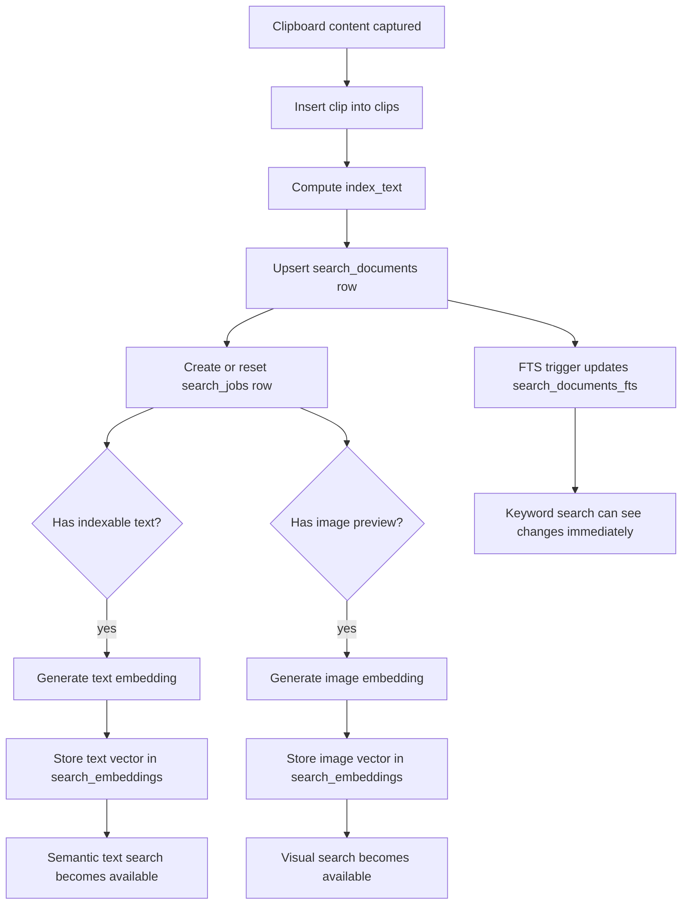
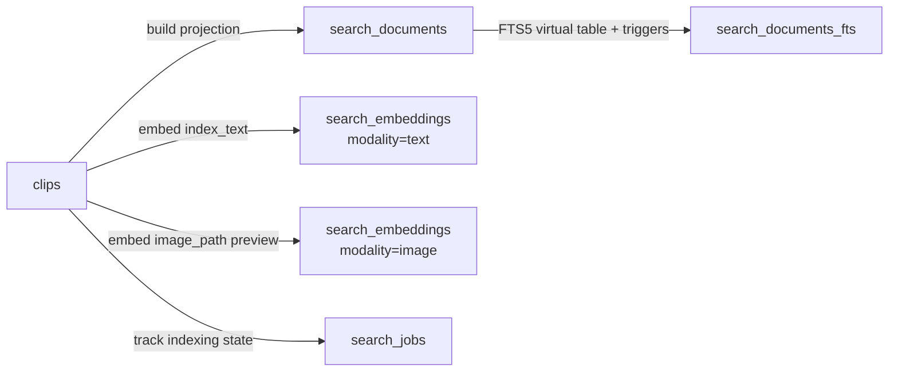
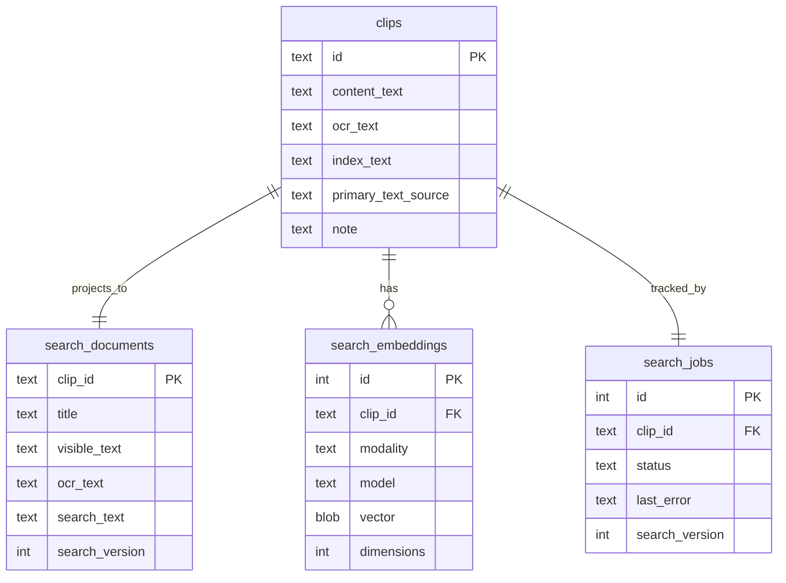
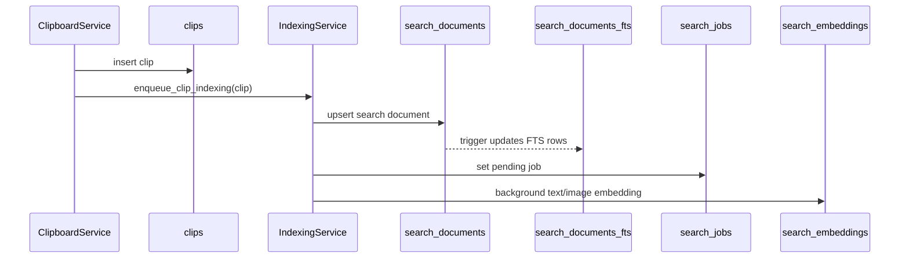
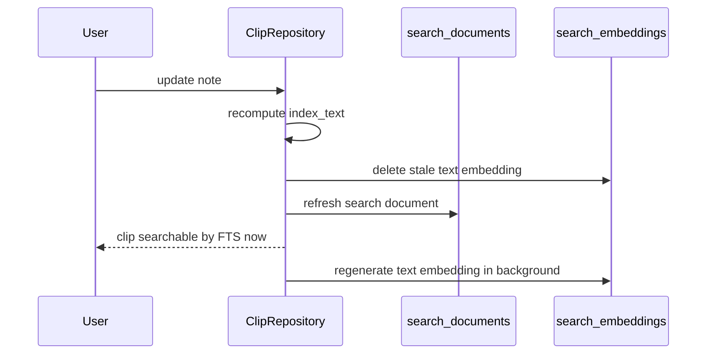
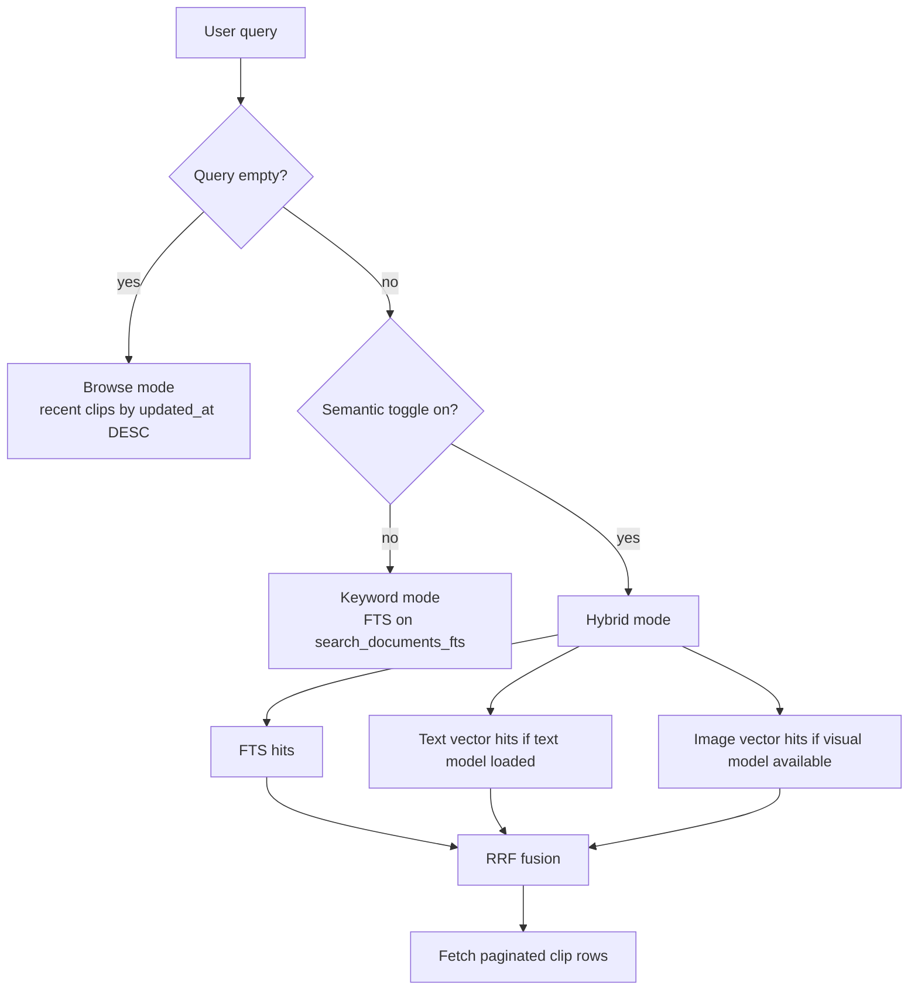
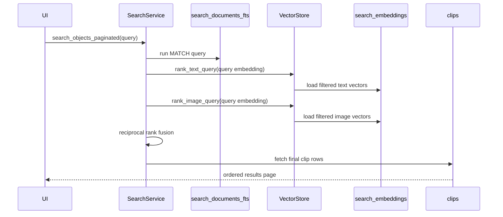

# Search Behavior

This document explains the current ClipsX search pipeline from:

1. clip capture
2. text/index construction
3. database storage
4. keyword search
5. semantic search

The important idea is that ClipsX does not use a chat model to search. It uses:

- SQLite FTS5 for exact/prefix keyword matching
- a local text embedding model for semantic text search
- an optional local image embedding model for visual search

## Short Version

```text
clipboard content
  -> clips table
  -> compute index_text
  -> upsert search_documents row
  -> FTS trigger updates search_documents_fts
  -> background job creates text/image embeddings
  -> search query runs:
       FTS
       + text vector similarity
       + image vector similarity
       -> reciprocal rank fusion
       -> final paginated clips
```



## The Main Data Sources

There are three search-content tables that matter most, plus one job table:



### 1. `clips`

This is the source-of-truth record for each clipboard item.

Relevant fields:

- `content_text`: best plain-text representation currently known
- `ocr_text`: raw OCR output kept as provenance
- `index_text`: canonical text used for text embeddings
- `primary_text_source`: where the current searchable text came from
- `note`: user annotation

`index_text` is the canonical text payload for semantic text indexing. In practice it is:

- `content_text`
- or `content_text + "\n\n" + note`
- or `note` only
- or empty string if the clip still has no real text

That logic lives in `compute_index_text`.

### 2. `search_documents`

This is the keyword-search projection. It is denormalized from `clips` so FTS can search the right combined text without reading the whole clip row shape.

Important columns:

- `clip_id`
- `title`
- `visible_text`
- `ocr_text`
- `search_text`
- `source_app`
- `search_version`
- `indexed_at`

`search_text` is what FTS actually indexes.

### 3. `search_embeddings`

This stores vectors for semantic retrieval.

Important columns:

- `clip_id`
- `modality`: `"text"` or `"image"`
- `model`
- `vector`: raw bytes
- `dimensions`

For text search, the vector is generated from `index_text`.

## How `index_text` Is Built

`index_text` is intentionally narrower than the FTS document.

Rules:

- Plain text, HTML, RTF, files, and office clips with extracted text start with `index_text` based on their plain text.
- User notes are appended to that text.
- Image clips start with `index_text = ""` and `primary_text_source = "none"`.
- If OCR later finds text, that OCR text becomes `content_text`, `primary_text_source = "ocr"`, and `index_text` is rebuilt.
- If OCR finds nothing, the placeholder stays in `content_text` for UI purposes, but `index_text` stays empty, so the clip is not text-searchable yet.
- If a note is added to a note-less image clip, `primary_text_source` becomes `"note"` and `index_text` becomes the note text.

So `index_text` answers this question:

> What text should we feed into the text embedding model right now?

## How The FTS Document Is Built

`search_documents.search_text` is broader than `index_text`.

When ClipsX builds a search document, it combines:

- canonical clip text from `content_text` when the source is real text
- the user note
- `ocr_text` if it differs from the canonical text
- `app_name`
- selected metadata terms such as `source_app`, `office_app`, `office_kind`, `table_source`, and `delimiter`

That means:

- semantic text search is based on `index_text`
- keyword search is based on `search_documents.search_text`

This is an important difference. FTS can match some metadata terms that were not embedded into the text vector.

## What Gets Stored In The Database



### Text vectors

When text indexing runs:

1. ClipsX loads the local BGE-M3 embedding model.
2. It embeds `clip.index_text`.
3. The `Vec<f32>` embedding is converted to little-endian bytes.
4. The bytes are stored in `search_embeddings.vector`.

So the DB does not store a JSON array of floats. It stores a binary blob plus:

- `model`
- `dimensions`
- `modality = 'text'`

At query time, those bytes are converted back into `Vec<f32>` and compared in app code with cosine similarity.

### Search jobs

`search_jobs` tracks indexing state per clip:

- `pending`
- `running`
- `completed`
- `failed`

This is how the app knows whether a clip is indexed, stale, missing, or failed.

### FTS storage

`search_documents_fts` is an SQLite FTS5 virtual table over `search_documents.search_text`.

Triggers keep it synchronized whenever `search_documents` changes.

## Indexing Lifecycle

### On new clip capture

After a new clip is saved:

1. The clip row is inserted into `clips`.
2. `IndexingService::enqueue_clip_indexing` runs.
3. It synchronously upserts a `search_documents` row.
4. It synchronously creates or resets a `search_jobs` row to `pending`.
5. If the clip has indexable text, background text embedding starts.
6. If the clip has an image preview, background image embedding may also start.

The key behavior is:

- keyword search becomes fresh immediately after the search document write
- semantic search may lag until the background embedding finishes



### On note edit

When a note changes:

1. `index_text` is recomputed.
2. The old text embedding is deleted if the text changed.
3. The clip is re-enqueued for indexing.
4. `search_documents` is refreshed immediately.
5. A new text embedding is generated in the background.

So note edits are searchable by FTS immediately, even before the new embedding exists.



### On OCR completion

When OCR finishes for an image or office clip:

- if OCR produced useful text and no stronger text source already owns the clip:
  - `content_text` is replaced with OCR text
  - `primary_text_source` becomes `"ocr"`
  - `index_text` is rebuilt
  - stale text embeddings are deleted
- if OCR produced no text:
  - the UI placeholder remains in `content_text`
  - `index_text` stays empty

Again, the search document is refreshed immediately and embeddings catch up in the background.

## How Query-Time Search Works

The frontend debounces the search box and calls `search_objects_paginated`.

There are really three modes:



### 1. Browse mode

If the query is empty:

- ClipsX does not run FTS.
- It just returns recent clips ordered by `updated_at DESC`.

### 2. Keyword-only mode

If the query is not empty and semantic mode is off:

1. The query is escaped for FTS5.
2. Each token becomes a quoted prefix match.
3. Multi-word queries are joined with `AND`.
4. SQLite runs `MATCH` against `search_documents_fts`.
5. Results are ordered by FTS rank, then `updated_at DESC`.

Example:

```text
hello world
-> "hello"* AND "world"*
```

### 3. Hybrid mode

If the query is not empty and semantic mode is on, the service attempts hybrid retrieval:

1. Run the same FTS search.
2. If the text embedding model is loaded, embed the query text and compare it against stored text embeddings.
3. If the visual model is available, embed the query for visual search and compare it against stored image embeddings.
4. Fuse the ranked result lists with Reciprocal Rank Fusion.
5. Fetch the final clip rows for the fused page.

The app-side vector ranking currently does not happen inside SQLite. It reads the candidate embeddings, converts blobs back to floats, computes cosine similarity in Rust, and sorts there.



## Filtering Rules

The same filters are applied across browse, keyword, and vector retrieval:

- favorites only
- pinned only
- selected tag
- slash type filters such as `/image`, `/code`, `/office`

For vector search, filters are applied before ranking by only loading embeddings whose clips already match the requested filters.

## Ranking Details

### Keyword ranking

FTS ranking comes from SQLite FTS5 rank order.

### Text semantic ranking

Text semantic ranking uses cosine similarity between:

- query embedding
- stored text embedding from `search_embeddings`

The default text similarity threshold is `0.5`.

### Visual ranking

Visual ranking uses cosine similarity against `modality = 'image'` vectors.

The default visual similarity threshold is `0.15`.

### Fusion

ClipsX fuses:

- FTS hits
- text semantic hits
- visual hits

with Reciprocal Rank Fusion.

Tie-breaking prefers:

1. higher fused score
2. presence of an FTS hit
3. better FTS rank
4. presence of a semantic hit
5. better semantic rank
6. presence of a visual hit

One subtle detail: the returned `similarity_score` on a clip is the text semantic score only, not the final fused score.

## What “Indexed” Means In Practice

A clip is effectively fully indexed when:

- its `search_documents` row is current
- its `search_jobs` row is `completed`
- required embeddings exist for the current model(s)

A clip can still be keyword-searchable before it is fully embedded, because the search document is written first.

## Important Mental Model

If you want to understand the pipeline quickly, think of it like this:

- `clips.index_text` = canonical text for text embeddings
- `search_documents.search_text` = broader keyword-search text
- `search_embeddings` = binary vector store
- `search_jobs` = indexing status
- FTS is immediate
- embeddings are asynchronous
- final search is hybrid rank fusion, not pure vector search

## Practical Examples

### Example: normal text clip

Copied text:

```text
OAuth callback URL
```

Stored result:

- `content_text = "OAuth callback URL"`
- `index_text = "OAuth callback URL"`
- `search_documents.search_text` includes that text
- a text embedding is generated from that exact `index_text`

Search behavior:

- query `oauth` matches immediately through FTS
- query `login redirect` can later match semantically through embeddings

### Example: image clip before OCR

Stored result:

- `content_text = "[Image: 123.png]"`
- `index_text = ""`
- `primary_text_source = "none"`

Search behavior:

- it is not text-searchable yet
- it may still participate in image-vector search if an image embedding exists

### Example: image clip after note but before OCR

Stored result:

- `note = "invoice from vendor"`
- `index_text = "invoice from vendor"`
- `primary_text_source = "note"`

Search behavior:

- FTS finds it immediately by `invoice`
- semantic text search finds it after the new text embedding is generated

### Example: OCR promotion

OCR returns:

```text
Invoice #4821
```

If the clip already had note `urgent`:

- `content_text = "Invoice #4821"`
- `index_text = "Invoice #4821\n\nurgent"`
- `primary_text_source = "ocr"`

Now both keyword and semantic text search use the OCR-derived text, with the note kept in the canonical text payload.
