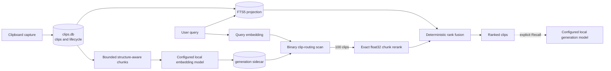
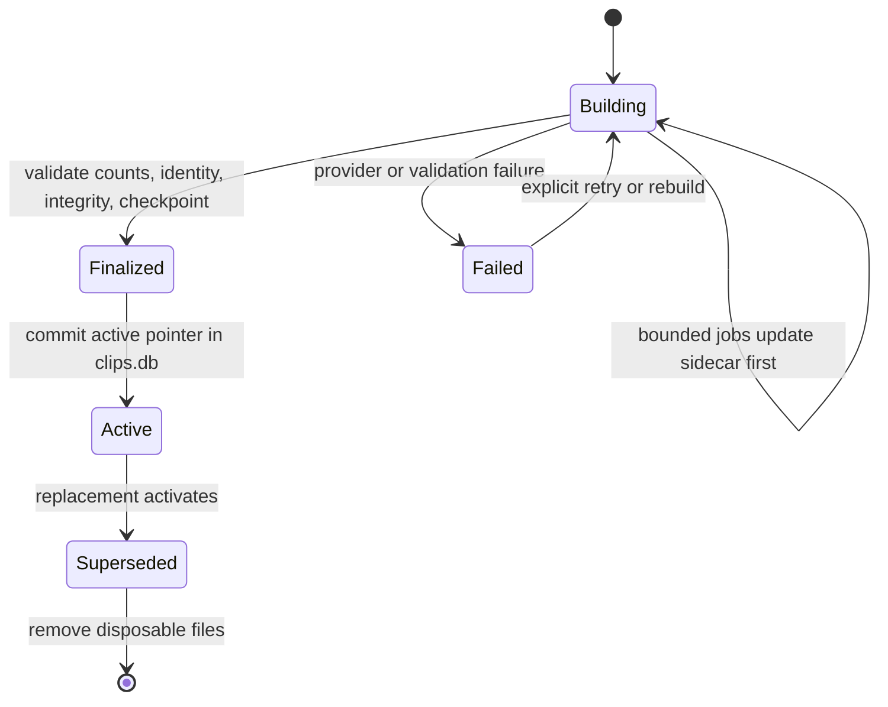

# Meaning Search and Recall

This document explains the semantic-search architecture that ClipsX implements,
why it was chosen, its trade-offs, and the evidence behind it. The system-wide
invariants remain in [ARCHITECTURE.md](ARCHITECTURE.md), database ownership is
defined in [MODELS.md](MODELS.md), and installed-build certification belongs in
[RELEASE.md](RELEASE.md).

## Purpose and constraints

ClipsX must preserve exact clipboard lookup while also finding related wording.
For example, keyword search can find `database password`, while Meaning Search
can connect it with `invalid credentials caused connection failure`.

The design has six constraints:

- canonical clipboard history must not depend on an AI model or search index;
- exact keyword search must remain available when Meaning Search is disabled or
  broken;
- capture and the UI must not wait for embedding work;
- one unusually large clip must not create unbounded provider, storage, or query
  work;
- rebuilding an index must never replace a working index with a partial one; and
- the implementation must remain local, cross-platform, and maintainable at the
  conservative 60,000-clip capacity target.

The 60,000-clip target is a capacity qualification target, not yet a release
claim. Installed builds still need labelled recall, latency, recovery, memory,
and full-storage certification on every advertised platform.

## Mental model

An embedding model converts text into a fixed-length vector. Nearby vectors are
expected to represent related meanings; the individual numbers have no useful
human-readable interpretation. A generation model, or LLM, does something
different: it reads a prompt and writes new text.

ClipsX therefore separates three operations:

1. FTS5 finds exact words and prefixes.
2. Meaning Search embeds the query and retrieves semantically related clips.
3. Recall optionally gives a bounded set of retrieved passages to a configured
   local generation model.

The word *generation* also appears in *index generation*. That means one
complete version of the derived semantic index, not generated prose. Exactly
one validated index generation is active for a semantic source.

## Architecture



`clips.db` stores canonical clips, FTS documents, embedding-space identity, and
index lifecycle records. Large semantic chunks and vectors live in one
generation-owned SQLite sidecar under `search-index/`. Sidecars are derived:
deleting all of them loses no clipboard content and leaves FTS usable.

## Key decisions

| Decision | Rationale | Cost or limitation |
| --- | --- | --- |
| Keep FTS mandatory and Meaning Search optional | Clipboard lookup depends heavily on exact identifiers, paths, URLs, code, and error text. Search still works without a provider or sidecar. | Two candidate lists require deterministic fusion. |
| Store semantic payloads in one sidecar per index generation | A replacement can be built and validated beside the active index. Canonical storage stays independent and sidecars are safely disposable. | Rebuilds temporarily require space for both generations. |
| Route by one binary signature per clip, then rerank full chunk vectors | The compact first stage narrows the search without a graph, trained index, server, or native dependency. Exact float32 reranking supplies the final semantic score. | Approximate routing can miss a clip, so recall must be measured and the candidate count tuned from evidence. |
| Chunk by content structure | Headings, JSON paths, table headers, code declarations, and paragraph boundaries retain meaning better than arbitrary fixed windows. | The pipeline is more complex and its version becomes part of index compatibility. |
| Limit every clip to 64 chunks | A pasted book cannot monopolize disk or provider work. Sampling covers the document and a routing summary represents omitted regions. | Some detail may be absent from the semantic index; canonical content remains complete and FTS remains independent. |
| Activate one explicit generation | Queries never guess which model, dimensions, or sidecar belong together. A failed rebuild cannot silently become live. | Generation state and recovery must be coordinated across the main database and sidecar. |
| Keep Recall explicit and separate from retrieval | Search remains deterministic, while LLM cost, privacy, and fallibility are visible to the user. | The user must request Recall and verify generated answers against their sources. |
| Exclude secret-faceted clips from Recall | A broad query must not silently aggregate detected passwords or tokens into a prompt, even for a local provider. | There is no override in the current design. |

## Index construction

Semantic inputs come independently from notes, tags, every ready text
representation, and completed OCR artifacts. Equivalent visible text is
embedded once, preferring the richest source that parses safely; genuinely
different representations remain searchable.

| Input | Boundaries and embedding-only context |
| --- | --- |
| HTML and Markdown | headings, paragraphs, lists, quotes, code, and table rows; heading ancestry and table headers |
| JSON | object subtrees and array ranges; JSON Pointer paths |
| CSV/TSV | complete rows packed with repeated headers |
| RTF | safely extracted visible paragraphs; unsafe control content is rejected |
| Code | declaration and blank-line boundaries with inferred language |
| OCR and plain text | paragraphs, lines, and whitespace-aware fallback windows |
| Notes and tags | separate labelled metadata chunks |

Blocks with the same structural context pack toward 1,536 UTF-8 bytes. A final
embedding input never exceeds 2,048 bytes, structural context is limited to 384
bytes, and an oversized atom uses Unicode-safe windows with at most 256 bytes of
overlap. If a provider still reports overflow, only that chunk is recursively
subdivided under a bounded retry budget.

After all inputs are chunked, the clip-level budget keeps up to eight note/tag
chunks, samples the remaining content across the document, and reserves the
last of 64 slots for a bounded routing summary when truncation occurred.
Complete enriched embedding inputs are hashed and sent to the provider once per
generation. Model identity, revision, dimensions, normalization, distance
metric, and the chunking pipeline version define compatibility; vectors from
different spaces are never mixed.

## Sidecar ownership and scale

Each `generation-{id}.sqlite` sidecar owns:

- clean display snippets and bounded provenance;
- stable clip and chunk ordinals;
- deduplicated normalized float32 embedding vectors;
- one binary routing signature per clip; and
- routing pages containing at most 256 clips.

The main database owns the generation status, safe relative filename, model
space, backend/encoding identity, candidate policy, size, and optional
checkpoint checksum. A sidecar contains no canonical clipboard truth.

Storage is driven by content and model dimensions, not merely clip count. At
1,024 dimensions, one float32 vector is 4,096 bytes. The conservative capacity
fixture of 540,000 vectors therefore implies about 2.06 GiB of raw float32
values before snippets, mappings, and SQLite overhead. One 1,024-bit routing
signature for each of 60,000 clips is only about 7.3 MiB before page overhead.
Images and other binary clipboard payloads live separately in managed storage.

The deterministic mixed corpus produced 77,900 chunks for 60,000 synthetic
clips, but release qualification deliberately also exercises the much larger
540,000-vector capacity case. Neither number predicts a particular user's disk
usage: average clip length, duplication, model dimensions, OCR, and binary
payloads dominate that estimate. The Intelligence UI therefore reports actual
active bytes and estimates rebuild space from the user's existing index when
possible.

## Retrieval and ranking

Canonical SQL first resolves the eligible clips for the current scope, tags,
representation families, and facets. The sidecar maps those IDs to stable
ordinals in a compact eligibility bitset.

Meaning Search then:

1. embeds the query in the active generation's vector space;
2. scans the eligible clips' binary routing signatures in parallel;
3. retains the best 100 candidate clips;
4. loads every float32 chunk vector belonging to those clips;
5. computes the exact normalized-vector score and keeps each clip's best chunk;
6. applies the optional model-local minimum similarity; and
7. returns bounded candidates to the common search planner.

The binary signature is the bitwise majority of a clip's normalized chunk-vector
signs. It only selects candidates; it never supplies the displayed or final
score. The displayed percentage is rounded cosine similarity, not a calibrated
confidence probability. Because model score ranges differ, the optional
device-local minimum resets when the embedding space changes and never filters
FTS matches.

FTS and semantic candidates are merged by clip ID and combined with equal-weight
reciprocal-rank fusion (`k = 60`). Exact lexical evidence remains available
independently, source failures are reported without discarding successful FTS
results, and stable score/time/ID ordering supports deterministic cursor pages.

## Generation lifecycle and recovery



The active sidecar remains searchable during a rebuild. Each job writes its
clip to the sidecar before marking the durable main-database job complete.
Per-clip replacement is idempotent, so startup can requeue an interrupted
`running` job without discarding a valid sidecar write.

A finalized sidecar left immediately before activation is validated and can be
activated without rebuilding. If an incomplete building sidecar is missing or
corrupt, recovery first resets its jobs to `pending` in `clips.db`, then replaces
the disposable file. This ordering prevents a second crash from activating an
empty index using stale completed-job state.

Ordinary clip changes update only that clip in the active generation. Before a
write, the coordinator clears the previous checkpoint checksum; SQLite
transactions, WAL recovery, schema identity, and integrity checks protect the
live file between bounded checkpoints.

A rebuild keeps the current generation, so the service requires its estimated
replacement bytes plus a 64 MiB reserve before starting. Clearing Meaning
Search removes sidecars and generation/job state without touching clips or FTS.
Canonical deletion succeeds independently; query eligibility prevents stale
derived rows from making a deleted clip visible, and reconciliation repairs
missed cleanup.

## Recall

Recall runs only after the user explicitly requests it from search results. It
accepts at most the first 10 ranked IDs, deduplicates and eligibility-checks
them, and excludes every clip carrying `core.security.secret`. For each retained
clip, Meaning Search selects the best matching passage; if embeddings are
unavailable, Recall falls back to bounded derived search text.

Each source passage is limited to 2 KiB, for at most 20 KiB of source material.
The question is limited to 2 KiB and the generated answer to 32 KiB. Clipboard
text is delimited as untrusted prompt data. The configured local generation
provider receives the question and numbered passages, while the UI labels the
answer as generated and fallible. Prompts and answers do not become canonical
clip metadata.

## Qualification evidence

The ignored Rust qualification tests are deterministic and must run in release
mode so debug timings are not presented as product measurements:

```powershell
cargo test --release --manifest-path src-tauri/Cargo.toml \
  semantic_scale_qualification -- --ignored --nocapture
cargo test --release --manifest-path src-tauri/Cargo.toml \
  packed_sqlite_scale_qualification -- --ignored --nocapture
```

| Evidence | Result | Interpretation |
| --- | --- | --- |
| Mixed chunking corpus | 60,000 clips; 77,900 chunks; p50 1, p95/p99/max 3; 71,901 unique inputs; 319,078,400 raw vector bytes at 1,024 dimensions | Deterministic scale foundation, not a real-user distribution |
| Full float32 scan | 540,000 × 1,024 vectors; p95 about 506 ms | Rejected for target latency |
| SQLite `vec1` ANN plus rerank | p95 2.242 ms, but recall@10 only 10%; sweep reached 20%; committed reopen reported a stored-PQ integrity mismatch | Rejected for recall and integrity |
| USearch HNSW | Basic persistence worked; default SIMD dependency failed under MSVC; 540,000-vector build exceeded 90 minutes at about 951 MiB | Rejected for packaging and rebuild cost |
| Parallel int8 flat scan | 540,000 × 1,024 vectors; p95 18.399 ms; 552,960,000 vector bytes | Fast, but the first SQLite physical layout was too slow and too large |
| Initial packed SQLite route | 60,000 clips / 540,000 chunks; p95 460.886 ms; 576,106,496-byte fixture | Rejected physical layout |
| Selected paged binary routing | Same capacity; 10,358,784-byte routing fixture; repeated 21-run Windows results about 83–97 ms p50 and 105–122 ms p95 | Passed the enforced local 125 ms p95 physical gate |

The selected design has one production retrieval implementation. Rejected
backends, the exact full-scan oracle, and synthetic fixtures do not become
fallback production paths.

## Remaining release validation

The architecture and local performance gate are complete. A 60,000-item product
claim still requires installed-package evidence for:

- labelled clipboard recall at 10 and 50, including filters and long documents;
- query and rebuild latency, peak memory, steady disk, and rebuild-peak disk;
- capture responsiveness during indexing;
- missing/corrupt sidecar and interrupted-build recovery; and
- Windows x64, Linux x64, macOS x64, and macOS arm64 packages.

Measurements may justify changing the candidate count or another bounded policy.
They must not introduce a second production backend or duplicate the generation
state machine.
