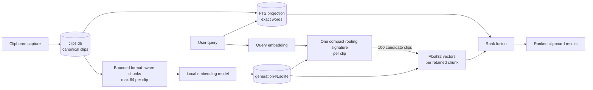
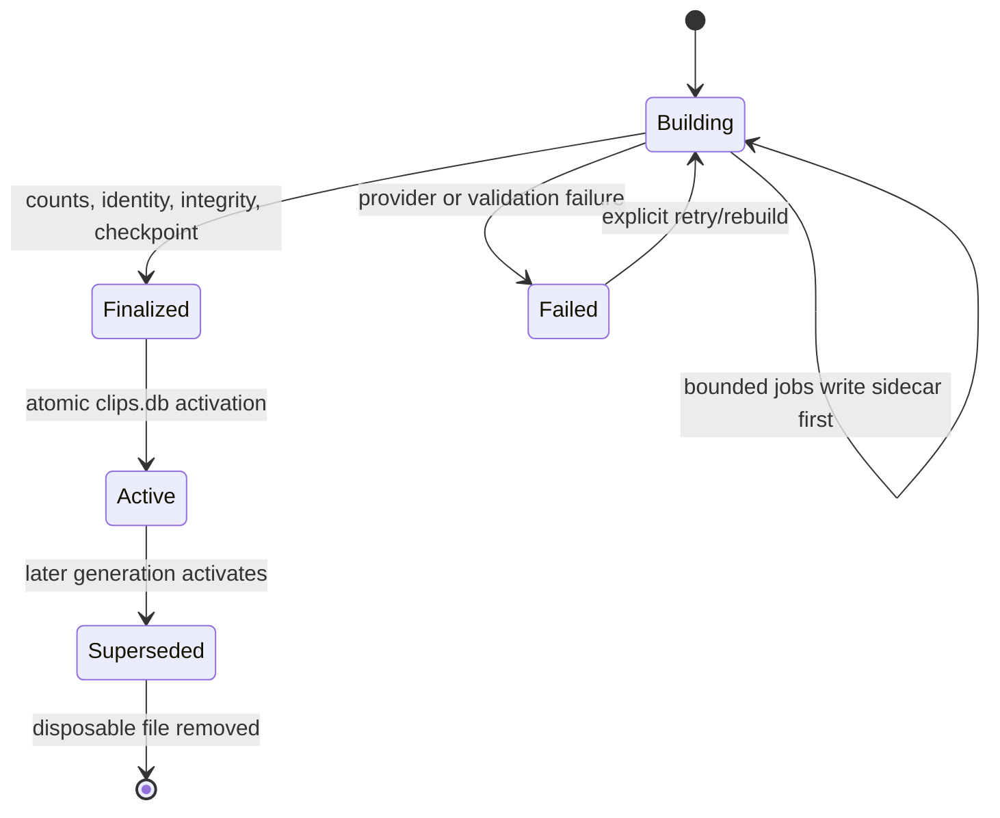

# Meaning Search and Recall architecture

This is the durable, beginner-oriented explanation of how ClipsX stores and
uses embeddings at large history sizes. The canonical rules remain in
[ARCHITECTURE.md](ARCHITECTURE.md); this document explains the rationale.

## The short version

ClipsX stores each clipboard item once as canonical history. Searchable text,
embeddings, and generated answers are disposable derived data. Exact-word
search (FTS) and meaning search run together in one search request, but meaning
search uses a two-stage index: a small approximate routing signature quickly
finds 100 likely clips, then the original float32 vectors choose the accurate
ranking. Both index types live in one generation-specific SQLite sidecar file.

Recall is separate. After search returns ranked results, the user may explicitly
ask a configured local text-generation model to answer from at most the first
10 results. The backend searches only within those IDs again to select the best
matching paragraph from each long document. If embeddings are unavailable, it
uses bounded searchable text instead. Each source passage is capped at 2 KiB,
so the ten passages contribute at most 20 KiB. Search retrieves; generation
writes a new answer. The answer is not treated as canonical clipboard truth.

## What “generation” means

An embedding model turns text into numbers so similar meanings can be compared;
it does not write an answer. A generation model (an LLM) reads a prompt and
produces new text. Therefore search must run first. It decides which clips are
relevant and gives Recall a small, ordered evidence set. The LLM does not choose
an embedding generation.

An embedding **generation** is a different use of the same word: it is one
complete version of the derived search index. It records one model, dimensions,
pipeline version, and sidecar. ClipsX explicitly marks one generation active.
A rebuild creates a new generation beside it, validates it, and atomically
activates it. Queries never guess which generation to use.

## Storage and retrieval



The sidecar is SQLite but is not another canonical database. It is a managed,
replaceable file under `search-index/`. `clips.db` holds only compact lifecycle
and configuration records. Deleting every sidecar loses no clipboard item; it
only makes meaning search unavailable until rebuilt. FTS remains mandatory.

The approximate first stage can miss a distant semantic relation, which is why
candidate recall is measured against exact search. It should not make close
relations such as “water” and “aqua” inaccurate once both land in the candidate
set: the second stage compares their full vectors. Increasing the candidate
count trades CPU and I/O for recall without changing storage architecture.

## Long text and Markdown

A long document is not stored as one giant embedding request. Format-aware
chunking preserves useful boundaries such as Markdown headings and code fences,
deduplicates equivalent representations, samples across the document, and
enforces 64 chunks per clip. When content is truncated, one routing chunk
summarizes sampled regions so material near the end can still nominate the clip.
Canonical content remains complete regardless of derived chunk limits.

## Rebuild lifecycle



The old active sidecar stays searchable during a rebuild. The UI reports
coverage, dimensions, current bytes, and estimated additional rebuild bytes.
Before starting, the service requires that estimate plus a 64 MiB reserve.
Interrupted jobs are requeued, finalized generations can resume activation, and
corrupt building files are reset from durable job state before replacement.

## Recall flow and privacy

```mermaid
sequenceDiagram
    actor User
    participant Search
    participant Recall
    participant LocalLLM as Local generation model
    User->>Search: Search question
    Search-->>User: Ranked results from FTS + meaning search
    User->>Recall: Press Recall
    Recall->>Recall: Keep first 10; exclude secret facets
    Recall->>Search: Best passage within each eligible result
    Search-->>Recall: Meaning passage, or bounded text fallback
    Recall->>LocalLLM: Question + numbered untrusted sources
    LocalLLM-->>Recall: Generated answer with source markers
    Recall-->>User: Answer + included/excluded counts
```

Recall never runs automatically. Secret-tagged clips are excluded even when the
provider is local; this default prevents an ordinary broad search from silently
aggregating passwords or tokens into a prompt. The local model receives at most
10 sources of at most 2 KiB each, the question is at most 2 KiB, and the answer
is at most 32 KiB. Generated
text can be wrong, so the UI asks the user to verify important answers against
the source clips.

## Why this design

| Choice | Benefit | Tradeoff / response |
|---|---|---|
| One SQLite sidecar per generation | Atomic replacement, simple cleanup, no server | Rebuild temporarily needs extra disk; preflight it |
| Binary routing then exact rerank | Small, dependency-free, fast at 60k clips | Approximate candidate stage; validate recall and tune candidate count |
| Mandatory FTS plus optional meaning source | Exact text always works and failures degrade safely | Two rankings need deterministic fusion |
| Maximum 64 chunks per clip | One pasted book cannot monopolize disk or provider work | Sampling may omit detail; routing chunk preserves document-wide signals |
| Explicit active generation | Queries use one known model/version | Rebuild lifecycle needs validation and recovery |
| Separate explicit Recall | Search stays deterministic; LLM cost and risk are visible | User must press an action and verify generated output |
| Exclude secrets from Recall | Safe default for broad retrieval | A future explicit, strongly warned override could be designed separately |

Rejected alternatives—HNSW, `vec1`, a full float32 scan, a remote vector
database, dual schemas, and multiple production backends—are recorded with
measurements in [SEMANTIC_SEARCH_QUALIFICATION.md](SEMANTIC_SEARCH_QUALIFICATION.md).

## Remaining certification, not architecture work

The implementation is complete, but release claims still require labelled real
clipboard recall and installed-package measurements on Windows x64, Linux x64,
macOS x64, and macOS arm64. Those tests may justify changing the candidate
count; they should not add a second backend or duplicate state machine.
