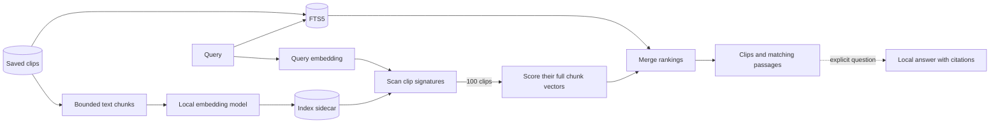
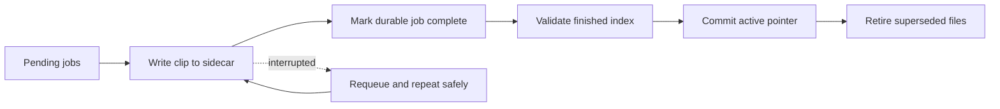

# Meaning Search and Recall

| Tool           | What it does                                                        | Needs a model?         |
| -------------- | ------------------------------------------------------------------- | ---------------------- |
| Keyword search | Finds words, prefixes, identifiers, paths, and code using FTS5      | No                     |
| Meaning Search | Finds related wording using text embeddings                         | Local embedding model  |
| Recall         | Answers an explicit question using retrieved passages and citations | Local generation model |

An **embedding** is a list of numbers representing text meaning. Similar vectors
suggest related text. A **generation model** writes an answer. An **index
generation** is a version of the search index, not an AI-written answer.
A **sidecar** is a separate, rebuildable database file beside the main database.

Original clips remain usable if models or indexes fail. Capture never waits for
embeddings. The 60,000-clip capacity target still requires installed-platform
qualification; it is not a certified product claim.

## Data flow



| Storage                               | Owns                                                         | Why                                             |
| ------------------------------------- | ------------------------------------------------------------ | ----------------------------------------------- |
| `clips.db`                            | Clips, FTS, model-space identity, jobs, active-index pointer | Canonical eligibility and durable coordination  |
| `search-index/generation-{id}.sqlite` | Chunks, snippets, provenance, vectors, routing signatures    | Disposable search payload; independent recovery |

A model space fixes provider/model revision, dimensions, normalization, distance
metric, and chunking compatibility. Vectors from different spaces never mix.

## Index construction

Inputs: notes, tags, every ready text representation, and completed OCR.
Equivalent visible text is embedded once, preferring the richest safely parsed
source; distinct representations remain searchable.

| Format           | Chunk boundaries / extra context used only for embedding                            |
| ---------------- | ----------------------------------------------------------------------------------- |
| HTML / Markdown  | Headings, paragraphs, lists, quotes, code, table rows; heading ancestry and headers |
| JSON             | Object subtrees, array ranges; JSON Pointer paths                                   |
| CSV / TSV        | Whole rows with repeated headers                                                    |
| RTF              | Safely extracted paragraphs; reject unsafe control content                          |
| Code             | Declarations and blank lines; inferred language                                     |
| OCR / plain text | Paragraphs, lines, Unicode-safe windows                                             |
| Notes / tags     | Separate labelled chunks                                                            |

| Budget                    | Limit                                                                 |
| ------------------------- | --------------------------------------------------------------------- |
| Packing target            | 1,536 UTF-8 bytes                                                     |
| Final embedding input     | 2,048 bytes                                                           |
| Structural context        | 384 bytes                                                             |
| Oversized-atom overlap    | At most 256 bytes                                                     |
| Chunks per clip           | 64                                                                    |
| Reserved note/tag chunks  | Up to 8                                                               |
| Truncated clip            | Sample across content; reserve final slot for bounded routing summary |
| Provider context overflow | Subdivide only that chunk; bounded retries                            |

Hash complete enriched inputs and embed duplicates once per generation.
Display snippets remain clean; structural embedding context does not become
canonical content.

## Retrieval and ranking

```text
Scope/tags/format/facet filters in canonical SQLite
  -> eligible IDs + update times -> sidecar ordinals -> compact eligibility bitset
  -> embed query in active space
  -> parallel scan of eligible clip signatures
  -> best 100 clips
  -> exact float32 scoring of every chunk in those clips
  -> best chunk per clip
  -> optional semantic similarity floor
  -> combine with keyword results -> stable cursor pages
```

Each clip signature is the bitwise majority of its normalized chunk-vector signs.
It selects candidates only; exact vector scoring supplies final similarity.
This keeps routing small and maintainable, but can miss relevant clips outside
the shortlist. Measure retrieval quality before changing the candidate budget.

Keyword and semantic ranks merge by clip ID using equal-weight reciprocal-rank
fusion, `k = 60`. Stable score/time/ID ordering makes pagination deterministic.
A semantic failure leaves keyword results available with diagnostics.

The displayed percentage is rounded cosine similarity, not confidence or a
probability. The optional device-local minimum applies only to semantic
candidates, defaults off, needs no reindex, and resets when model space changes.
FTS matches are never filtered by it.

## Index lifecycle and recovery



Exactly one validated generation is active per semantic source. Sidecar writes
precede job completion; per-clip replacement is safe to repeat.

| Operation / failure                            | Behaviour                                                                                                                    |
| ---------------------------------------------- | ---------------------------------------------------------------------------------------------------------------------------- |
| Replacement generation built beside active one | Existing generation can serve searches until validated replacement activates                                                 |
| Reindex All                                    | Check disk and provider, then discard text spaces/indexes/jobs and build fresh; old semantic index does not remain available |
| Clear-space command                            | Same provider-validated full reset; enqueues fresh work                                                                      |
| Provider validation fails before reset         | Preserve existing index                                                                                                      |
| Interrupted running job                        | Requeue; existing valid sidecar write may be repeated                                                                        |
| Finished sidecar, activation interrupted       | Validate and activate without rebuilding                                                                                     |
| Missing/corrupt building sidecar               | Reset durable jobs to pending before replacing file                                                                          |
| Ordinary clip edit                             | Update only that clip; clear old checkpoint checksum before write                                                            |
| Clip deletion                                  | Canonical deletion succeeds; eligibility hides stale rows; durable cleanup removes retained-index references                 |
| Factory reset                                  | Remove the owned search-index directory with other reset data                                                                |

**Replacement and explicit reset differ.** The reset clears text embedding
spaces, generations, jobs, cleanup intents, and sidecars; preserves clips, FTS,
and provider configuration; recreates the model space; and queues eligible clips.
Meaning Search waits for the new index. Reindex checks estimated replacement
space plus a 64 MiB reserve before starting.

SQLite transactions, WAL recovery, schema identity, integrity checks, and bounded
checkpoints protect active sidecars. Resetting job state before replacing a broken
building file prevents a second crash from activating an empty index with stale
"completed" jobs.

## Storage and trade-offs

Each sidecar contains clean snippets/provenance, stable clip/chunk ordinals,
deduplicated normalized float32 vectors, one binary signature per clip, and
routing pages of at most 256 clips. The main database records its safe relative
path, state, space, backend/encoding, candidate policy, size, and optional checksum.

| Design                                  | Benefit                                                     | Cost                                                       |
| --------------------------------------- | ----------------------------------------------------------- | ---------------------------------------------------------- |
| Mandatory FTS + optional Meaning Search | Exact lookup survives model failure                         | Merge two rankings                                         |
| Generation sidecars                     | Validate before activation; disposable derived files        | Parallel replacement may need two indexes on disk          |
| Binary routing + exact rerank           | Compact first scan; no graph/server/native index dependency | Shortlist can miss a relevant clip                         |
| Structured chunks + per-clip budget     | Preserve context and bound work                             | Long clips lose semantic detail; original remains complete |
| Explicit Recall                         | User controls when generation runs                          | Answers need source verification                           |

At 1,024 dimensions:

```text
One float32 vector       = 1,024 × 4 bytes = 4 KiB
540,000 vectors          ≈ 2.06 GiB before snippets/mappings/SQLite overhead
60,000 binary signatures ≈ 7.3 MiB before page overhead
```

The mixed 60,000-clip fixture yields 77,900 chunks, with 71,901 unique inputs
(319,078,400 raw vector bytes at 1,024 dimensions; chunk-count p50 1,
p95/p99/max 3). It is synthetic, not a prediction of user storage. The larger
540,000-vector case tests capacity. Model dimensions, text lengths, duplication,
OCR, and separate binary payloads determine real disk use. Intelligence reports
actual active bytes and estimates replacement space from the existing index.

## Recall

Recall starts only when the user submits a question. It searches eligible
history independently of visible rows or pagination.

```text
Question + fixed search scope
  -> up to 100 candidates
  -> deduplicate and exclude core.security.secret clips
  -> select matching passages; keyword-centred fallback without embeddings
  -> snapshot citations/fingerprints and recheck eligibility
  -> fit provider context budget with room for answer
  -> stream stages, evidence, text, and one terminal event
```

| Bound                    | Maximum                                          |
| ------------------------ | ------------------------------------------------ |
| Question                 | 2 KiB                                            |
| Evidence                 | 10 passages; 2 KiB each; 20 KiB total            |
| Answer                   | 32 KiB; provider request also caps output tokens |
| Temporary session        | 10 completed turns / 1 MiB retention budget      |
| Inactivity expiry        | 30 minutes                                       |
| Active answer generation | One across the app's Recall runtime              |

Secret-faceted clips cannot be included by override. Clipboard text is delimited
as untrusted prompt data; answers are labelled generated and fallible.
Host state owns citations, turns, cancellation, and ordered events. Adapters
receive prepared bounded messages and declare streaming, cancellation, execution
location, and context-budget capabilities.

Ollama is the only shipped generation adapter. Prompts and answers are not logged,
persistently cached, or stored as canonical metadata. Hosted adapters require an
explicit authorization and data-handling policy.

## Qualification

Run ignored scale tests in release mode using the application binary target:

```sh
cargo test --release --manifest-path src-tauri/Cargo.toml --bin clipsx semantic_scale_qualification -- --ignored --nocapture
cargo test --release --manifest-path src-tauri/Cargo.toml --bin clipsx packed_sqlite_scale_qualification -- --ignored --nocapture
cargo test --release --manifest-path src-tauri/Cargo.toml --bin clipsx history_search_scale_qualification -- --ignored --nocapture
```

| Test                 | Scope / gate                                                                                              |
| -------------------- | --------------------------------------------------------------------------------------------------------- |
| Semantic corpus      | Structure, bounded chunks, deduplication, 60,000 synthetic clips                                          |
| Paged binary routing | 60,000 clips / 540,000 chunks; 21 runs; p95 at most 125 ms on qualification host                          |
| History / FTS        | First/deep 50-item pages, selective/common search, batched hydration; p95 100 ms history / 250 ms keyword |

These are test gates, not current release measurements. Retain actual output with
the tested revision and machine in [release evidence](RELEASE.md#evidence-and-sign-off).
There is one production retrieval backend; full-scan oracles and fixtures are
test tools.

Before advertising 60,000 clips, certify labelled recall@10/@50 with filters and
long documents, query/rebuild latency, peak memory, steady/rebuild disk,
capture responsiveness during indexing, and interrupted/missing/corrupt-index
recovery on each advertised platform.
